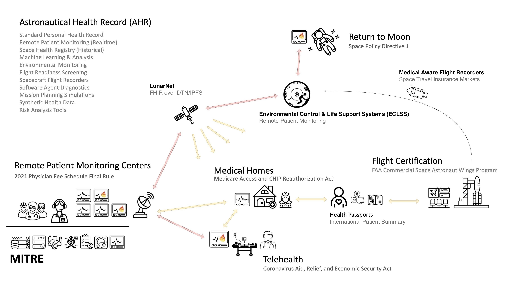

# Space Health Implementation Guide - v0.5.4

* [**Table of Contents**](toc.md)
* **Space Health Implementation Guide**

## Space Health Implementation Guide

| | |
| :--- | :--- |
| *Official URL*:https://mitre.org/fhir/space-health/ImplementationGuide/mitre.fhir.spacehealth | *Version*:0.5.4 |
| Draft as of 2025-12-29 | *Computable Name*:SpaceflightHealthSimulationsReferenceDocumentation |

Welcome to the HL7 FHIR Aerospace Medicine Implementation Guide (IG). This guide documents a standardized approach for modeling and exchanging health and medical data in aerospace environments using the Fast Healthcare Interoperability Resources (FHIR) specification. The goal of this IG is to bridge the gap between terrestrial healthcare informatics and the emerging needs of space medicine by enabling consistent, interoperable simulation and data exchange across mission profiles, devices, and care environments.

This guide is intended for developers, researchers, mission planners, medical device manufacturers, and clinicians who are designing, evaluating, or simulating health monitoring systems in aerospace domains—from commercial space tourism to long-duration crewed missions. It provides the data schemas, usage patterns, and practical mappings needed to support synthetic patient generation and interoperability across the continuum of spaceflight health data—from pre-launch screening to in-flight telemetry to post-mission rehabilitation.



The design philosophy of this guide is grounded in a central thesis:

> A hospital ICU bed, an astronaut's spacesuit, and NASA mission control all share a common imperative: to continuously monitor, analyze, and act upon a human’s vital signs in a life-critical environment.

If this thesis holds, then the boundaries between Earth-based clinical care and spaceflight operational medicine begin to blur. The underlying data requirements of intensive care units—real-time biometric streaming, automated alerting, device interoperability, and physician oversight—are strikingly similar to those required for safeguarding astronauts in microgravity or hostile environments. Conversely, the rugged, autonomous, and adaptive systems developed for human spaceflight offer a promising model for remote, resource-constrained, and austere healthcare delivery on Earth.

This dual-use insight informs the architecture of this implementation guide. It proposes that spacesuits, spacecraft life support systems, and mission control centers should function as distributed, mobile intensive care environments. To enable this, they must speak the same language as Earth-based healthcare systems—namely, the FHIR standard that underpins modern electronic health record (EHR) systems, clinical decision support tools, and remote patient monitoring platforms.

By modeling aerospace medicine scenarios using FHIR resources, we unlock a number of benefits:

* We align space medicine data with terrestrial clinical systems, allowing seamless integration with hospital EMRs, biosurveillance platforms, and public health registries.
* We enable robust simulation of mission-specific medical events using synthetic patients, supporting validation, training, and protocol development without exposing real-world health data.
* We promote interoperability across vendors and systems—from wearable sensors in suits, to rovers and habitats, to ground-based mission support teams—by anchoring them to a shared, standards-based data model.

This guide includes scenario-specific implementations of FHIR resources such as Observation, Encounter, Procedure, Condition, Device, and MedicationAdministration, with extensions and constraints suitable for the aerospace domain. Use cases include:

* Health assessments before and after reentry
* Flight readiness evaluations and crew medical certification
* Continuous physiologic monitoring in microgravity
* Radiation exposure tracking during lunar EVAs
* Emergency response modeling in pressurized rovers or habitats
* Actuarial analysis of risk factors for the insurance industry.

Ultimately, this implementation guide is not only a tool for simulating patients in space - it is a statement about the convergence of aerospace and clinical medicine, and a call to design our next-generation health systems with both Earth and space in mind. As we prepare for commercial space tourism, lunar occupations, and human Mars missions, the infrastructure we build must be informed by the highest standards of safety, interoperability, and resilience.


## Resource Content

```json
{
  "resourceType" : "ImplementationGuide",
  "id" : "mitre.fhir.spacehealth",
  "url" : "https://mitre.org/fhir/space-health/ImplementationGuide/mitre.fhir.spacehealth",
  "version" : "0.5.4",
  "name" : "SpaceflightHealthSimulationsReferenceDocumentation",
  "status" : "draft",
  "date" : "2025-12-29T23:18:22-07:00",
  "publisher" : "MITRE",
  "contact" : [
    {
      "name" : "MITRE",
      "telecom" : [
        {
          "system" : "url",
          "value" : "https://www.mitre.org/"
        }
      ]
    }
  ],
  "description" : "Example Implementation Guide for building aerospace medicine applications that interact with ground based hospitals.",
  "packageId" : "mitre.fhir.spacehealth",
  "license" : "CC0-1.0",
  "fhirVersion" : ["4.0.1"],
  "dependsOn" : [
    {
      "id" : "hl7tx",
      "extension" : [
        {
          "url" : "http://hl7.org/fhir/tools/StructureDefinition/implementationguide-dependency-comment",
          "valueMarkdown" : "Automatically added as a dependency - all IGs depend on HL7 Terminology"
        }
      ],
      "uri" : "http://terminology.hl7.org/ImplementationGuide/hl7.terminology",
      "packageId" : "hl7.terminology.r4",
      "version" : "7.0.1"
    },
    {
      "id" : "hl7ext",
      "extension" : [
        {
          "url" : "http://hl7.org/fhir/tools/StructureDefinition/implementationguide-dependency-comment",
          "valueMarkdown" : "Automatically added as a dependency - all IGs depend on the HL7 Extension Pack"
        }
      ],
      "uri" : "http://hl7.org/fhir/extensions/ImplementationGuide/hl7.fhir.uv.extensions",
      "packageId" : "hl7.fhir.uv.extensions.r4",
      "version" : "5.2.0"
    },
    {
      "id" : "hl7_fhir_us_core",
      "uri" : "http://hl7.org/fhir/us/core/ImplementationGuide/hl7.fhir.us.core",
      "packageId" : "hl7.fhir.us.core",
      "version" : "4.0.0"
    }
  ],
  "definition" : {
    "extension" : [
      {
        "extension" : [
          {
            "url" : "code",
            "valueString" : "copyrightyear"
          },
          {
            "url" : "value",
            "valueString" : "2022+"
          }
        ],
        "url" : "http://hl7.org/fhir/tools/StructureDefinition/ig-parameter"
      },
      {
        "extension" : [
          {
            "url" : "code",
            "valueString" : "releaselabel"
          },
          {
            "url" : "value",
            "valueString" : "ci-build"
          }
        ],
        "url" : "http://hl7.org/fhir/tools/StructureDefinition/ig-parameter"
      },
      {
        "extension" : [
          {
            "url" : "code",
            "valueString" : "autoload-resources"
          },
          {
            "url" : "value",
            "valueString" : "true"
          }
        ],
        "url" : "http://hl7.org/fhir/tools/StructureDefinition/ig-parameter"
      },
      {
        "extension" : [
          {
            "url" : "code",
            "valueString" : "path-liquid"
          },
          {
            "url" : "value",
            "valueString" : "template/liquid"
          }
        ],
        "url" : "http://hl7.org/fhir/tools/StructureDefinition/ig-parameter"
      },
      {
        "extension" : [
          {
            "url" : "code",
            "valueString" : "path-liquid"
          },
          {
            "url" : "value",
            "valueString" : "input/liquid"
          }
        ],
        "url" : "http://hl7.org/fhir/tools/StructureDefinition/ig-parameter"
      },
      {
        "extension" : [
          {
            "url" : "code",
            "valueString" : "path-qa"
          },
          {
            "url" : "value",
            "valueString" : "temp/qa"
          }
        ],
        "url" : "http://hl7.org/fhir/tools/StructureDefinition/ig-parameter"
      },
      {
        "extension" : [
          {
            "url" : "code",
            "valueString" : "path-temp"
          },
          {
            "url" : "value",
            "valueString" : "temp/pages"
          }
        ],
        "url" : "http://hl7.org/fhir/tools/StructureDefinition/ig-parameter"
      },
      {
        "extension" : [
          {
            "url" : "code",
            "valueString" : "path-output"
          },
          {
            "url" : "value",
            "valueString" : "output"
          }
        ],
        "url" : "http://hl7.org/fhir/tools/StructureDefinition/ig-parameter"
      },
      {
        "extension" : [
          {
            "url" : "code",
            "valueString" : "path-suppressed-warnings"
          },
          {
            "url" : "value",
            "valueString" : "input/ignoreWarnings.txt"
          }
        ],
        "url" : "http://hl7.org/fhir/tools/StructureDefinition/ig-parameter"
      },
      {
        "extension" : [
          {
            "url" : "code",
            "valueString" : "path-history"
          },
          {
            "url" : "value",
            "valueString" : "https://mitre.org/fhir/space-health/history.html"
          }
        ],
        "url" : "http://hl7.org/fhir/tools/StructureDefinition/ig-parameter"
      },
      {
        "extension" : [
          {
            "url" : "code",
            "valueString" : "template-html"
          },
          {
            "url" : "value",
            "valueString" : "template-page.html"
          }
        ],
        "url" : "http://hl7.org/fhir/tools/StructureDefinition/ig-parameter"
      },
      {
        "extension" : [
          {
            "url" : "code",
            "valueString" : "template-md"
          },
          {
            "url" : "value",
            "valueString" : "template-page-md.html"
          }
        ],
        "url" : "http://hl7.org/fhir/tools/StructureDefinition/ig-parameter"
      },
      {
        "extension" : [
          {
            "url" : "code",
            "valueString" : "apply-contact"
          },
          {
            "url" : "value",
            "valueString" : "true"
          }
        ],
        "url" : "http://hl7.org/fhir/tools/StructureDefinition/ig-parameter"
      },
      {
        "extension" : [
          {
            "url" : "code",
            "valueString" : "apply-context"
          },
          {
            "url" : "value",
            "valueString" : "true"
          }
        ],
        "url" : "http://hl7.org/fhir/tools/StructureDefinition/ig-parameter"
      },
      {
        "extension" : [
          {
            "url" : "code",
            "valueString" : "apply-copyright"
          },
          {
            "url" : "value",
            "valueString" : "true"
          }
        ],
        "url" : "http://hl7.org/fhir/tools/StructureDefinition/ig-parameter"
      },
      {
        "extension" : [
          {
            "url" : "code",
            "valueString" : "apply-jurisdiction"
          },
          {
            "url" : "value",
            "valueString" : "true"
          }
        ],
        "url" : "http://hl7.org/fhir/tools/StructureDefinition/ig-parameter"
      },
      {
        "extension" : [
          {
            "url" : "code",
            "valueString" : "apply-license"
          },
          {
            "url" : "value",
            "valueString" : "true"
          }
        ],
        "url" : "http://hl7.org/fhir/tools/StructureDefinition/ig-parameter"
      },
      {
        "extension" : [
          {
            "url" : "code",
            "valueString" : "apply-publisher"
          },
          {
            "url" : "value",
            "valueString" : "true"
          }
        ],
        "url" : "http://hl7.org/fhir/tools/StructureDefinition/ig-parameter"
      },
      {
        "extension" : [
          {
            "url" : "code",
            "valueString" : "apply-version"
          },
          {
            "url" : "value",
            "valueString" : "true"
          }
        ],
        "url" : "http://hl7.org/fhir/tools/StructureDefinition/ig-parameter"
      },
      {
        "extension" : [
          {
            "url" : "code",
            "valueString" : "apply-wg"
          },
          {
            "url" : "value",
            "valueString" : "true"
          }
        ],
        "url" : "http://hl7.org/fhir/tools/StructureDefinition/ig-parameter"
      },
      {
        "extension" : [
          {
            "url" : "code",
            "valueString" : "active-tables"
          },
          {
            "url" : "value",
            "valueString" : "true"
          }
        ],
        "url" : "http://hl7.org/fhir/tools/StructureDefinition/ig-parameter"
      },
      {
        "extension" : [
          {
            "url" : "code",
            "valueString" : "fmm-definition"
          },
          {
            "url" : "value",
            "valueString" : "http://hl7.org/fhir/versions.html#maturity"
          }
        ],
        "url" : "http://hl7.org/fhir/tools/StructureDefinition/ig-parameter"
      },
      {
        "extension" : [
          {
            "url" : "code",
            "valueString" : "propagate-status"
          },
          {
            "url" : "value",
            "valueString" : "true"
          }
        ],
        "url" : "http://hl7.org/fhir/tools/StructureDefinition/ig-parameter"
      },
      {
        "extension" : [
          {
            "url" : "code",
            "valueString" : "excludelogbinaryformat"
          },
          {
            "url" : "value",
            "valueString" : "true"
          }
        ],
        "url" : "http://hl7.org/fhir/tools/StructureDefinition/ig-parameter"
      },
      {
        "extension" : [
          {
            "url" : "code",
            "valueString" : "tabbed-snapshots"
          },
          {
            "url" : "value",
            "valueString" : "true"
          }
        ],
        "url" : "http://hl7.org/fhir/tools/StructureDefinition/ig-parameter"
      },
      {
        "url" : "http://hl7.org/fhir/tools/StructureDefinition/ig-internal-dependency",
        "valueCode" : "hl7.fhir.uv.tools.r4#0.8.0"
      },
      {
        "extension" : [
          {
            "url" : "code",
            "valueCode" : "copyrightyear"
          },
          {
            "url" : "value",
            "valueString" : "2022+"
          }
        ],
        "url" : "http://hl7.org/fhir/tools/StructureDefinition/ig-parameter"
      },
      {
        "extension" : [
          {
            "url" : "code",
            "valueCode" : "releaselabel"
          },
          {
            "url" : "value",
            "valueString" : "ci-build"
          }
        ],
        "url" : "http://hl7.org/fhir/tools/StructureDefinition/ig-parameter"
      },
      {
        "extension" : [
          {
            "url" : "code",
            "valueCode" : "autoload-resources"
          },
          {
            "url" : "value",
            "valueString" : "true"
          }
        ],
        "url" : "http://hl7.org/fhir/tools/StructureDefinition/ig-parameter"
      },
      {
        "extension" : [
          {
            "url" : "code",
            "valueCode" : "path-liquid"
          },
          {
            "url" : "value",
            "valueString" : "template/liquid"
          }
        ],
        "url" : "http://hl7.org/fhir/tools/StructureDefinition/ig-parameter"
      },
      {
        "extension" : [
          {
            "url" : "code",
            "valueCode" : "path-liquid"
          },
          {
            "url" : "value",
            "valueString" : "input/liquid"
          }
        ],
        "url" : "http://hl7.org/fhir/tools/StructureDefinition/ig-parameter"
      },
      {
        "extension" : [
          {
            "url" : "code",
            "valueCode" : "path-qa"
          },
          {
            "url" : "value",
            "valueString" : "temp/qa"
          }
        ],
        "url" : "http://hl7.org/fhir/tools/StructureDefinition/ig-parameter"
      },
      {
        "extension" : [
          {
            "url" : "code",
            "valueCode" : "path-temp"
          },
          {
            "url" : "value",
            "valueString" : "temp/pages"
          }
        ],
        "url" : "http://hl7.org/fhir/tools/StructureDefinition/ig-parameter"
      },
      {
        "extension" : [
          {
            "url" : "code",
            "valueCode" : "path-output"
          },
          {
            "url" : "value",
            "valueString" : "output"
          }
        ],
        "url" : "http://hl7.org/fhir/tools/StructureDefinition/ig-parameter"
      },
      {
        "extension" : [
          {
            "url" : "code",
            "valueCode" : "path-suppressed-warnings"
          },
          {
            "url" : "value",
            "valueString" : "input/ignoreWarnings.txt"
          }
        ],
        "url" : "http://hl7.org/fhir/tools/StructureDefinition/ig-parameter"
      },
      {
        "extension" : [
          {
            "url" : "code",
            "valueCode" : "path-history"
          },
          {
            "url" : "value",
            "valueString" : "https://mitre.org/fhir/space-health/history.html"
          }
        ],
        "url" : "http://hl7.org/fhir/tools/StructureDefinition/ig-parameter"
      },
      {
        "extension" : [
          {
            "url" : "code",
            "valueCode" : "template-html"
          },
          {
            "url" : "value",
            "valueString" : "template-page.html"
          }
        ],
        "url" : "http://hl7.org/fhir/tools/StructureDefinition/ig-parameter"
      },
      {
        "extension" : [
          {
            "url" : "code",
            "valueCode" : "template-md"
          },
          {
            "url" : "value",
            "valueString" : "template-page-md.html"
          }
        ],
        "url" : "http://hl7.org/fhir/tools/StructureDefinition/ig-parameter"
      },
      {
        "extension" : [
          {
            "url" : "code",
            "valueCode" : "apply-contact"
          },
          {
            "url" : "value",
            "valueString" : "true"
          }
        ],
        "url" : "http://hl7.org/fhir/tools/StructureDefinition/ig-parameter"
      },
      {
        "extension" : [
          {
            "url" : "code",
            "valueCode" : "apply-context"
          },
          {
            "url" : "value",
            "valueString" : "true"
          }
        ],
        "url" : "http://hl7.org/fhir/tools/StructureDefinition/ig-parameter"
      },
      {
        "extension" : [
          {
            "url" : "code",
            "valueCode" : "apply-copyright"
          },
          {
            "url" : "value",
            "valueString" : "true"
          }
        ],
        "url" : "http://hl7.org/fhir/tools/StructureDefinition/ig-parameter"
      },
      {
        "extension" : [
          {
            "url" : "code",
            "valueCode" : "apply-jurisdiction"
          },
          {
            "url" : "value",
            "valueString" : "true"
          }
        ],
        "url" : "http://hl7.org/fhir/tools/StructureDefinition/ig-parameter"
      },
      {
        "extension" : [
          {
            "url" : "code",
            "valueCode" : "apply-license"
          },
          {
            "url" : "value",
            "valueString" : "true"
          }
        ],
        "url" : "http://hl7.org/fhir/tools/StructureDefinition/ig-parameter"
      },
      {
        "extension" : [
          {
            "url" : "code",
            "valueCode" : "apply-publisher"
          },
          {
            "url" : "value",
            "valueString" : "true"
          }
        ],
        "url" : "http://hl7.org/fhir/tools/StructureDefinition/ig-parameter"
      },
      {
        "extension" : [
          {
            "url" : "code",
            "valueCode" : "apply-version"
          },
          {
            "url" : "value",
            "valueString" : "true"
          }
        ],
        "url" : "http://hl7.org/fhir/tools/StructureDefinition/ig-parameter"
      },
      {
        "extension" : [
          {
            "url" : "code",
            "valueCode" : "apply-wg"
          },
          {
            "url" : "value",
            "valueString" : "true"
          }
        ],
        "url" : "http://hl7.org/fhir/tools/StructureDefinition/ig-parameter"
      },
      {
        "extension" : [
          {
            "url" : "code",
            "valueCode" : "active-tables"
          },
          {
            "url" : "value",
            "valueString" : "true"
          }
        ],
        "url" : "http://hl7.org/fhir/tools/StructureDefinition/ig-parameter"
      },
      {
        "extension" : [
          {
            "url" : "code",
            "valueCode" : "fmm-definition"
          },
          {
            "url" : "value",
            "valueString" : "http://hl7.org/fhir/versions.html#maturity"
          }
        ],
        "url" : "http://hl7.org/fhir/tools/StructureDefinition/ig-parameter"
      },
      {
        "extension" : [
          {
            "url" : "code",
            "valueCode" : "propagate-status"
          },
          {
            "url" : "value",
            "valueString" : "true"
          }
        ],
        "url" : "http://hl7.org/fhir/tools/StructureDefinition/ig-parameter"
      },
      {
        "extension" : [
          {
            "url" : "code",
            "valueCode" : "excludelogbinaryformat"
          },
          {
            "url" : "value",
            "valueString" : "true"
          }
        ],
        "url" : "http://hl7.org/fhir/tools/StructureDefinition/ig-parameter"
      },
      {
        "extension" : [
          {
            "url" : "code",
            "valueCode" : "tabbed-snapshots"
          },
          {
            "url" : "value",
            "valueString" : "true"
          }
        ],
        "url" : "http://hl7.org/fhir/tools/StructureDefinition/ig-parameter"
      }
    ],
    "resource" : [
      {
        "extension" : [
          {
            "url" : "http://hl7.org/fhir/tools/StructureDefinition/resource-information",
            "valueString" : "ValueSet"
          }
        ],
        "reference" : {
          "reference" : "ValueSet/SpaceAdaptationBoneHealth"
        },
        "name" : "Adaptations of Bone Health",
        "description" : "Bone health adaptations observed in spaceflight conditions.",
        "exampleBoolean" : false
      },
      {
        "extension" : [
          {
            "url" : "http://hl7.org/fhir/tools/StructureDefinition/resource-information",
            "valueString" : "StructureDefinition:resource"
          }
        ],
        "reference" : {
          "reference" : "StructureDefinition/advanced-dive-profile"
        },
        "name" : "Advanced Dive Profile",
        "description" : "Comprehensive dive profile with enhanced data collection and regulatory compliance",
        "exampleBoolean" : false
      },
      {
        "extension" : [
          {
            "url" : "http://hl7.org/fhir/tools/StructureDefinition/resource-information",
            "valueString" : "CodeSystem"
          }
        ],
        "reference" : {
          "reference" : "CodeSystem/aerospace-behavioral-state-cs"
        },
        "name" : "Aerospace Behavioral State Code System",
        "description" : "Codes describing behavioral and psychological state parameters in aerospace missions.",
        "exampleBoolean" : false
      },
      {
        "extension" : [
          {
            "url" : "http://hl7.org/fhir/tools/StructureDefinition/resource-information",
            "valueString" : "ValueSet"
          }
        ],
        "reference" : {
          "reference" : "ValueSet/AircraftFumeExposureValueSet"
        },
        "name" : "Aircraft Fume Exposure",
        "description" : "Health impacts from exposure to aircraft contaminated air and fume events.",
        "exampleBoolean" : false
      },
      {
        "extension" : [
          {
            "url" : "http://hl7.org/fhir/tools/StructureDefinition/resource-information",
            "valueString" : "ValueSet"
          }
        ],
        "reference" : {
          "reference" : "ValueSet/artemis-all-devices-vs"
        },
        "name" : "All Artemis Devices",
        "description" : "Both certified and prototype Artemis devices",
        "exampleBoolean" : false
      },
      {
        "extension" : [
          {
            "url" : "http://hl7.org/fhir/tools/StructureDefinition/resource-information",
            "valueString" : "ValueSet"
          }
        ],
        "reference" : {
          "reference" : "ValueSet/mars-all-devices-vs"
        },
        "name" : "All Mars Mission Devices",
        "description" : "Both certified and prototype Mars devices",
        "exampleBoolean" : false
      },
      {
        "extension" : [
          {
            "url" : "http://hl7.org/fhir/tools/StructureDefinition/resource-information",
            "valueString" : "Location"
          }
        ],
        "reference" : {
          "reference" : "Location/AquariusUnderwaterLaboratory"
        },
        "name" : "Aquarius Underwater Laboratory",
        "description" : "NOAA's Aquarius underwater research station used for NEEMO missions",
        "exampleBoolean" : true
      },
      {
        "extension" : [
          {
            "url" : "http://hl7.org/fhir/tools/StructureDefinition/resource-information",
            "valueString" : "StructureDefinition:extension"
          }
        ],
        "reference" : {
          "reference" : "StructureDefinition/areographic-coordinates"
        },
        "name" : "Areographic Coordinates",
        "description" : "Mars latitude and longitude for surface locations",
        "exampleBoolean" : false
      },
      {
        "extension" : [
          {
            "url" : "http://hl7.org/fhir/tools/StructureDefinition/resource-information",
            "valueString" : "Location"
          }
        ],
        "reference" : {
          "reference" : "Location/ArtemisBaseCampHabitat"
        },
        "name" : "Artemis Base Camp Habitat",
        "description" : "Artemis lunar surface habitat module",
        "exampleCanonical" : "https://mitre.org/fhir/space-health/StructureDefinition/SpaceLocation"
      },
      {
        "extension" : [
          {
            "url" : "http://hl7.org/fhir/tools/StructureDefinition/resource-information",
            "valueString" : "ValueSet"
          }
        ],
        "reference" : {
          "reference" : "ValueSet/artemis-certified-devices-vs"
        },
        "name" : "Artemis Certified Devices",
        "description" : "Flight-qualified Artemis mission hardware",
        "exampleBoolean" : false
      },
      {
        "extension" : [
          {
            "url" : "http://hl7.org/fhir/tools/StructureDefinition/resource-information",
            "valueString" : "CodeSystem"
          }
        ],
        "reference" : {
          "reference" : "CodeSystem/artemis-certified-devices-cs"
        },
        "name" : "Artemis Certified Devices",
        "description" : "Flight-qualified hardware and systems used in Artemis missions (Orion, xEMU, Starship-HLS, Gateway, LTV, etc.)",
        "exampleBoolean" : false
      },
      {
        "extension" : [
          {
            "url" : "http://hl7.org/fhir/tools/StructureDefinition/resource-information",
            "valueString" : "Procedure"
          }
        ],
        "reference" : {
          "reference" : "Procedure/Artemis-III-EVA-1"
        },
        "name" : "Artemis III EVA-1",
        "description" : "First lunar surface EVA of Artemis III mission at Malapert Massif",
        "exampleCanonical" : "https://mitre.org/fhir/space-health/StructureDefinition/eva-procedure"
      },
      {
        "extension" : [
          {
            "url" : "http://hl7.org/fhir/tools/StructureDefinition/resource-information",
            "valueString" : "Observation"
          }
        ],
        "reference" : {
          "reference" : "Observation/Artemis-III-EVA1-Radiation"
        },
        "name" : "Artemis III EVA-1 Radiation Exposure",
        "description" : "Radiation dose during first lunar surface EVA (6.5 hours unshielded)",
        "exampleCanonical" : "https://mitre.org/fhir/space-health/StructureDefinition/artemis-radiation-exposure"
      },
      {
        "extension" : [
          {
            "url" : "http://hl7.org/fhir/tools/StructureDefinition/resource-information",
            "valueString" : "Procedure"
          }
        ],
        "reference" : {
          "reference" : "Procedure/Artemis-III-EVA-2"
        },
        "name" : "Artemis III EVA-2",
        "description" : "Second lunar surface EVA of Artemis III mission exploring shadowed crater",
        "exampleCanonical" : "https://mitre.org/fhir/space-health/StructureDefinition/eva-procedure"
      },
      {
        "extension" : [
          {
            "url" : "http://hl7.org/fhir/tools/StructureDefinition/resource-information",
            "valueString" : "Encounter"
          }
        ],
        "reference" : {
          "reference" : "Encounter/Artemis-III-Mission"
        },
        "name" : "Artemis III Mission Encounter",
        "description" : "Encounter representing the entire Artemis III mission from launch to splashdown",
        "exampleBoolean" : true
      },
      {
        "extension" : [
          {
            "url" : "http://hl7.org/fhir/tools/StructureDefinition/resource-information",
            "valueString" : "PlanDefinition"
          }
        ],
        "reference" : {
          "reference" : "PlanDefinition/Artemis-III-Mission-Plan"
        },
        "name" : "Artemis III Mission Plan",
        "description" : "Complete mission plan for Artemis III including phases, timelines, and EVA schedules",
        "exampleCanonical" : "https://mitre.org/fhir/space-health/StructureDefinition/mission-plan"
      },
      {
        "extension" : [
          {
            "url" : "http://hl7.org/fhir/tools/StructureDefinition/resource-information",
            "valueString" : "Observation"
          }
        ],
        "reference" : {
          "reference" : "Observation/Artemis-III-Translunar-Radiation"
        },
        "name" : "Artemis III Translunar Radiation Exposure",
        "description" : "Cumulative radiation dose during 4-day translunar cruise",
        "exampleCanonical" : "https://mitre.org/fhir/space-health/StructureDefinition/artemis-radiation-exposure"
      },
      {
        "extension" : [
          {
            "url" : "http://hl7.org/fhir/tools/StructureDefinition/resource-information",
            "valueString" : "ValueSet"
          }
        ],
        "reference" : {
          "reference" : "ValueSet/artemis-landing-region-vs"
        },
        "name" : "Artemis Landing Regions",
        "description" : "Candidate Artemis III south pole landing regions for Location bindings",
        "exampleBoolean" : false
      },
      {
        "extension" : [
          {
            "url" : "http://hl7.org/fhir/tools/StructureDefinition/resource-information",
            "valueString" : "CodeSystem"
          }
        ],
        "reference" : {
          "reference" : "CodeSystem/artemis-landing-region-cs"
        },
        "name" : "Artemis Landing Regions",
        "description" : "Candidate Artemis III landing regions near the lunar south pole (within 6° of pole, near permanently shadowed craters)",
        "exampleBoolean" : false
      },
      {
        "extension" : [
          {
            "url" : "http://hl7.org/fhir/tools/StructureDefinition/resource-information",
            "valueString" : "ValueSet"
          }
        ],
        "reference" : {
          "reference" : "ValueSet/artemis-mission-vs"
        },
        "name" : "Artemis Missions",
        "description" : "All Artemis program missions I-V",
        "exampleBoolean" : false
      },
      {
        "extension" : [
          {
            "url" : "http://hl7.org/fhir/tools/StructureDefinition/resource-information",
            "valueString" : "CodeSystem"
          }
        ],
        "reference" : {
          "reference" : "CodeSystem/artemis-mission-cs"
        },
        "name" : "Artemis Missions",
        "description" : "Historical and planned Artemis program missions with target destinations, launch dates, and status",
        "exampleBoolean" : false
      },
      {
        "extension" : [
          {
            "url" : "http://hl7.org/fhir/tools/StructureDefinition/resource-information",
            "valueString" : "ValueSet"
          }
        ],
        "reference" : {
          "reference" : "ValueSet/artemis-prototype-devices-vs"
        },
        "name" : "Artemis Prototype Devices",
        "description" : "Developmental and test Artemis hardware",
        "exampleBoolean" : false
      },
      {
        "extension" : [
          {
            "url" : "http://hl7.org/fhir/tools/StructureDefinition/resource-information",
            "valueString" : "CodeSystem"
          }
        ],
        "reference" : {
          "reference" : "CodeSystem/artemis-prototype-devices-cs"
        },
        "name" : "Artemis Prototype Devices",
        "description" : "Developmental and test hardware not yet flight-certified (demo units, ground analogs, next-gen prototypes)",
        "exampleBoolean" : false
      },
      {
        "extension" : [
          {
            "url" : "http://hl7.org/fhir/tools/StructureDefinition/resource-information",
            "valueString" : "StructureDefinition:resource"
          }
        ],
        "reference" : {
          "reference" : "StructureDefinition/artemis-radiation-exposure"
        },
        "name" : "Artemis Radiation Exposure",
        "description" : "Radiation exposure observation for deep space missions with GCR vs SPE differentiation and shielding context",
        "exampleBoolean" : false
      },
      {
        "extension" : [
          {
            "url" : "http://hl7.org/fhir/tools/StructureDefinition/resource-information",
            "valueString" : "StructureDefinition:resource"
          }
        ],
        "reference" : {
          "reference" : "StructureDefinition/AstrodynamicsObservation"
        },
        "name" : "Astrodynamics Observation",
        "description" : "An observation of a satellite or celestial object's orbital characteristics, using orbital elements.",
        "exampleBoolean" : false
      },
      {
        "extension" : [
          {
            "url" : "http://hl7.org/fhir/tools/StructureDefinition/resource-information",
            "valueString" : "Questionnaire"
          }
        ],
        "reference" : {
          "reference" : "Questionnaire/AstronautFlightReadinessQuestionnaire"
        },
        "name" : "Astronaut and Space Tourist Medical Screening Questionnaire",
        "description" : "A medical screening form for astronaut or space tourism flight readiness, based on FAA Form 8500-8, NASA/ESA standards, and commercial vendor practices.",
        "exampleBoolean" : false
      },
      {
        "extension" : [
          {
            "url" : "http://hl7.org/fhir/tools/StructureDefinition/resource-information",
            "valueString" : "StructureDefinition:resource"
          }
        ],
        "reference" : {
          "reference" : "StructureDefinition/Astronaut"
        },
        "name" : "Astronaut Patient Profile",
        "description" : "Patient profile for astronauts and space travelers",
        "exampleBoolean" : false
      },
      {
        "extension" : [
          {
            "url" : "http://hl7.org/fhir/tools/StructureDefinition/resource-information",
            "valueString" : "StructureDefinition:resource"
          }
        ],
        "reference" : {
          "reference" : "StructureDefinition/autonomous-medical-encounter"
        },
        "name" : "Autonomous Medical Encounter",
        "description" : "Encounter profile for crew-led medical events with no real-time ground support due to communication delays",
        "exampleBoolean" : false
      },
      {
        "extension" : [
          {
            "url" : "http://hl7.org/fhir/tools/StructureDefinition/resource-information",
            "valueString" : "Encounter"
          }
        ],
        "reference" : {
          "reference" : "Encounter/Emergency-Appendicitis-Sol189"
        },
        "name" : "Autonomous Medical Encounter - Appendicitis Sol 189",
        "description" : "Crew-led emergency appendectomy on Mars with 15-minute Earth communication delay",
        "exampleCanonical" : "https://mitre.org/fhir/space-health/StructureDefinition/autonomous-medical-encounter"
      },
      {
        "extension" : [
          {
            "url" : "http://hl7.org/fhir/tools/StructureDefinition/resource-information",
            "valueString" : "StructureDefinition:resource"
          }
        ],
        "reference" : {
          "reference" : "StructureDefinition/average-blood-pressure"
        },
        "name" : "Average Blood Pressure",
        "description" : "A calculated average of two or more blood pressure readings in a specified time period or according to a specified algorithm or protocol.  The average blood pressure has a systolic and a diastolic component.",
        "exampleBoolean" : false
      },
      {
        "extension" : [
          {
            "url" : "http://hl7.org/fhir/tools/StructureDefinition/resource-information",
            "valueString" : "ValueSet"
          }
        ],
        "reference" : {
          "reference" : "ValueSet/AstronautBackPain"
        },
        "name" : "Back Pain and Space Travel",
        "description" : "Back pain and associated conditions observed in astronauts and their potential terrestrial applications.",
        "exampleBoolean" : false
      },
      {
        "extension" : [
          {
            "url" : "http://hl7.org/fhir/tools/StructureDefinition/resource-information",
            "valueString" : "StructureDefinition:resource"
          }
        ],
        "reference" : {
          "reference" : "StructureDefinition/BarotraumaAssessment"
        },
        "name" : "Barotrauma Assessment",
        "description" : "Assessment of pressure-related injuries (barotrauma)",
        "exampleBoolean" : false
      },
      {
        "extension" : [
          {
            "url" : "http://hl7.org/fhir/tools/StructureDefinition/resource-information",
            "valueString" : "CodeSystem"
          }
        ],
        "reference" : {
          "reference" : "CodeSystem/behavioral-biomarker-cs"
        },
        "name" : "Behavioral Biomarker Code System",
        "description" : "Codes for physiologic and digital biomarkers related to behavioral health and stress.",
        "exampleBoolean" : false
      },
      {
        "extension" : [
          {
            "url" : "http://hl7.org/fhir/tools/StructureDefinition/resource-information",
            "valueString" : "ValueSet"
          }
        ],
        "reference" : {
          "reference" : "ValueSet/behavioral-health-metrics-vs"
        },
        "name" : "Behavioral Health Metrics Value Set",
        "description" : "Key behavioral health state metrics used in aerospace behavioral health monitoring.",
        "exampleBoolean" : false
      },
      {
        "extension" : [
          {
            "url" : "http://hl7.org/fhir/tools/StructureDefinition/resource-information",
            "valueString" : "StructureDefinition:resource"
          }
        ],
        "reference" : {
          "reference" : "StructureDefinition/behavioral-health-state"
        },
        "name" : "Behavioral Health State",
        "description" : "Point-in-time behavioral and psychological state assessment for aerospace missions.",
        "exampleBoolean" : false
      },
      {
        "extension" : [
          {
            "url" : "http://hl7.org/fhir/tools/StructureDefinition/resource-information",
            "valueString" : "Location"
          }
        ],
        "reference" : {
          "reference" : "Location/Biosphere2UnderseaHabitat"
        },
        "name" : "Biosphere 2 Undersea Habitat",
        "description" : "University of Arizona Biosphere 2 analog training facility",
        "exampleBoolean" : true
      },
      {
        "extension" : [
          {
            "url" : "http://hl7.org/fhir/tools/StructureDefinition/resource-information",
            "valueString" : "StructureDefinition:resource"
          }
        ],
        "reference" : {
          "reference" : "StructureDefinition/bp-device"
        },
        "name" : "Blood Pressure Device",
        "description" : "A profile of the Device resource used specifically for blood pressure devices and includes an extension for blood pressure cuff size.",
        "exampleBoolean" : false
      },
      {
        "extension" : [
          {
            "url" : "http://hl7.org/fhir/tools/StructureDefinition/resource-information",
            "valueString" : "StructureDefinition:resource"
          }
        ],
        "reference" : {
          "reference" : "StructureDefinition/blood-pressure-panel"
        },
        "name" : "Blood Pressure Panel",
        "description" : "Blood Pressure Panel; a grouping of systolic, diastolic, and mean arterial blood pressure components.",
        "exampleBoolean" : false
      },
      {
        "extension" : [
          {
            "url" : "http://hl7.org/fhir/tools/StructureDefinition/resource-information",
            "valueString" : "Location"
          }
        ],
        "reference" : {
          "reference" : "Location/BlueOriginWestTexas"
        },
        "name" : "Blue Origin West Texas Facility",
        "description" : "Blue Origin suborbital flight operations",
        "exampleBoolean" : true
      },
      {
        "extension" : [
          {
            "url" : "http://hl7.org/fhir/tools/StructureDefinition/resource-information",
            "valueString" : "StructureDefinition:resource"
          }
        ],
        "reference" : {
          "reference" : "StructureDefinition/height"
        },
        "name" : "Body Height",
        "description" : "The measurement in centimeters or feet and inches from the top of the head to the heel, usually while standing.",
        "exampleBoolean" : false
      },
      {
        "extension" : [
          {
            "url" : "http://hl7.org/fhir/tools/StructureDefinition/resource-information",
            "valueString" : "StructureDefinition:resource"
          }
        ],
        "reference" : {
          "reference" : "StructureDefinition/body-mass-index"
        },
        "name" : "Body Mass Index",
        "description" : "A numerical index based on an individual's weight in kilograms divided by the square of their height in meters.",
        "exampleBoolean" : false
      },
      {
        "extension" : [
          {
            "url" : "http://hl7.org/fhir/tools/StructureDefinition/resource-information",
            "valueString" : "StructureDefinition:resource"
          }
        ],
        "reference" : {
          "reference" : "StructureDefinition/body-temperature"
        },
        "name" : "Body Temperature",
        "description" : "The measured heat of an individual's body.",
        "exampleBoolean" : false
      },
      {
        "extension" : [
          {
            "url" : "http://hl7.org/fhir/tools/StructureDefinition/resource-information",
            "valueString" : "StructureDefinition:resource"
          }
        ],
        "reference" : {
          "reference" : "StructureDefinition/body-weight"
        },
        "name" : "Body Weight",
        "description" : "The measured mass of an individual's body.",
        "exampleBoolean" : false
      },
      {
        "extension" : [
          {
            "url" : "http://hl7.org/fhir/tools/StructureDefinition/resource-information",
            "valueString" : "Location"
          }
        ],
        "reference" : {
          "reference" : "Location/StarlinerCalypso"
        },
        "name" : "Boeing Starliner Calypso",
        "description" : "Boeing CST-100 Starliner spacecraft",
        "exampleCanonical" : "https://mitre.org/fhir/space-health/StructureDefinition/SpaceVehicle"
      },
      {
        "extension" : [
          {
            "url" : "http://hl7.org/fhir/tools/StructureDefinition/resource-information",
            "valueString" : "ValueSet"
          }
        ],
        "reference" : {
          "reference" : "ValueSet/SpaceTravelBrainChanges"
        },
        "name" : "Brain and Neurologic Changes",
        "description" : "Concepts related to physiological and neurological changes from prolonged space travel.",
        "exampleBoolean" : false
      },
      {
        "extension" : [
          {
            "url" : "http://hl7.org/fhir/tools/StructureDefinition/resource-information",
            "valueString" : "Location"
          }
        ],
        "reference" : {
          "reference" : "Location/BrooksAltitudeChamber"
        },
        "name" : "Brooks Altitude Chamber",
        "description" : "High-altitude environmental training facility",
        "exampleBoolean" : true
      },
      {
        "extension" : [
          {
            "url" : "http://hl7.org/fhir/tools/StructureDefinition/resource-information",
            "valueString" : "Location"
          }
        ],
        "reference" : {
          "reference" : "Location/BrooksAerospaceMedicine"
        },
        "name" : "Brooks School of Aerospace Medicine",
        "description" : "USAF School of Aerospace Medicine hyperbaric facility",
        "exampleBoolean" : true
      },
      {
        "extension" : [
          {
            "url" : "http://hl7.org/fhir/tools/StructureDefinition/resource-information",
            "valueString" : "StructureDefinition:resource"
          }
        ],
        "reference" : {
          "reference" : "StructureDefinition/calorie-deficit-assessment"
        },
        "name" : "Calorie Deficit Assessment",
        "description" : "Quantifies acute and cumulative calorie deficits for astronauts",
        "exampleBoolean" : false
      },
      {
        "extension" : [
          {
            "url" : "http://hl7.org/fhir/tools/StructureDefinition/resource-information",
            "valueString" : "ValueSet"
          }
        ],
        "reference" : {
          "reference" : "ValueSet/calorie-deficit-risk-vs"
        },
        "name" : "Calorie Deficit Risk Levels",
        "description" : "Risk categorization for caloric deficits",
        "exampleBoolean" : false
      },
      {
        "extension" : [
          {
            "url" : "http://hl7.org/fhir/tools/StructureDefinition/resource-information",
            "valueString" : "CodeSystem"
          }
        ],
        "reference" : {
          "reference" : "CodeSystem/calorie-deficit-risk-cs"
        },
        "name" : "Calorie Deficit Risk Levels",
        "description" : "Risk categorization for caloric deficits",
        "exampleBoolean" : false
      },
      {
        "extension" : [
          {
            "url" : "http://hl7.org/fhir/tools/StructureDefinition/resource-information",
            "valueString" : "StructureDefinition:extension"
          }
        ],
        "reference" : {
          "reference" : "StructureDefinition/cardiovascular-fitness"
        },
        "name" : "Cardiovascular Fitness Assessment",
        "description" : "Assessment of cardiovascular fitness for diving",
        "exampleBoolean" : false
      },
      {
        "extension" : [
          {
            "url" : "http://hl7.org/fhir/tools/StructureDefinition/resource-information",
            "valueString" : "Location"
          }
        ],
        "reference" : {
          "reference" : "Location/CHESAUnderseaLaboratory"
        },
        "name" : "CHESA Undersea Laboratory",
        "description" : "Commercial underwater training facility",
        "exampleBoolean" : true
      },
      {
        "extension" : [
          {
            "url" : "http://hl7.org/fhir/tools/StructureDefinition/resource-information",
            "valueString" : "ValueSet"
          }
        ],
        "reference" : {
          "reference" : "ValueSet/cognitive-performance-indicators-vs"
        },
        "name" : "Cognitive Performance Indicators Value Set",
        "description" : "Cognitive and vigilance performance indicators relevant to operational readiness.",
        "exampleBoolean" : false
      },
      {
        "extension" : [
          {
            "url" : "http://hl7.org/fhir/tools/StructureDefinition/resource-information",
            "valueString" : "StructureDefinition:resource"
          }
        ],
        "reference" : {
          "reference" : "StructureDefinition/SpaceEquipment"
        },
        "name" : "Commercial Space Equipment",
        "description" : "STUB - Device profile for commercial space equipment.",
        "exampleBoolean" : false
      },
      {
        "extension" : [
          {
            "url" : "http://hl7.org/fhir/tools/StructureDefinition/resource-information",
            "valueString" : "StructureDefinition:extension"
          }
        ],
        "reference" : {
          "reference" : "StructureDefinition/communication-delay"
        },
        "name" : "Communication Delay",
        "description" : "Earth-Mars light-time delay for data transmission context",
        "exampleBoolean" : false
      },
      {
        "extension" : [
          {
            "url" : "http://hl7.org/fhir/tools/StructureDefinition/resource-information",
            "valueString" : "StructureDefinition:resource"
          }
        ],
        "reference" : {
          "reference" : "StructureDefinition/communication-session-assessment"
        },
        "name" : "Communication Session Assessment",
        "description" : "Assessment of communication system performance during underwater training",
        "exampleBoolean" : false
      },
      {
        "extension" : [
          {
            "url" : "http://hl7.org/fhir/tools/StructureDefinition/resource-information",
            "valueString" : "StructureDefinition:extension"
          }
        ],
        "reference" : {
          "reference" : "StructureDefinition/communication-systems"
        },
        "name" : "Communication Systems Used",
        "description" : "Communication systems and protocols used during training",
        "exampleBoolean" : false
      },
      {
        "extension" : [
          {
            "url" : "http://hl7.org/fhir/tools/StructureDefinition/resource-information",
            "valueString" : "ValueSet"
          }
        ],
        "reference" : {
          "reference" : "ValueSet/organ-dose-codes-vs-complete"
        },
        "name" : "Complete Organ-Specific Dose Codes",
        "description" : "Comprehensive codes for organ-specific radiation dose measurements",
        "exampleBoolean" : false
      },
      {
        "extension" : [
          {
            "url" : "http://hl7.org/fhir/tools/StructureDefinition/resource-information",
            "valueString" : "ValueSet"
          }
        ],
        "reference" : {
          "reference" : "ValueSet/radiation-countermeasures-vs-complete"
        },
        "name" : "Complete Radiation Countermeasures",
        "description" : "Comprehensive list of protective measures against space radiation",
        "exampleBoolean" : false
      },
      {
        "extension" : [
          {
            "url" : "http://hl7.org/fhir/tools/StructureDefinition/resource-information",
            "valueString" : "ValueSet"
          }
        ],
        "reference" : {
          "reference" : "ValueSet/radiation-detector-type-vs-complete"
        },
        "name" : "Complete Radiation Detector Types",
        "description" : "Comprehensive list of radiation detection devices used in space",
        "exampleBoolean" : false
      },
      {
        "extension" : [
          {
            "url" : "http://hl7.org/fhir/tools/StructureDefinition/resource-information",
            "valueString" : "ValueSet"
          }
        ],
        "reference" : {
          "reference" : "ValueSet/space-radiation-dose-codes-vs-complete"
        },
        "name" : "Complete Space Radiation Dose Measurement Codes",
        "description" : "Comprehensive codes for radiation dose measurements in space environments",
        "exampleBoolean" : false
      },
      {
        "extension" : [
          {
            "url" : "http://hl7.org/fhir/tools/StructureDefinition/resource-information",
            "valueString" : "ValueSet"
          }
        ],
        "reference" : {
          "reference" : "ValueSet/space-radiation-type-vs-complete"
        },
        "name" : "Complete Space Radiation Types",
        "description" : "Comprehensive list of ionizing radiation types encountered in space",
        "exampleBoolean" : false
      },
      {
        "extension" : [
          {
            "url" : "http://hl7.org/fhir/tools/StructureDefinition/resource-information",
            "valueString" : "StructureDefinition:extension"
          }
        ],
        "reference" : {
          "reference" : "StructureDefinition/complication-monitoring"
        },
        "name" : "Complication Monitoring",
        "description" : "Monitoring for treatment complications",
        "exampleBoolean" : false
      },
      {
        "extension" : [
          {
            "url" : "http://hl7.org/fhir/tools/StructureDefinition/resource-information",
            "valueString" : "Condition"
          }
        ],
        "reference" : {
          "reference" : "Condition/ConditionAsphyxiation"
        },
        "name" : "Condition - Asphyxiation",
        "description" : "Oxygen deprivation",
        "exampleCanonical" : "https://mitre.org/fhir/space-health/StructureDefinition/SpaceCondition"
      },
      {
        "extension" : [
          {
            "url" : "http://hl7.org/fhir/tools/StructureDefinition/resource-information",
            "valueString" : "Condition"
          }
        ],
        "reference" : {
          "reference" : "Condition/ConditionBluntTrauma"
        },
        "name" : "Condition - Blunt Trauma",
        "description" : "Blunt injury (disorder)",
        "exampleCanonical" : "https://mitre.org/fhir/space-health/StructureDefinition/SpaceCondition"
      },
      {
        "extension" : [
          {
            "url" : "http://hl7.org/fhir/tools/StructureDefinition/resource-information",
            "valueString" : "Condition"
          }
        ],
        "reference" : {
          "reference" : "Condition/ConditionBurn"
        },
        "name" : "Condition - Burn",
        "description" : "Burn injury (morphologic abnormality)",
        "exampleCanonical" : "https://mitre.org/fhir/space-health/StructureDefinition/SpaceCondition"
      },
      {
        "extension" : [
          {
            "url" : "http://hl7.org/fhir/tools/StructureDefinition/resource-information",
            "valueString" : "Condition"
          }
        ],
        "reference" : {
          "reference" : "Condition/ConditionHeartAttack"
        },
        "name" : "Condition - Heart Attack",
        "description" : "Myocardial infarction (disorder)",
        "exampleCanonical" : "https://mitre.org/fhir/space-health/StructureDefinition/SpaceCondition"
      },
      {
        "extension" : [
          {
            "url" : "http://hl7.org/fhir/tools/StructureDefinition/resource-information",
            "valueString" : "Condition"
          }
        ],
        "reference" : {
          "reference" : "Condition/ConditionHypoxia"
        },
        "name" : "Condition - Hypoxia",
        "description" : "Oxygen deprivation",
        "exampleCanonical" : "https://mitre.org/fhir/space-health/StructureDefinition/SpaceCondition"
      },
      {
        "extension" : [
          {
            "url" : "http://hl7.org/fhir/tools/StructureDefinition/resource-information",
            "valueString" : "Condition"
          }
        ],
        "reference" : {
          "reference" : "Condition/ConditionOccularDegeneration"
        },
        "name" : "Condition - Occular Degeneration",
        "description" : "Microgravity induced occular degeneration.",
        "exampleCanonical" : "https://mitre.org/fhir/space-health/StructureDefinition/SpaceCondition"
      },
      {
        "extension" : [
          {
            "url" : "http://hl7.org/fhir/tools/StructureDefinition/resource-information",
            "valueString" : "Condition"
          }
        ],
        "reference" : {
          "reference" : "Condition/ConditionOsteoporosis"
        },
        "name" : "Condition - Osteoporosis",
        "description" : "Microgravity induced bone loss.",
        "exampleCanonical" : "https://mitre.org/fhir/space-health/StructureDefinition/SpaceCondition"
      },
      {
        "extension" : [
          {
            "url" : "http://hl7.org/fhir/tools/StructureDefinition/resource-information",
            "valueString" : "Condition"
          }
        ],
        "reference" : {
          "reference" : "Condition/ConditionRadiationExposure"
        },
        "name" : "Condition - Radiation Exposure",
        "description" : "Radiation exposure (rads)",
        "exampleCanonical" : "https://mitre.org/fhir/space-health/StructureDefinition/SpaceCondition"
      },
      {
        "extension" : [
          {
            "url" : "http://hl7.org/fhir/tools/StructureDefinition/resource-information",
            "valueString" : "Condition"
          }
        ],
        "reference" : {
          "reference" : "Condition/ConditionSmokeInhalation"
        },
        "name" : "Condition - Smoke Inhalation",
        "description" : "Smoke inhalation injury (disorder)",
        "exampleCanonical" : "https://mitre.org/fhir/space-health/StructureDefinition/SpaceCondition"
      },
      {
        "extension" : [
          {
            "url" : "http://hl7.org/fhir/tools/StructureDefinition/resource-information",
            "valueString" : "Condition"
          }
        ],
        "reference" : {
          "reference" : "Condition/ConditionStroke"
        },
        "name" : "Condition - Stroke",
        "description" : "Cerebrovascular accident (disorder)",
        "exampleCanonical" : "https://mitre.org/fhir/space-health/StructureDefinition/SpaceCondition"
      },
      {
        "extension" : [
          {
            "url" : "http://hl7.org/fhir/tools/StructureDefinition/resource-information",
            "valueString" : "StructureDefinition:extension"
          }
        ],
        "reference" : {
          "reference" : "StructureDefinition/crew-coordination"
        },
        "name" : "Crew Coordination Assessment",
        "description" : "Assessment of crew coordination during simulation",
        "exampleBoolean" : false
      },
      {
        "extension" : [
          {
            "url" : "http://hl7.org/fhir/tools/StructureDefinition/resource-information",
            "valueString" : "Location"
          }
        ],
        "reference" : {
          "reference" : "Location/CrewDragonEndeavour"
        },
        "name" : "Crew Dragon Endeavour",
        "description" : "SpaceX Crew Dragon spacecraft Endeavour",
        "exampleCanonical" : "https://mitre.org/fhir/space-health/StructureDefinition/SpaceVehicle"
      },
      {
        "extension" : [
          {
            "url" : "http://hl7.org/fhir/tools/StructureDefinition/resource-information",
            "valueString" : "Location"
          }
        ],
        "reference" : {
          "reference" : "Location/CrewDragonResilience"
        },
        "name" : "Crew Dragon Resilience",
        "description" : "SpaceX Crew Dragon spacecraft Resilience",
        "exampleCanonical" : "https://mitre.org/fhir/space-health/StructureDefinition/SpaceVehicle"
      },
      {
        "extension" : [
          {
            "url" : "http://hl7.org/fhir/tools/StructureDefinition/resource-information",
            "valueString" : "Location"
          }
        ],
        "reference" : {
          "reference" : "Location/CSADavidFloridaLaboratory"
        },
        "name" : "CSA David Florida Laboratory",
        "description" : "Canadian Space Agency testing facility",
        "exampleCanonical" : "https://mitre.org/fhir/space-health/StructureDefinition/NeutralBuoyancyFacility"
      },
      {
        "extension" : [
          {
            "url" : "http://hl7.org/fhir/tools/StructureDefinition/resource-information",
            "valueString" : "Location"
          }
        ],
        "reference" : {
          "reference" : "Location/CSALifeSciencesResearch"
        },
        "name" : "CSA Life Sciences Research",
        "description" : "Canadian Space Agency life sciences research division",
        "exampleBoolean" : true
      },
      {
        "extension" : [
          {
            "url" : "http://hl7.org/fhir/tools/StructureDefinition/resource-information",
            "valueString" : "StructureDefinition:resource"
          }
        ],
        "reference" : {
          "reference" : "StructureDefinition/cumulative-radiation-dose"
        },
        "name" : "Cumulative Radiation Dose (Fixed)",
        "description" : "Enhanced cumulative radiation dose tracking with comprehensive time periods",
        "exampleBoolean" : false
      },
      {
        "extension" : [
          {
            "url" : "http://hl7.org/fhir/tools/StructureDefinition/resource-information",
            "valueString" : "StructureDefinition:resource"
          }
        ],
        "reference" : {
          "reference" : "StructureDefinition/cumulative-stress-burden"
        },
        "name" : "Cumulative Stress Burden",
        "description" : "Longitudinal, integrated measure of cumulative stress burden analogous to cumulative radiation dose.",
        "exampleBoolean" : false
      },
      {
        "extension" : [
          {
            "url" : "http://hl7.org/fhir/tools/StructureDefinition/resource-information",
            "valueString" : "StructureDefinition:extension"
          }
        ],
        "reference" : {
          "reference" : "StructureDefinition/decompression-algorithm"
        },
        "name" : "Decompression Algorithm Used",
        "description" : "The specific decompression algorithm or table used",
        "exampleBoolean" : false
      },
      {
        "extension" : [
          {
            "url" : "http://hl7.org/fhir/tools/StructureDefinition/resource-information",
            "valueString" : "ValueSet"
          }
        ],
        "reference" : {
          "reference" : "ValueSet/decompression-procedures"
        },
        "name" : "Decompression Procedures",
        "description" : "Standardized decompression procedures and protocols",
        "exampleBoolean" : false
      },
      {
        "extension" : [
          {
            "url" : "http://hl7.org/fhir/tools/StructureDefinition/resource-information",
            "valueString" : "StructureDefinition:resource"
          }
        ],
        "reference" : {
          "reference" : "StructureDefinition/decompression-protocol"
        },
        "name" : "Decompression Protocol",
        "description" : "Standardized decompression procedures for diving operations and space analog training",
        "exampleBoolean" : false
      },
      {
        "extension" : [
          {
            "url" : "http://hl7.org/fhir/tools/StructureDefinition/resource-information",
            "valueString" : "CodeSystem"
          }
        ],
        "reference" : {
          "reference" : "CodeSystem/decompression-protocol-cs"
        },
        "name" : "Decompression Protocols and Procedures",
        "description" : "Standardized decompression protocols and safety procedures",
        "exampleBoolean" : false
      },
      {
        "extension" : [
          {
            "url" : "http://hl7.org/fhir/tools/StructureDefinition/resource-information",
            "valueString" : "StructureDefinition:resource"
          }
        ],
        "reference" : {
          "reference" : "StructureDefinition/DecompressionSickness"
        },
        "name" : "Decompression Sickness",
        "description" : "Decompression sickness occurring during diving or altitude training",
        "exampleBoolean" : false
      },
      {
        "extension" : [
          {
            "url" : "http://hl7.org/fhir/tools/StructureDefinition/resource-information",
            "valueString" : "Organization"
          }
        ],
        "reference" : {
          "reference" : "Organization/UsDeptOfDefence"
        },
        "name" : "Department of Defense",
        "description" : "Organization - Department of Defense",
        "exampleBoolean" : true
      },
      {
        "extension" : [
          {
            "url" : "http://hl7.org/fhir/tools/StructureDefinition/resource-information",
            "valueString" : "StructureDefinition:extension"
          }
        ],
        "reference" : {
          "reference" : "StructureDefinition/derived-from-group"
        },
        "name" : "Derived From Activity Group",
        "description" : "Links aggregated metrics to source activity group observations",
        "exampleBoolean" : false
      },
      {
        "extension" : [
          {
            "url" : "http://hl7.org/fhir/tools/StructureDefinition/resource-information",
            "valueString" : "Device"
          }
        ],
        "reference" : {
          "reference" : "Device/DeviceAirLock"
        },
        "name" : "Device - Air Lock",
        "description" : "Air Lock",
        "exampleCanonical" : "https://mitre.org/fhir/space-health/StructureDefinition/SpaceEquipment"
      },
      {
        "extension" : [
          {
            "url" : "http://hl7.org/fhir/tools/StructureDefinition/resource-information",
            "valueString" : "Device"
          }
        ],
        "reference" : {
          "reference" : "Device/AscentEntrySpacesuit"
        },
        "name" : "Device - Ascent/Entry Spacesuit",
        "description" : "Ascent/Entry Spacesuit",
        "exampleCanonical" : "https://mitre.org/fhir/space-health/StructureDefinition/SpaceEquipment"
      },
      {
        "extension" : [
          {
            "url" : "http://hl7.org/fhir/tools/StructureDefinition/resource-information",
            "valueString" : "Device"
          }
        ],
        "reference" : {
          "reference" : "Device/AstroSpacesuit"
        },
        "name" : "Device - Astro Spacesuit",
        "description" : "Astro Spacesuit",
        "exampleCanonical" : "https://mitre.org/fhir/space-health/StructureDefinition/SpaceEquipment"
      },
      {
        "extension" : [
          {
            "url" : "http://hl7.org/fhir/tools/StructureDefinition/resource-information",
            "valueString" : "Device"
          }
        ],
        "reference" : {
          "reference" : "Device/CislunarHighwayPatrolSystem"
        },
        "name" : "Device - Cislunar Highway Patrol System",
        "description" : "Space traffic patrol system",
        "exampleCanonical" : "https://mitre.org/fhir/space-health/StructureDefinition/SpaceEquipment"
      },
      {
        "extension" : [
          {
            "url" : "http://hl7.org/fhir/tools/StructureDefinition/resource-information",
            "valueString" : "Device"
          }
        ],
        "reference" : {
          "reference" : "Device/DeviceCyberTruck"
        },
        "name" : "Device - Cyber Truck",
        "description" : "Cyber truck",
        "exampleCanonical" : "https://mitre.org/fhir/space-health/StructureDefinition/SpaceEquipment"
      },
      {
        "extension" : [
          {
            "url" : "http://hl7.org/fhir/tools/StructureDefinition/resource-information",
            "valueString" : "Device"
          }
        ],
        "reference" : {
          "reference" : "Device/DreamChaserVehicle"
        },
        "name" : "Device - Dream Chaser",
        "description" : "Space Vehicle",
        "exampleCanonical" : "https://mitre.org/fhir/space-health/StructureDefinition/SpaceEquipment"
      },
      {
        "extension" : [
          {
            "url" : "http://hl7.org/fhir/tools/StructureDefinition/resource-information",
            "valueString" : "Device"
          }
        ],
        "reference" : {
          "reference" : "Device/DeviceFlightRecorder"
        },
        "name" : "Device - Flight Recorder (FHIR)",
        "description" : "Mission flight recorder that monitors astronaut and passenger activities.",
        "exampleCanonical" : "https://mitre.org/fhir/space-health/StructureDefinition/SpaceEquipment"
      },
      {
        "extension" : [
          {
            "url" : "http://hl7.org/fhir/tools/StructureDefinition/resource-information",
            "valueString" : "Device"
          }
        ],
        "reference" : {
          "reference" : "Device/DeviceFlightSuit"
        },
        "name" : "Device - Flight Suit",
        "description" : "Flight suit for space travel.",
        "exampleCanonical" : "https://mitre.org/fhir/space-health/StructureDefinition/SpaceEquipment"
      },
      {
        "extension" : [
          {
            "url" : "http://hl7.org/fhir/tools/StructureDefinition/resource-information",
            "valueString" : "Device"
          }
        ],
        "reference" : {
          "reference" : "Device/DeviceHospitalBed"
        },
        "name" : "Device - Hospital Bed",
        "description" : "General hospital bed.",
        "exampleCanonical" : "https://mitre.org/fhir/space-health/StructureDefinition/SpaceEquipment"
      },
      {
        "extension" : [
          {
            "url" : "http://hl7.org/fhir/tools/StructureDefinition/resource-information",
            "valueString" : "Device"
          }
        ],
        "reference" : {
          "reference" : "Device/JamesWebTelescope"
        },
        "name" : "Device - James Webb Telescope",
        "description" : "Deep space telescope at Legrange Point 2",
        "exampleCanonical" : "https://mitre.org/fhir/space-health/StructureDefinition/SpaceEquipment"
      },
      {
        "extension" : [
          {
            "url" : "http://hl7.org/fhir/tools/StructureDefinition/resource-information",
            "valueString" : "Device"
          }
        ],
        "reference" : {
          "reference" : "Device/DeviceRadiotelescope"
        },
        "name" : "Device - Lunar Crater Radio Telescope",
        "description" : "Lunar Crater Radio Telescope",
        "exampleCanonical" : "https://mitre.org/fhir/space-health/StructureDefinition/SpaceEquipment"
      },
      {
        "extension" : [
          {
            "url" : "http://hl7.org/fhir/tools/StructureDefinition/resource-information",
            "valueString" : "Device"
          }
        ],
        "reference" : {
          "reference" : "Device/DeviceLunarRover"
        },
        "name" : "Device - Lunar Rover",
        "description" : "Lunar rover",
        "exampleCanonical" : "https://mitre.org/fhir/space-health/StructureDefinition/SpaceEquipment"
      },
      {
        "extension" : [
          {
            "url" : "http://hl7.org/fhir/tools/StructureDefinition/resource-information",
            "valueString" : "Device"
          }
        ],
        "reference" : {
          "reference" : "Device/DeviceOrbitalReef"
        },
        "name" : "Device - Orbital Reef",
        "description" : "Space Station",
        "exampleCanonical" : "https://mitre.org/fhir/space-health/StructureDefinition/SpaceEquipment"
      },
      {
        "extension" : [
          {
            "url" : "http://hl7.org/fhir/tools/StructureDefinition/resource-information",
            "valueString" : "Device"
          }
        ],
        "reference" : {
          "reference" : "Device/DeviceSmartClothing"
        },
        "name" : "Device - Smart Clothing",
        "description" : "ECG enabled undershirt",
        "exampleCanonical" : "https://mitre.org/fhir/space-health/StructureDefinition/SpaceEquipment"
      },
      {
        "extension" : [
          {
            "url" : "http://hl7.org/fhir/tools/StructureDefinition/resource-information",
            "valueString" : "Device"
          }
        ],
        "reference" : {
          "reference" : "Device/DeviceSpaceGarage"
        },
        "name" : "Device - Space Garage",
        "description" : "Space Garage",
        "exampleCanonical" : "https://mitre.org/fhir/space-health/StructureDefinition/SpaceEquipment"
      },
      {
        "extension" : [
          {
            "url" : "http://hl7.org/fhir/tools/StructureDefinition/resource-information",
            "valueString" : "Device"
          }
        ],
        "reference" : {
          "reference" : "Device/DeviceSpaceSuit"
        },
        "name" : "Device - Space Suit",
        "description" : "Environmental suit for extra-vehicular operations.",
        "exampleCanonical" : "https://mitre.org/fhir/space-health/StructureDefinition/SpaceEquipment"
      },
      {
        "extension" : [
          {
            "url" : "http://hl7.org/fhir/tools/StructureDefinition/resource-information",
            "valueString" : "Device"
          }
        ],
        "reference" : {
          "reference" : "Device/DeviceSpaceTent"
        },
        "name" : "Device - Space Tent",
        "description" : "Space Tent",
        "exampleCanonical" : "https://mitre.org/fhir/space-health/StructureDefinition/SpaceEquipment"
      },
      {
        "extension" : [
          {
            "url" : "http://hl7.org/fhir/tools/StructureDefinition/resource-information",
            "valueString" : "Device"
          }
        ],
        "reference" : {
          "reference" : "Device/DeviceTelehealthMonitor"
        },
        "name" : "Device - Telehealth Monitor",
        "description" : "Monitoring terminal that supports both video conferencing and streaming vital sign signals.",
        "exampleCanonical" : "https://mitre.org/fhir/space-health/StructureDefinition/SpaceEquipment"
      },
      {
        "extension" : [
          {
            "url" : "http://hl7.org/fhir/tools/StructureDefinition/resource-information",
            "valueString" : "Device"
          }
        ],
        "reference" : {
          "reference" : "Device/DeviceVitalSignsMonitor"
        },
        "name" : "Device - Vital Signs Monitor",
        "description" : "Vital signs monitor (heart rate, respiration, blood pressure, temperature).",
        "exampleCanonical" : "https://mitre.org/fhir/space-health/StructureDefinition/SpaceEquipment"
      },
      {
        "extension" : [
          {
            "url" : "http://hl7.org/fhir/tools/StructureDefinition/resource-information",
            "valueString" : "Device"
          }
        ],
        "reference" : {
          "reference" : "Device/xEMUSpacesuit"
        },
        "name" : "Device - xEMU Spacesuit",
        "description" : "xEMU Spacesuit",
        "exampleCanonical" : "https://mitre.org/fhir/space-health/StructureDefinition/SpaceEquipment"
      },
      {
        "extension" : [
          {
            "url" : "http://hl7.org/fhir/tools/StructureDefinition/resource-information",
            "valueString" : "Device"
          }
        ],
        "reference" : {
          "reference" : "Device/xEVASSpacesuit"
        },
        "name" : "Device - xEVAS Spacesuit",
        "description" : "xEVAS Spacesuit",
        "exampleCanonical" : "https://mitre.org/fhir/space-health/StructureDefinition/SpaceEquipment"
      },
      {
        "extension" : [
          {
            "url" : "http://hl7.org/fhir/tools/StructureDefinition/resource-information",
            "valueString" : "StructureDefinition:resource"
          }
        ],
        "reference" : {
          "reference" : "StructureDefinition/DiveMedicalClearance"
        },
        "name" : "Dive Medical Clearance",
        "description" : "Medical clearance examination for diving operations",
        "exampleBoolean" : false
      },
      {
        "extension" : [
          {
            "url" : "http://hl7.org/fhir/tools/StructureDefinition/resource-information",
            "valueString" : "StructureDefinition:resource"
          }
        ],
        "reference" : {
          "reference" : "StructureDefinition/DiveProfile"
        },
        "name" : "Dive Profile",
        "description" : "Comprehensive dive profile including depth, time, and environmental data",
        "exampleBoolean" : false
      },
      {
        "extension" : [
          {
            "url" : "http://hl7.org/fhir/tools/StructureDefinition/resource-information",
            "valueString" : "CodeSystem"
          }
        ],
        "reference" : {
          "reference" : "CodeSystem/regulatory-compliance-cs"
        },
        "name" : "Diving and Space Medicine Regulatory Compliance",
        "description" : "Regulatory standards and compliance codes for diving and space medicine",
        "exampleBoolean" : false
      },
      {
        "extension" : [
          {
            "url" : "http://hl7.org/fhir/tools/StructureDefinition/resource-information",
            "valueString" : "StructureDefinition:resource"
          }
        ],
        "reference" : {
          "reference" : "StructureDefinition/DivingEquipment"
        },
        "name" : "Diving Equipment",
        "description" : "Equipment used for diving operations and underwater training",
        "exampleBoolean" : false
      },
      {
        "extension" : [
          {
            "url" : "http://hl7.org/fhir/tools/StructureDefinition/resource-information",
            "valueString" : "StructureDefinition:extension"
          }
        ],
        "reference" : {
          "reference" : "StructureDefinition/diving-contraindications"
        },
        "name" : "Diving Medical Contraindications",
        "description" : "Medical conditions that contraindicate diving",
        "exampleBoolean" : false
      },
      {
        "extension" : [
          {
            "url" : "http://hl7.org/fhir/tools/StructureDefinition/resource-information",
            "valueString" : "ValueSet"
          }
        ],
        "reference" : {
          "reference" : "ValueSet/diving-contraindicated-conditions"
        },
        "name" : "Diving Medical Contraindications",
        "description" : "Medical conditions that contraindicate diving activities",
        "exampleBoolean" : false
      },
      {
        "extension" : [
          {
            "url" : "http://hl7.org/fhir/tools/StructureDefinition/resource-information",
            "valueString" : "ValueSet"
          }
        ],
        "reference" : {
          "reference" : "ValueSet/diving-medical-examinations"
        },
        "name" : "Diving Medical Examinations",
        "description" : "Types of medical examinations for diving fitness",
        "exampleBoolean" : false
      },
      {
        "extension" : [
          {
            "url" : "http://hl7.org/fhir/tools/StructureDefinition/resource-information",
            "valueString" : "CodeSystem"
          }
        ],
        "reference" : {
          "reference" : "CodeSystem/diving-medicine-cs"
        },
        "name" : "Diving Medicine Code System",
        "description" : "Medical codes specific to diving medicine and hyperbaric treatments",
        "exampleBoolean" : false
      },
      {
        "extension" : [
          {
            "url" : "http://hl7.org/fhir/tools/StructureDefinition/resource-information",
            "valueString" : "Location"
          }
        ],
        "reference" : {
          "reference" : "Location/DLRAerospaceMedicine"
        },
        "name" : "DLR Institute of Aerospace Medicine",
        "description" : "German Aerospace Center medical research institute",
        "exampleBoolean" : true
      },
      {
        "extension" : [
          {
            "url" : "http://hl7.org/fhir/tools/StructureDefinition/resource-information",
            "valueString" : "ValueSet"
          }
        ],
        "reference" : {
          "reference" : "ValueSet/dosimeter-type-vs"
        },
        "name" : "Dosimeter Types",
        "description" : "Types of radiation dosimeters",
        "exampleBoolean" : false
      },
      {
        "extension" : [
          {
            "url" : "http://hl7.org/fhir/tools/StructureDefinition/resource-information",
            "valueString" : "Location"
          }
        ],
        "reference" : {
          "reference" : "Location/EarthMoonL4L5Stations"
        },
        "name" : "Earth-Moon L4/L5 Stations",
        "description" : "Space habitats at Earth-Moon Lagrange points",
        "exampleCanonical" : "https://mitre.org/fhir/space-health/StructureDefinition/SpaceLocation"
      },
      {
        "extension" : [
          {
            "url" : "http://hl7.org/fhir/tools/StructureDefinition/resource-information",
            "valueString" : "Location"
          }
        ],
        "reference" : {
          "reference" : "Location/EdwardsAirForceBase"
        },
        "name" : "Edwards Air Force Base",
        "description" : "USAF Test Pilot School and aerospace medicine research",
        "exampleBoolean" : true
      },
      {
        "extension" : [
          {
            "url" : "http://hl7.org/fhir/tools/StructureDefinition/resource-information",
            "valueString" : "StructureDefinition:extension"
          }
        ],
        "reference" : {
          "reference" : "StructureDefinition/emergency-procedures"
        },
        "name" : "Emergency Procedures",
        "description" : "Emergency decompression procedures if applicable",
        "exampleBoolean" : false
      },
      {
        "extension" : [
          {
            "url" : "http://hl7.org/fhir/tools/StructureDefinition/resource-information",
            "valueString" : "StructureDefinition:extension"
          }
        ],
        "reference" : {
          "reference" : "StructureDefinition/emergency-response"
        },
        "name" : "Emergency Response Assessment",
        "description" : "Assessment of emergency response procedures",
        "exampleBoolean" : false
      },
      {
        "extension" : [
          {
            "url" : "http://hl7.org/fhir/tools/StructureDefinition/resource-information",
            "valueString" : "StructureDefinition:extension"
          }
        ],
        "reference" : {
          "reference" : "StructureDefinition/response-time"
        },
        "name" : "Emergency Response Time",
        "description" : "Time from emergency recognition to response initiation",
        "exampleBoolean" : false
      },
      {
        "extension" : [
          {
            "url" : "http://hl7.org/fhir/tools/StructureDefinition/resource-information",
            "valueString" : "StructureDefinition:extension"
          }
        ],
        "reference" : {
          "reference" : "StructureDefinition/energy-expenditure"
        },
        "name" : "Energy Expenditure",
        "description" : "Total daily energy expenditure in kcal/day",
        "exampleBoolean" : false
      },
      {
        "extension" : [
          {
            "url" : "http://hl7.org/fhir/tools/StructureDefinition/resource-information",
            "valueString" : "CodeSystem"
          }
        ],
        "reference" : {
          "reference" : "CodeSystem/aerospace-code-system-enhanced"
        },
        "name" : "Enhanced Aerospace Medicine Code System",
        "description" : "Comprehensive code system for aerospace medicine concepts including all referenced codes",
        "exampleBoolean" : false
      },
      {
        "extension" : [
          {
            "url" : "http://hl7.org/fhir/tools/StructureDefinition/resource-information",
            "valueString" : "StructureDefinition:resource"
          }
        ],
        "reference" : {
          "reference" : "StructureDefinition/enhanced-hyperbaric-treatment"
        },
        "name" : "Enhanced Hyperbaric Treatment",
        "description" : "Comprehensive hyperbaric oxygen therapy with full monitoring and safety protocols",
        "exampleBoolean" : false
      },
      {
        "extension" : [
          {
            "url" : "http://hl7.org/fhir/tools/StructureDefinition/resource-information",
            "valueString" : "StructureDefinition:resource"
          }
        ],
        "reference" : {
          "reference" : "StructureDefinition/enhanced-neutral-buoyancy-session"
        },
        "name" : "Enhanced Neutral Buoyancy Training Session",
        "description" : "Comprehensive neutral buoyancy training session with full regulatory compliance tracking",
        "exampleBoolean" : false
      },
      {
        "extension" : [
          {
            "url" : "http://hl7.org/fhir/tools/StructureDefinition/resource-information",
            "valueString" : "StructureDefinition:extension"
          }
        ],
        "reference" : {
          "reference" : "StructureDefinition/environmental-conditions"
        },
        "name" : "Environmental Conditions",
        "description" : "Environmental conditions during training session",
        "exampleBoolean" : false
      },
      {
        "extension" : [
          {
            "url" : "http://hl7.org/fhir/tools/StructureDefinition/resource-information",
            "valueString" : "StructureDefinition:extension"
          }
        ],
        "reference" : {
          "reference" : "StructureDefinition/environmental-factors"
        },
        "name" : "Environmental Factors",
        "description" : "Environmental conditions affecting decompression requirements",
        "exampleBoolean" : false
      },
      {
        "extension" : [
          {
            "url" : "http://hl7.org/fhir/tools/StructureDefinition/resource-information",
            "valueString" : "StructureDefinition:resource"
          }
        ],
        "reference" : {
          "reference" : "StructureDefinition/EnvironmentalMonitoring"
        },
        "name" : "Environmental Monitoring",
        "description" : "Profile for environmental monitoring.",
        "exampleBoolean" : false
      },
      {
        "extension" : [
          {
            "url" : "http://hl7.org/fhir/tools/StructureDefinition/resource-information",
            "valueString" : "StructureDefinition:logical"
          }
        ],
        "reference" : {
          "reference" : "StructureDefinition/EnvironmentalMonitoringLogicalModel"
        },
        "name" : "Environmental Monitoring API for Closed Biome Systems",
        "description" : "A logical model representing the comprehensive environmental monitoring parameters for closed biome systems, including space habitats, lunar/Mars colonies, and Earth-based smart greenhouses.",
        "exampleBoolean" : false
      },
      {
        "extension" : [
          {
            "url" : "http://hl7.org/fhir/tools/StructureDefinition/resource-information",
            "valueString" : "Location"
          }
        ],
        "reference" : {
          "reference" : "Location/ESACentrfugeCologne"
        },
        "name" : "ESA Human Centrifuge",
        "description" : "European Space Agency centrifuge facility",
        "exampleBoolean" : true
      },
      {
        "extension" : [
          {
            "url" : "http://hl7.org/fhir/tools/StructureDefinition/resource-information",
            "valueString" : "Location"
          }
        ],
        "reference" : {
          "reference" : "Location/EuropeanAstronautCentreNBL"
        },
        "name" : "European Astronaut Centre NBL",
        "description" : "ESA's neutral buoyancy facility in Cologne, Germany",
        "exampleCanonical" : "https://mitre.org/fhir/space-health/StructureDefinition/NeutralBuoyancyFacility"
      },
      {
        "extension" : [
          {
            "url" : "http://hl7.org/fhir/tools/StructureDefinition/resource-information",
            "valueString" : "StructureDefinition:extension"
          }
        ],
        "reference" : {
          "reference" : "StructureDefinition/eva-number"
        },
        "name" : "EVA Number",
        "description" : "Sequential EVA identifier within a mission (e.g., EVA-1, EVA-2)",
        "exampleBoolean" : false
      },
      {
        "extension" : [
          {
            "url" : "http://hl7.org/fhir/tools/StructureDefinition/resource-information",
            "valueString" : "ValueSet"
          }
        ],
        "reference" : {
          "reference" : "ValueSet/evs-units-vs"
        },
        "name" : "EVS Units",
        "description" : "Units for Exercise Vital Sign measurements",
        "exampleBoolean" : false
      },
      {
        "extension" : [
          {
            "url" : "http://hl7.org/fhir/tools/StructureDefinition/resource-information",
            "valueString" : "Patient"
          }
        ],
        "reference" : {
          "reference" : "Patient/ExampleAstronaut"
        },
        "name" : "Example Astronaut",
        "description" : "Example astronaut for testing radiation tracking",
        "exampleCanonical" : "https://mitre.org/fhir/space-health/StructureDefinition/Astronaut"
      },
      {
        "extension" : [
          {
            "url" : "http://hl7.org/fhir/tools/StructureDefinition/resource-information",
            "valueString" : "Procedure"
          }
        ],
        "reference" : {
          "reference" : "Procedure/ExampleDiveMedicalClearance"
        },
        "name" : "Example Dive Medical Clearance",
        "description" : "Example medical clearance for diving operations",
        "exampleCanonical" : "https://mitre.org/fhir/space-health/StructureDefinition/DiveMedicalClearance"
      },
      {
        "extension" : [
          {
            "url" : "http://hl7.org/fhir/tools/StructureDefinition/resource-information",
            "valueString" : "Location"
          }
        ],
        "reference" : {
          "reference" : "Location/ExampleHyperbaricChamber"
        },
        "name" : "Example Hyperbaric Chamber",
        "description" : "Example hyperbaric chamber facility",
        "exampleCanonical" : "https://mitre.org/fhir/space-health/StructureDefinition/hyperbaric-chamber"
      },
      {
        "extension" : [
          {
            "url" : "http://hl7.org/fhir/tools/StructureDefinition/resource-information",
            "valueString" : "Procedure"
          }
        ],
        "reference" : {
          "reference" : "Procedure/ExampleNeutralBuoyancySession"
        },
        "name" : "Example Neutral Buoyancy Training Session",
        "description" : "Example of a typical neutral buoyancy training session",
        "exampleCanonical" : "https://mitre.org/fhir/space-health/StructureDefinition/NeutralBuoyancySession"
      },
      {
        "extension" : [
          {
            "url" : "http://hl7.org/fhir/tools/StructureDefinition/resource-information",
            "valueString" : "Observation"
          }
        ],
        "reference" : {
          "reference" : "Observation/ExampleDiveProfile"
        },
        "name" : "Example Training Dive Profile",
        "description" : "Example dive profile from neutral buoyancy training",
        "exampleCanonical" : "https://mitre.org/fhir/space-health/StructureDefinition/DiveProfile"
      },
      {
        "extension" : [
          {
            "url" : "http://hl7.org/fhir/tools/StructureDefinition/resource-information",
            "valueString" : "StructureDefinition:extension"
          }
        ],
        "reference" : {
          "reference" : "StructureDefinition/exercise-device"
        },
        "name" : "Exercise Device",
        "description" : "Reference to the exercise equipment used (e.g., T2 Treadmill, ARED, CEVIS)",
        "exampleBoolean" : false
      },
      {
        "extension" : [
          {
            "url" : "http://hl7.org/fhir/tools/StructureDefinition/resource-information",
            "valueString" : "StructureDefinition:resource"
          }
        ],
        "reference" : {
          "reference" : "StructureDefinition/eva-procedure"
        },
        "name" : "Extravehicular Activity Procedure",
        "description" : "Record of an Artemis mission EVA (moonwalk) with duration, location, participants, suit device, and metabolic data",
        "exampleBoolean" : false
      },
      {
        "extension" : [
          {
            "url" : "http://hl7.org/fhir/tools/StructureDefinition/resource-information",
            "valueString" : "Questionnaire"
          }
        ],
        "reference" : {
          "reference" : "Questionnaire/FAA8500Questionnaire"
        },
        "name" : "FAA Form 8500-8 Questionnaire",
        "description" : "FAA Form 8500-8 Application for Airman Medical Certificate converted to FHIR Questionnaire format",
        "exampleBoolean" : false
      },
      {
        "extension" : [
          {
            "url" : "http://hl7.org/fhir/tools/StructureDefinition/resource-information",
            "valueString" : "Questionnaire"
          }
        ],
        "reference" : {
          "reference" : "Questionnaire/GShockEligibility"
        },
        "name" : "G-SHOCK Centrifugal Trainer Eligibility Questionnaire",
        "description" : "Pre-training screening questionnaire to determine eligibility for G-SHOCK multi-axis gimbal training",
        "exampleBoolean" : false
      },
      {
        "extension" : [
          {
            "url" : "http://hl7.org/fhir/tools/StructureDefinition/resource-information",
            "valueString" : "ValueSet"
          }
        ],
        "reference" : {
          "reference" : "ValueSet/GimbalContraindicatedConditions"
        },
        "name" : "Gimbal Contraindications",
        "description" : "Contraindicated conditions for riding a multi-axis gimbal",
        "exampleBoolean" : false
      },
      {
        "extension" : [
          {
            "url" : "http://hl7.org/fhir/tools/StructureDefinition/resource-information",
            "valueString" : "StructureDefinition:resource"
          }
        ],
        "reference" : {
          "reference" : "StructureDefinition/GimbalScreening"
        },
        "name" : "Gimbal Screening",
        "description" : "Screening protocol for Multi Axis Gimbal training device.",
        "exampleBoolean" : false
      },
      {
        "extension" : [
          {
            "url" : "http://hl7.org/fhir/tools/StructureDefinition/resource-information",
            "valueString" : "Observation"
          }
        ],
        "reference" : {
          "reference" : "Observation/HabitatEnvironment-Sol125"
        },
        "name" : "Habitat Environmental Conditions - Sol 125",
        "description" : "Atmospheric monitoring inside Mars habitat on Sol 125",
        "exampleCanonical" : "https://mitre.org/fhir/space-health/StructureDefinition/habitat-environmental-observation"
      },
      {
        "extension" : [
          {
            "url" : "http://hl7.org/fhir/tools/StructureDefinition/resource-information",
            "valueString" : "StructureDefinition:resource"
          }
        ],
        "reference" : {
          "reference" : "StructureDefinition/habitat-environmental-observation"
        },
        "name" : "Habitat Environmental Monitoring",
        "description" : "Observation of environmental conditions inside Mars habitat (pressure, O2, CO2, temperature, humidity, dust)",
        "exampleBoolean" : false
      },
      {
        "extension" : [
          {
            "url" : "http://hl7.org/fhir/tools/StructureDefinition/resource-information",
            "valueString" : "StructureDefinition:resource"
          }
        ],
        "reference" : {
          "reference" : "StructureDefinition/habitat-location"
        },
        "name" : "Habitat Location",
        "description" : "Location profile for lunar habitats, Gateway modules, and landing sites with selenographic coordinates and region code",
        "exampleBoolean" : false
      },
      {
        "extension" : [
          {
            "url" : "http://hl7.org/fhir/tools/StructureDefinition/resource-information",
            "valueString" : "StructureDefinition:extension"
          }
        ],
        "reference" : {
          "reference" : "StructureDefinition/harness-load"
        },
        "name" : "Harness Load",
        "description" : "Percentage of body weight applied by harness during treadmill exercise",
        "exampleBoolean" : false
      },
      {
        "extension" : [
          {
            "url" : "http://hl7.org/fhir/tools/StructureDefinition/resource-information",
            "valueString" : "StructureDefinition:resource"
          }
        ],
        "reference" : {
          "reference" : "StructureDefinition/heart-rate"
        },
        "name" : "Heart Rate",
        "description" : "The number of heart beats in a minute.",
        "exampleBoolean" : false
      },
      {
        "extension" : [
          {
            "url" : "http://hl7.org/fhir/tools/StructureDefinition/resource-information",
            "valueString" : "ValueSet"
          }
        ],
        "reference" : {
          "reference" : "ValueSet/crewed-mars-missions-vs"
        },
        "name" : "Human Mars Mission Plans",
        "description" : "Proposed and conceptual human mission architectures to Mars",
        "exampleBoolean" : false
      },
      {
        "extension" : [
          {
            "url" : "http://hl7.org/fhir/tools/StructureDefinition/resource-information",
            "valueString" : "CodeSystem"
          }
        ],
        "reference" : {
          "reference" : "CodeSystem/crewed-mars-missions-cs"
        },
        "name" : "Human Mars Mission Plans",
        "description" : "Proposed or conceptual human mission architectures to Mars (Mars Direct, NASA DRMs, SpaceX, etc.)",
        "exampleBoolean" : false
      },
      {
        "extension" : [
          {
            "url" : "http://hl7.org/fhir/tools/StructureDefinition/resource-information",
            "valueString" : "StructureDefinition:extension"
          }
        ],
        "reference" : {
          "reference" : "StructureDefinition/hydration-deficit"
        },
        "name" : "Hydration Deficit",
        "description" : "Daily hydration deficit in liters per day",
        "exampleBoolean" : false
      },
      {
        "extension" : [
          {
            "url" : "http://hl7.org/fhir/tools/StructureDefinition/resource-information",
            "valueString" : "CodeSystem"
          }
        ],
        "reference" : {
          "reference" : "CodeSystem/hydration-type-cs"
        },
        "name" : "Hydration Product Types",
        "description" : "Types of hydration products used in space",
        "exampleBoolean" : false
      },
      {
        "extension" : [
          {
            "url" : "http://hl7.org/fhir/tools/StructureDefinition/resource-information",
            "valueString" : "StructureDefinition:resource"
          }
        ],
        "reference" : {
          "reference" : "StructureDefinition/hydration-status-observation"
        },
        "name" : "Hydration Status Observation",
        "description" : "Hydration status monitoring for space missions",
        "exampleBoolean" : false
      },
      {
        "extension" : [
          {
            "url" : "http://hl7.org/fhir/tools/StructureDefinition/resource-information",
            "valueString" : "ValueSet"
          }
        ],
        "reference" : {
          "reference" : "ValueSet/hydration-type-vs"
        },
        "name" : "Hydration Types",
        "description" : "Types of hydration products used in space",
        "exampleBoolean" : false
      },
      {
        "extension" : [
          {
            "url" : "http://hl7.org/fhir/tools/StructureDefinition/resource-information",
            "valueString" : "StructureDefinition:resource"
          }
        ],
        "reference" : {
          "reference" : "StructureDefinition/hyperbaric-chamber"
        },
        "name" : "Hyperbaric Chamber",
        "description" : "A medical facility equipped with a hyperbaric chamber for pressurized treatment",
        "exampleBoolean" : false
      },
      {
        "extension" : [
          {
            "url" : "http://hl7.org/fhir/tools/StructureDefinition/resource-information",
            "valueString" : "StructureDefinition:extension"
          }
        ],
        "reference" : {
          "reference" : "StructureDefinition/hyperbaric-capabilities"
        },
        "name" : "Hyperbaric Chamber Capabilities",
        "description" : "Specific capabilities of the hyperbaric chamber",
        "exampleBoolean" : false
      },
      {
        "extension" : [
          {
            "url" : "http://hl7.org/fhir/tools/StructureDefinition/resource-information",
            "valueString" : "ValueSet"
          }
        ],
        "reference" : {
          "reference" : "ValueSet/hyperbaric-capabilities-vs"
        },
        "name" : "Hyperbaric Chamber Capabilities",
        "description" : "Capabilities available in hyperbaric chambers",
        "exampleBoolean" : false
      },
      {
        "extension" : [
          {
            "url" : "http://hl7.org/fhir/tools/StructureDefinition/resource-information",
            "valueString" : "CodeSystem"
          }
        ],
        "reference" : {
          "reference" : "CodeSystem/hyperbaric-capabilities-cs"
        },
        "name" : "Hyperbaric Chamber Capabilities",
        "description" : "Capabilities and services available in hyperbaric chambers",
        "exampleBoolean" : false
      },
      {
        "extension" : [
          {
            "url" : "http://hl7.org/fhir/tools/StructureDefinition/resource-information",
            "valueString" : "StructureDefinition:extension"
          }
        ],
        "reference" : {
          "reference" : "StructureDefinition/chamber-configuration"
        },
        "name" : "Hyperbaric Chamber Configuration",
        "description" : "Configuration and setup of the hyperbaric chamber",
        "exampleBoolean" : false
      },
      {
        "extension" : [
          {
            "url" : "http://hl7.org/fhir/tools/StructureDefinition/resource-information",
            "valueString" : "StructureDefinition:extension"
          }
        ],
        "reference" : {
          "reference" : "StructureDefinition/chamber-type"
        },
        "name" : "Hyperbaric Chamber Type",
        "description" : "Type of hyperbaric chamber (monoplace, multiplace, etc.)",
        "exampleBoolean" : false
      },
      {
        "extension" : [
          {
            "url" : "http://hl7.org/fhir/tools/StructureDefinition/resource-information",
            "valueString" : "ValueSet"
          }
        ],
        "reference" : {
          "reference" : "ValueSet/hyperbaric-chamber-type-vs"
        },
        "name" : "Hyperbaric Chamber Types",
        "description" : "Types of hyperbaric chambers",
        "exampleBoolean" : false
      },
      {
        "extension" : [
          {
            "url" : "http://hl7.org/fhir/tools/StructureDefinition/resource-information",
            "valueString" : "CodeSystem"
          }
        ],
        "reference" : {
          "reference" : "CodeSystem/hyperbaric-chamber-type-cs"
        },
        "name" : "Hyperbaric Chamber Types",
        "description" : "Types of hyperbaric chambers",
        "exampleBoolean" : false
      },
      {
        "extension" : [
          {
            "url" : "http://hl7.org/fhir/tools/StructureDefinition/resource-information",
            "valueString" : "StructureDefinition:resource"
          }
        ],
        "reference" : {
          "reference" : "StructureDefinition/HyperbaricTreatment"
        },
        "name" : "Hyperbaric Treatment",
        "description" : "Hyperbaric oxygen therapy or chamber treatment",
        "exampleBoolean" : false
      },
      {
        "extension" : [
          {
            "url" : "http://hl7.org/fhir/tools/StructureDefinition/resource-information",
            "valueString" : "Location"
          }
        ],
        "reference" : {
          "reference" : "Location/HyperbaricChamberFacility"
        },
        "name" : "Hyperbaric Treatment Chamber",
        "description" : "Hyperbaric medicine treatment facility",
        "exampleBoolean" : true
      },
      {
        "extension" : [
          {
            "url" : "http://hl7.org/fhir/tools/StructureDefinition/resource-information",
            "valueString" : "StructureDefinition:extension"
          }
        ],
        "reference" : {
          "reference" : "StructureDefinition/treatment-table"
        },
        "name" : "Hyperbaric Treatment Table",
        "description" : "Specific treatment table used (e.g., USN Table 6)",
        "exampleBoolean" : false
      },
      {
        "extension" : [
          {
            "url" : "http://hl7.org/fhir/tools/StructureDefinition/resource-information",
            "valueString" : "Contract"
          }
        ],
        "reference" : {
          "reference" : "Contract/SpaceTourismTravelInsuranceContract"
        },
        "name" : "Insurance - Contract",
        "description" : "STUB - Space tourist insurance coverage.",
        "exampleCanonical" : "https://mitre.org/fhir/space-health/StructureDefinition/SpaceInsuranceContract"
      },
      {
        "extension" : [
          {
            "url" : "http://hl7.org/fhir/tools/StructureDefinition/resource-information",
            "valueString" : "InsurancePlan"
          }
        ],
        "reference" : {
          "reference" : "InsurancePlan/SpaceTourismTravelInsurance"
        },
        "name" : "Insurance - Plan",
        "description" : "Space tourist insurance plan.",
        "exampleCanonical" : "https://mitre.org/fhir/space-health/StructureDefinition/SpaceInsurance"
      },
      {
        "extension" : [
          {
            "url" : "http://hl7.org/fhir/tools/StructureDefinition/resource-information",
            "valueString" : "StructureDefinition:extension"
          }
        ],
        "reference" : {
          "reference" : "StructureDefinition/inventory-risk-flag"
        },
        "name" : "Inventory Risk Flag",
        "description" : "Risk level for nutrition inventory status",
        "exampleBoolean" : false
      },
      {
        "extension" : [
          {
            "url" : "http://hl7.org/fhir/tools/StructureDefinition/resource-information",
            "valueString" : "StructureDefinition:extension"
          }
        ],
        "reference" : {
          "reference" : "StructureDefinition/isolation-risk"
        },
        "name" : "Isolation Risk Factor",
        "description" : "Captures isolation and confinement risk factors affecting behavioral health",
        "exampleBoolean" : false
      },
      {
        "extension" : [
          {
            "url" : "http://hl7.org/fhir/tools/StructureDefinition/resource-information",
            "valueString" : "CodeSystem"
          }
        ],
        "reference" : {
          "reference" : "CodeSystem/isolation-syndrome-factor-cs"
        },
        "name" : "Isolation Syndrome Factor Code System",
        "description" : "Factors contributing to isolation, confinement, and psychosocial risk in aerospace missions.",
        "exampleBoolean" : false
      },
      {
        "extension" : [
          {
            "url" : "http://hl7.org/fhir/tools/StructureDefinition/resource-information",
            "valueString" : "ValueSet"
          }
        ],
        "reference" : {
          "reference" : "ValueSet/isolation-syndrome-factors-vs"
        },
        "name" : "Isolation Syndrome Factors Value Set",
        "description" : "Risk factors related to isolation and confinement that affect behavioral health.",
        "exampleBoolean" : false
      },
      {
        "extension" : [
          {
            "url" : "http://hl7.org/fhir/tools/StructureDefinition/resource-information",
            "valueString" : "StructureDefinition:resource"
          }
        ],
        "reference" : {
          "reference" : "StructureDefinition/isru-production-log"
        },
        "name" : "ISRU Production Log",
        "description" : "Tracking ISRU propellant production (CH4/O2) for Mars return journey",
        "exampleBoolean" : false
      },
      {
        "extension" : [
          {
            "url" : "http://hl7.org/fhir/tools/StructureDefinition/resource-information",
            "valueString" : "Observation"
          }
        ],
        "reference" : {
          "reference" : "Observation/ISRU-Production-Sol210"
        },
        "name" : "ISRU Production Log - Sol 210",
        "description" : "Cumulative propellant production by Sol 210 (7 months operation)",
        "exampleCanonical" : "https://mitre.org/fhir/space-health/StructureDefinition/isru-production-log"
      },
      {
        "extension" : [
          {
            "url" : "http://hl7.org/fhir/tools/StructureDefinition/resource-information",
            "valueString" : "Device"
          }
        ],
        "reference" : {
          "reference" : "Device/ISRU-Plant-Jezero-1"
        },
        "name" : "ISRU Propellant Production Plant",
        "description" : "In-situ resource utilization plant for CH4/O2 production from Martian atmosphere",
        "exampleBoolean" : true
      },
      {
        "extension" : [
          {
            "url" : "http://hl7.org/fhir/tools/StructureDefinition/resource-information",
            "valueString" : "StructureDefinition:extension"
          }
        ],
        "reference" : {
          "reference" : "StructureDefinition/isru-status"
        },
        "name" : "ISRU System Status",
        "description" : "In-Situ Resource Utilization system status and propellant production levels",
        "exampleBoolean" : false
      },
      {
        "extension" : [
          {
            "url" : "http://hl7.org/fhir/tools/StructureDefinition/resource-information",
            "valueString" : "Observation"
          }
        ],
        "reference" : {
          "reference" : "Observation/ISS-AnxietyAssessment-PreEVA"
        },
        "name" : "ISS Anxiety Assessment - Pre-EVA",
        "description" : "Pre-EVA anxiety assessment with HRV biomarker showing elevated stress.",
        "exampleCanonical" : "http://hl7.org/fhir/uv/aerospace/StructureDefinition/behavioral-health-state"
      },
      {
        "extension" : [
          {
            "url" : "http://hl7.org/fhir/tools/StructureDefinition/resource-information",
            "valueString" : "Procedure"
          }
        ],
        "reference" : {
          "reference" : "Procedure/ISS-BrightLightTherapy-Week8"
        },
        "name" : "ISS Bright Light Therapy - Mission Week 8",
        "description" : "Scheduled bright light exposure to stabilize circadian rhythm and improve sleep quality.",
        "exampleCanonical" : "http://hl7.org/fhir/uv/aerospace/StructureDefinition/psychological-countermeasure-activity"
      },
      {
        "extension" : [
          {
            "url" : "http://hl7.org/fhir/tools/StructureDefinition/resource-information",
            "valueString" : "Procedure"
          }
        ],
        "reference" : {
          "reference" : "Procedure/ISS-CBT-Session-Week12"
        },
        "name" : "ISS CBT Session - Mission Week 12",
        "description" : "Telemedicine cognitive behavioral therapy session addressing mid-mission mood decline.",
        "exampleCanonical" : "http://hl7.org/fhir/uv/aerospace/StructureDefinition/psychological-countermeasure-activity"
      },
      {
        "extension" : [
          {
            "url" : "http://hl7.org/fhir/tools/StructureDefinition/resource-information",
            "valueString" : "Observation"
          }
        ],
        "reference" : {
          "reference" : "Observation/ISS-CognitiveReadiness-PostAnomaly"
        },
        "name" : "ISS Cognitive Readiness - Post-Anomaly",
        "description" : "Cognitive readiness assessment following ammonia leak alarm (false positive).",
        "exampleCanonical" : "http://hl7.org/fhir/uv/aerospace/StructureDefinition/behavioral-health-state"
      },
      {
        "extension" : [
          {
            "url" : "http://hl7.org/fhir/tools/StructureDefinition/resource-information",
            "valueString" : "Location"
          }
        ],
        "reference" : {
          "reference" : "Location/InternationalSpaceStationColumbus"
        },
        "name" : "ISS Columbus Laboratory",
        "description" : "International Space Station European laboratory module",
        "exampleCanonical" : "https://mitre.org/fhir/space-health/StructureDefinition/SpaceLocation"
      },
      {
        "extension" : [
          {
            "url" : "http://hl7.org/fhir/tools/StructureDefinition/resource-information",
            "valueString" : "Procedure"
          }
        ],
        "reference" : {
          "reference" : "Procedure/ISS-CrewDebrief-PostAnomaly"
        },
        "name" : "ISS Crew Debrief - Post-Anomaly",
        "description" : "Structured crew debrief following ammonia leak false alarm to process stress and restore team cohesion.",
        "exampleCanonical" : "http://hl7.org/fhir/uv/aerospace/StructureDefinition/psychological-countermeasure-activity"
      },
      {
        "extension" : [
          {
            "url" : "http://hl7.org/fhir/tools/StructureDefinition/resource-information",
            "valueString" : "Observation"
          }
        ],
        "reference" : {
          "reference" : "Observation/ISS-StressBurden-Day180"
        },
        "name" : "ISS Cumulative Stress Burden - Mission Day 180 (End of Mission)",
        "description" : "End-of-mission cumulative stress burden showing sustained elevation despite countermeasures.",
        "exampleCanonical" : "http://hl7.org/fhir/uv/aerospace/StructureDefinition/cumulative-stress-burden"
      },
      {
        "extension" : [
          {
            "url" : "http://hl7.org/fhir/tools/StructureDefinition/resource-information",
            "valueString" : "Observation"
          }
        ],
        "reference" : {
          "reference" : "Observation/ISS-StressBurden-Day90"
        },
        "name" : "ISS Cumulative Stress Burden - Mission Day 90",
        "description" : "Third-quarter phenomenon stress accumulation with breakdown by emotional, cognitive, and social domains.",
        "exampleCanonical" : "http://hl7.org/fhir/uv/aerospace/StructureDefinition/cumulative-stress-burden"
      },
      {
        "extension" : [
          {
            "url" : "http://hl7.org/fhir/tools/StructureDefinition/resource-information",
            "valueString" : "Location"
          }
        ],
        "reference" : {
          "reference" : "Location/InternationalSpaceStationCupola"
        },
        "name" : "ISS Cupola Module",
        "description" : "International Space Station Cupola observation module",
        "exampleCanonical" : "https://mitre.org/fhir/space-health/StructureDefinition/SpaceLocation"
      },
      {
        "extension" : [
          {
            "url" : "http://hl7.org/fhir/tools/StructureDefinition/resource-information",
            "valueString" : "Location"
          }
        ],
        "reference" : {
          "reference" : "Location/InternationalSpaceStationDestiny"
        },
        "name" : "ISS Destiny Laboratory",
        "description" : "International Space Station US laboratory module",
        "exampleCanonical" : "https://mitre.org/fhir/space-health/StructureDefinition/SpaceLocation"
      },
      {
        "extension" : [
          {
            "url" : "http://hl7.org/fhir/tools/StructureDefinition/resource-information",
            "valueString" : "Observation"
          }
        ],
        "reference" : {
          "reference" : "Observation/ISS-EVS-MinPerWeek-2025W23"
        },
        "name" : "ISS EVS Minutes per Week - Week 23 2025",
        "description" : "EVS minutes per week derived from ISS treadmill and ARED exercise sessions during Expedition 75, mission week 23.",
        "exampleCanonical" : "https://mitre.org/fhir/space-health/StructureDefinition/space-evs-minutes-per-week"
      },
      {
        "extension" : [
          {
            "url" : "http://hl7.org/fhir/tools/StructureDefinition/resource-information",
            "valueString" : "Encounter"
          }
        ],
        "reference" : {
          "reference" : "Encounter/ISS-Exp75-InFlight"
        },
        "name" : "ISS Expedition 75 In-Flight Period",
        "description" : "Encounter representing the in-flight period of ISS Expedition 75",
        "exampleBoolean" : true
      },
      {
        "extension" : [
          {
            "url" : "http://hl7.org/fhir/tools/StructureDefinition/resource-information",
            "valueString" : "Procedure"
          }
        ],
        "reference" : {
          "reference" : "Procedure/ISS-GuidedMeditation-Daily"
        },
        "name" : "ISS Guided Meditation - Daily Practice",
        "description" : "Daily 15-minute guided meditation session for stress reduction and mood regulation.",
        "exampleCanonical" : "http://hl7.org/fhir/uv/aerospace/StructureDefinition/psychological-countermeasure-activity"
      },
      {
        "extension" : [
          {
            "url" : "http://hl7.org/fhir/tools/StructureDefinition/resource-information",
            "valueString" : "Observation"
          }
        ],
        "reference" : {
          "reference" : "Observation/ISS-IsolationFactor-CircadianDrift"
        },
        "name" : "ISS Isolation Factor - Circadian Drift",
        "description" : "Sleep-wake cycle misalignment due to shift work and 16 sunrises per day.",
        "exampleBoolean" : true
      },
      {
        "extension" : [
          {
            "url" : "http://hl7.org/fhir/tools/StructureDefinition/resource-information",
            "valueString" : "Observation"
          }
        ],
        "reference" : {
          "reference" : "Observation/ISS-IsolationFactor-Confinement"
        },
        "name" : "ISS Isolation Factor - Confinement",
        "description" : "Assessment of confinement stress during prolonged mission.",
        "exampleBoolean" : true
      },
      {
        "extension" : [
          {
            "url" : "http://hl7.org/fhir/tools/StructureDefinition/resource-information",
            "valueString" : "Observation"
          }
        ],
        "reference" : {
          "reference" : "Observation/ISS-IsolationFactor-InterpersonalFriction"
        },
        "name" : "ISS Isolation Factor - Interpersonal Friction",
        "description" : "Documented interpersonal tension between crew members during third quarter.",
        "exampleBoolean" : true
      },
      {
        "extension" : [
          {
            "url" : "http://hl7.org/fhir/tools/StructureDefinition/resource-information",
            "valueString" : "Location"
          }
        ],
        "reference" : {
          "reference" : "Location/InternationalSpaceStationKibo"
        },
        "name" : "ISS Kibo Laboratory",
        "description" : "International Space Station Japanese laboratory module",
        "exampleCanonical" : "https://mitre.org/fhir/space-health/StructureDefinition/SpaceLocation"
      },
      {
        "extension" : [
          {
            "url" : "http://hl7.org/fhir/tools/StructureDefinition/resource-information",
            "valueString" : "Observation"
          }
        ],
        "reference" : {
          "reference" : "Observation/ISS-MoodAssessment-Week12"
        },
        "name" : "ISS Mood Assessment - Mission Week 12",
        "description" : "Weekly mood and anxiety assessment with cortisol biomarker during mid-mission period.",
        "exampleCanonical" : "http://hl7.org/fhir/uv/aerospace/StructureDefinition/behavioral-health-state"
      },
      {
        "extension" : [
          {
            "url" : "http://hl7.org/fhir/tools/StructureDefinition/resource-information",
            "valueString" : "Device"
          }
        ],
        "reference" : {
          "reference" : "Device/ISS-T2-Treadmill"
        },
        "name" : "ISS T2 Treadmill",
        "description" : "Treadmill 2 (T2) on the International Space Station with vibration isolation",
        "exampleBoolean" : true
      },
      {
        "extension" : [
          {
            "url" : "http://hl7.org/fhir/tools/StructureDefinition/resource-information",
            "valueString" : "Observation"
          }
        ],
        "reference" : {
          "reference" : "Observation/ISS-T2-Run-Type-001"
        },
        "name" : "ISS T2 Treadmill Run - Activity Type",
        "description" : "Activity-based measure indicating the type of ISS T2 treadmill running.",
        "exampleCanonical" : "https://mitre.org/fhir/space-health/StructureDefinition/space-exercise-activity-measure"
      },
      {
        "extension" : [
          {
            "url" : "http://hl7.org/fhir/tools/StructureDefinition/resource-information",
            "valueString" : "Observation"
          }
        ],
        "reference" : {
          "reference" : "Observation/ISS-T2-Run-Duration-001"
        },
        "name" : "ISS T2 Treadmill Run - Duration",
        "description" : "Activity-based measure capturing duration (minutes) of an ISS T2 treadmill session.",
        "exampleCanonical" : "https://mitre.org/fhir/space-health/StructureDefinition/space-exercise-activity-measure"
      },
      {
        "extension" : [
          {
            "url" : "http://hl7.org/fhir/tools/StructureDefinition/resource-information",
            "valueString" : "Observation"
          }
        ],
        "reference" : {
          "reference" : "Observation/ISS-T2-Run-MeanHR-001"
        },
        "name" : "ISS T2 Treadmill Run - Mean Heart Rate",
        "description" : "Mean heart rate during an ISS treadmill session.",
        "exampleCanonical" : "https://mitre.org/fhir/space-health/StructureDefinition/space-exercise-activity-measure"
      },
      {
        "extension" : [
          {
            "url" : "http://hl7.org/fhir/tools/StructureDefinition/resource-information",
            "valueString" : "Observation"
          }
        ],
        "reference" : {
          "reference" : "Observation/ISS-T2-Run-Group-001"
        },
        "name" : "ISS T2 Treadmill Session - Activity Group",
        "description" : "Panel Observation representing a single 30-minute ISS T2 treadmill session.",
        "exampleCanonical" : "https://mitre.org/fhir/space-health/StructureDefinition/space-exercise-activity-group"
      },
      {
        "extension" : [
          {
            "url" : "http://hl7.org/fhir/tools/StructureDefinition/resource-information",
            "valueString" : "Procedure"
          }
        ],
        "reference" : {
          "reference" : "Procedure/ISS-Exercise-Session-Proc-001"
        },
        "name" : "ISS T2 Treadmill Session - Procedure",
        "description" : "Procedure resource representing a single ISS T2 treadmill session linked to PA artifacts and the SpaceExerciseActivityGroup panel.",
        "exampleCanonical" : "https://mitre.org/fhir/space-health/StructureDefinition/space-exercise-session"
      },
      {
        "extension" : [
          {
            "url" : "http://hl7.org/fhir/tools/StructureDefinition/resource-information",
            "valueString" : "Location"
          }
        ],
        "reference" : {
          "reference" : "Location/InternationalSpaceStationUnity"
        },
        "name" : "ISS Unity Node",
        "description" : "International Space Station Unity connecting node",
        "exampleCanonical" : "https://mitre.org/fhir/space-health/StructureDefinition/SpaceLocation"
      },
      {
        "extension" : [
          {
            "url" : "http://hl7.org/fhir/tools/StructureDefinition/resource-information",
            "valueString" : "Location"
          }
        ],
        "reference" : {
          "reference" : "Location/InternationalSpaceStationZvezda"
        },
        "name" : "ISS Zvezda Service Module",
        "description" : "International Space Station Russian service module with enhanced shielding",
        "exampleCanonical" : "https://mitre.org/fhir/space-health/StructureDefinition/SpaceLocation"
      },
      {
        "extension" : [
          {
            "url" : "http://hl7.org/fhir/tools/StructureDefinition/resource-information",
            "valueString" : "Location"
          }
        ],
        "reference" : {
          "reference" : "Location/JamesWebbSpaceTelescope"
        },
        "name" : "James Webb Space Telescope Location",
        "description" : "James Webb Space Telescope at Sun-Earth L2",
        "exampleCanonical" : "https://mitre.org/fhir/space-health/StructureDefinition/SpaceLocation"
      },
      {
        "extension" : [
          {
            "url" : "http://hl7.org/fhir/tools/StructureDefinition/resource-information",
            "valueString" : "Location"
          }
        ],
        "reference" : {
          "reference" : "Location/JAXASpaceBiomedicalResearch"
        },
        "name" : "JAXA Space Biomedical Research Office",
        "description" : "Japan Aerospace Exploration Agency medical research",
        "exampleBoolean" : true
      },
      {
        "extension" : [
          {
            "url" : "http://hl7.org/fhir/tools/StructureDefinition/resource-information",
            "valueString" : "Location"
          }
        ],
        "reference" : {
          "reference" : "Location/KSCMedicalFacility"
        },
        "name" : "Kennedy Space Center Medical Facility",
        "description" : "KSC astronaut medical support facility",
        "exampleBoolean" : true
      },
      {
        "extension" : [
          {
            "url" : "http://hl7.org/fhir/tools/StructureDefinition/resource-information",
            "valueString" : "StructureDefinition:extension"
          }
        ],
        "reference" : {
          "reference" : "StructureDefinition/lessons-learned"
        },
        "name" : "Lessons Learned",
        "description" : "Lessons learned and recommendations from emergency response",
        "exampleBoolean" : false
      },
      {
        "extension" : [
          {
            "url" : "http://hl7.org/fhir/tools/StructureDefinition/resource-information",
            "valueString" : "Location"
          }
        ],
        "reference" : {
          "reference" : "Location/LocationAirlock1"
        },
        "name" : "Location - Airlock1",
        "description" : "Airlock 1",
        "exampleBoolean" : true
      },
      {
        "extension" : [
          {
            "url" : "http://hl7.org/fhir/tools/StructureDefinition/resource-information",
            "valueString" : "Location"
          }
        ],
        "reference" : {
          "reference" : "Location/LocationArtemisSpaceCamp"
        },
        "name" : "Location - Artemis Space Camp",
        "description" : "Artemis space camp (Pending)",
        "exampleCanonical" : "https://mitre.org/fhir/space-health/StructureDefinition/SpaceLocation"
      },
      {
        "extension" : [
          {
            "url" : "http://hl7.org/fhir/tools/StructureDefinition/resource-information",
            "valueString" : "Location"
          }
        ],
        "reference" : {
          "reference" : "Location/LocationBiosphere2"
        },
        "name" : "Location - Biosphere2",
        "description" : "Biosphere 2 ecology dome at University of Arizona",
        "exampleBoolean" : true
      },
      {
        "extension" : [
          {
            "url" : "http://hl7.org/fhir/tools/StructureDefinition/resource-information",
            "valueString" : "Location"
          }
        ],
        "reference" : {
          "reference" : "Location/LocationCrater0"
        },
        "name" : "Location - Crater",
        "description" : "Lunar crater with no known scientific or industrial uses.",
        "exampleBoolean" : true
      },
      {
        "extension" : [
          {
            "url" : "http://hl7.org/fhir/tools/StructureDefinition/resource-information",
            "valueString" : "Location"
          }
        ],
        "reference" : {
          "reference" : "Location/LocationCyberTruck"
        },
        "name" : "Location - Cyber Truck",
        "description" : "Tesla cyber truck",
        "exampleBoolean" : true
      },
      {
        "extension" : [
          {
            "url" : "http://hl7.org/fhir/tools/StructureDefinition/resource-information",
            "valueString" : "Location"
          }
        ],
        "reference" : {
          "reference" : "Location/LocationDragon"
        },
        "name" : "Location - Dragon Capsule",
        "description" : "Dragon capsule, part of the SpaceX Crew Dragon flight system.",
        "exampleBoolean" : true
      },
      {
        "extension" : [
          {
            "url" : "http://hl7.org/fhir/tools/StructureDefinition/resource-information",
            "valueString" : "Location"
          }
        ],
        "reference" : {
          "reference" : "Location/LocationLunarGateway"
        },
        "name" : "Location - Gateway",
        "description" : "Lunar Gateway - outpost and transfer station in lunar orbit.  (Pending)",
        "exampleCanonical" : "https://mitre.org/fhir/space-health/StructureDefinition/SpaceLocation"
      },
      {
        "extension" : [
          {
            "url" : "http://hl7.org/fhir/tools/StructureDefinition/resource-information",
            "valueString" : "Location"
          }
        ],
        "reference" : {
          "reference" : "Location/LocationCrater3"
        },
        "name" : "Location - Habitat Crater",
        "description" : "Lunar micro-crater suitable for habitat construction.",
        "exampleBoolean" : true
      },
      {
        "extension" : [
          {
            "url" : "http://hl7.org/fhir/tools/StructureDefinition/resource-information",
            "valueString" : "Location"
          }
        ],
        "reference" : {
          "reference" : "Location/LocationCrater1"
        },
        "name" : "Location - Ice Crater",
        "description" : "Lunar crater containing ice",
        "exampleBoolean" : true
      },
      {
        "extension" : [
          {
            "url" : "http://hl7.org/fhir/tools/StructureDefinition/resource-information",
            "valueString" : "Location"
          }
        ],
        "reference" : {
          "reference" : "Location/LocationIcuBed"
        },
        "name" : "Location - ICU Bed",
        "description" : "Intensive Care Unit - Bed",
        "exampleBoolean" : true
      },
      {
        "extension" : [
          {
            "url" : "http://hl7.org/fhir/tools/StructureDefinition/resource-information",
            "valueString" : "Location"
          }
        ],
        "reference" : {
          "reference" : "Location/LocationIcuWard"
        },
        "name" : "Location - ICU Ward",
        "description" : "Intensive Care Unit - Ward",
        "exampleBoolean" : true
      },
      {
        "extension" : [
          {
            "url" : "http://hl7.org/fhir/tools/StructureDefinition/resource-information",
            "valueString" : "Location"
          }
        ],
        "reference" : {
          "reference" : "Location/LocationInternationalSpaceStation"
        },
        "name" : "Location - ISS",
        "description" : "International Space Station - football field sized orbital space station in low earth orbit (LEO)",
        "exampleCanonical" : "https://mitre.org/fhir/space-health/StructureDefinition/SpaceLocation"
      },
      {
        "extension" : [
          {
            "url" : "http://hl7.org/fhir/tools/StructureDefinition/resource-information",
            "valueString" : "Location"
          }
        ],
        "reference" : {
          "reference" : "Location/KennedySpaceCenter"
        },
        "name" : "Location - Kennedy Space Center",
        "description" : "Kennedy Space Center, Florida",
        "exampleCanonical" : "https://mitre.org/fhir/space-health/StructureDefinition/SpaceLocation"
      },
      {
        "extension" : [
          {
            "url" : "http://hl7.org/fhir/tools/StructureDefinition/resource-information",
            "valueString" : "Location"
          }
        ],
        "reference" : {
          "reference" : "Location/LabToOrbit"
        },
        "name" : "Location - Lab To Orbit",
        "description" : "Lab To Orbit - Colorado",
        "exampleCanonical" : "https://mitre.org/fhir/space-health/StructureDefinition/SpaceLocation"
      },
      {
        "extension" : [
          {
            "url" : "http://hl7.org/fhir/tools/StructureDefinition/resource-information",
            "valueString" : "Location"
          }
        ],
        "reference" : {
          "reference" : "Location/LegangePoint2"
        },
        "name" : "Location - Legrange Point 2",
        "description" : "Legrange Point 2",
        "exampleCanonical" : "https://mitre.org/fhir/space-health/StructureDefinition/SpaceLocation"
      },
      {
        "extension" : [
          {
            "url" : "http://hl7.org/fhir/tools/StructureDefinition/resource-information",
            "valueString" : "Location"
          }
        ],
        "reference" : {
          "reference" : "Location/LocationLunarTent1"
        },
        "name" : "Location - Lunar Tent 1",
        "description" : "Inflatable lunar tent with controlled atmosphere.",
        "exampleBoolean" : true
      },
      {
        "extension" : [
          {
            "url" : "http://hl7.org/fhir/tools/StructureDefinition/resource-information",
            "valueString" : "Location"
          }
        ],
        "reference" : {
          "reference" : "Location/LocationLunarVillage"
        },
        "name" : "Location - Lunar Village",
        "description" : "EU Lunar Village (Pending)",
        "exampleCanonical" : "https://mitre.org/fhir/space-health/StructureDefinition/SpaceLocation"
      },
      {
        "extension" : [
          {
            "url" : "http://hl7.org/fhir/tools/StructureDefinition/resource-information",
            "valueString" : "Location"
          }
        ],
        "reference" : {
          "reference" : "Location/LocationLunarBuggy"
        },
        "name" : "Location - LunarBuggy",
        "description" : "Lunar buggy for the Artemis mission (GM / Lockheed Martin)",
        "exampleBoolean" : true
      },
      {
        "extension" : [
          {
            "url" : "http://hl7.org/fhir/tools/StructureDefinition/resource-information",
            "valueString" : "Location"
          }
        ],
        "reference" : {
          "reference" : "Location/LocationMirSpaceStation"
        },
        "name" : "Location - Mir",
        "description" : "Mir Space Station (Decomissioned)",
        "exampleCanonical" : "https://mitre.org/fhir/space-health/StructureDefinition/SpaceLocation"
      },
      {
        "extension" : [
          {
            "url" : "http://hl7.org/fhir/tools/StructureDefinition/resource-information",
            "valueString" : "Location"
          }
        ],
        "reference" : {
          "reference" : "Location/LocationOrbitalReefSpaceStation"
        },
        "name" : "Location - Orbital Reef",
        "description" : "Orbital Reef Space Station",
        "exampleCanonical" : "https://mitre.org/fhir/space-health/StructureDefinition/SpaceLocation"
      },
      {
        "extension" : [
          {
            "url" : "http://hl7.org/fhir/tools/StructureDefinition/resource-information",
            "valueString" : "Location"
          }
        ],
        "reference" : {
          "reference" : "Location/LocationTaingong"
        },
        "name" : "Location - Palace in the Sky",
        "description" : "Palace in the Sky (Taingong)",
        "exampleCanonical" : "https://mitre.org/fhir/space-health/StructureDefinition/SpaceLocation"
      },
      {
        "extension" : [
          {
            "url" : "http://hl7.org/fhir/tools/StructureDefinition/resource-information",
            "valueString" : "Location"
          }
        ],
        "reference" : {
          "reference" : "Location/LocationSoyez"
        },
        "name" : "Location - Soyez Capsule",
        "description" : "Soyez capsule, part of the Korolev Design Bureau lunar landing flight system.",
        "exampleBoolean" : true
      },
      {
        "extension" : [
          {
            "url" : "http://hl7.org/fhir/tools/StructureDefinition/resource-information",
            "valueString" : "Location"
          }
        ],
        "reference" : {
          "reference" : "Location/LocationSpaceLabSpaceStation"
        },
        "name" : "Location - Space Lab",
        "description" : "Space Lab (Decomissioned)",
        "exampleCanonical" : "https://mitre.org/fhir/space-health/StructureDefinition/SpaceLocation"
      },
      {
        "extension" : [
          {
            "url" : "http://hl7.org/fhir/tools/StructureDefinition/resource-information",
            "valueString" : "Location"
          }
        ],
        "reference" : {
          "reference" : "Location/LocationSpaceGarage"
        },
        "name" : "Location - SpaceGarage1",
        "description" : "Space Garage",
        "exampleBoolean" : true
      },
      {
        "extension" : [
          {
            "url" : "http://hl7.org/fhir/tools/StructureDefinition/resource-information",
            "valueString" : "Location"
          }
        ],
        "reference" : {
          "reference" : "Location/LocationCrater2"
        },
        "name" : "Location - Telescope Crater",
        "description" : "Lunar crater suitable for a space telescope.",
        "exampleBoolean" : true
      },
      {
        "extension" : [
          {
            "url" : "http://hl7.org/fhir/tools/StructureDefinition/resource-information",
            "valueString" : "StructureDefinition:extension"
          }
        ],
        "reference" : {
          "reference" : "StructureDefinition/location-capabilities"
        },
        "name" : "Location Capabilities",
        "description" : "Specific capabilities and equipment available at location",
        "exampleBoolean" : false
      },
      {
        "extension" : [
          {
            "url" : "http://hl7.org/fhir/tools/StructureDefinition/resource-information",
            "valueString" : "CodeSystem"
          }
        ],
        "reference" : {
          "reference" : "CodeSystem/location-capabilities-cs"
        },
        "name" : "Location Capabilities Code System",
        "description" : "Capabilities and services available at aerospace medicine locations",
        "exampleBoolean" : false
      },
      {
        "extension" : [
          {
            "url" : "http://hl7.org/fhir/tools/StructureDefinition/resource-information",
            "valueString" : "ValueSet"
          }
        ],
        "reference" : {
          "reference" : "ValueSet/location-capabilities-vs"
        },
        "name" : "Location Capabilities Value Set",
        "description" : "Capabilities and services available at aerospace medicine locations",
        "exampleBoolean" : false
      },
      {
        "extension" : [
          {
            "url" : "http://hl7.org/fhir/tools/StructureDefinition/resource-information",
            "valueString" : "StructureDefinition:extension"
          }
        ],
        "reference" : {
          "reference" : "StructureDefinition/location-hierarchy"
        },
        "name" : "Location Hierarchy",
        "description" : "Hierarchical relationship between locations (parent/child)",
        "exampleBoolean" : false
      },
      {
        "extension" : [
          {
            "url" : "http://hl7.org/fhir/tools/StructureDefinition/resource-information",
            "valueString" : "StructureDefinition:extension"
          }
        ],
        "reference" : {
          "reference" : "StructureDefinition/lunar-coordinates"
        },
        "name" : "Lunar Coordinates",
        "description" : "Selenographic latitude and longitude for lunar surface locations",
        "exampleBoolean" : false
      },
      {
        "extension" : [
          {
            "url" : "http://hl7.org/fhir/tools/StructureDefinition/resource-information",
            "valueString" : "ValueSet"
          }
        ],
        "reference" : {
          "reference" : "ValueSet/LunarDustToxicityValueSet"
        },
        "name" : "Lunar Dust Toxicity",
        "description" : "Conditions and effects associated with lunar dust exposure, including respiratory, ocular, and systemic toxicities.",
        "exampleBoolean" : false
      },
      {
        "extension" : [
          {
            "url" : "http://hl7.org/fhir/tools/StructureDefinition/resource-information",
            "valueString" : "Location"
          }
        ],
        "reference" : {
          "reference" : "Location/Gateway-HALO-Module"
        },
        "name" : "Lunar Gateway HALO Module",
        "description" : "Habitation and Logistics Outpost module of Lunar Gateway in NRHO",
        "exampleCanonical" : "https://mitre.org/fhir/space-health/StructureDefinition/habitat-location"
      },
      {
        "extension" : [
          {
            "url" : "http://hl7.org/fhir/tools/StructureDefinition/resource-information",
            "valueString" : "Location"
          }
        ],
        "reference" : {
          "reference" : "Location/LunarGatewayHALO"
        },
        "name" : "Lunar Gateway HALO Module",
        "description" : "Lunar Gateway Habitation and Logistics Outpost",
        "exampleCanonical" : "https://mitre.org/fhir/space-health/StructureDefinition/SpaceLocation"
      },
      {
        "extension" : [
          {
            "url" : "http://hl7.org/fhir/tools/StructureDefinition/resource-information",
            "valueString" : "Location"
          }
        ],
        "reference" : {
          "reference" : "Location/LunarGatewayPPE"
        },
        "name" : "Lunar Gateway Power and Propulsion Element",
        "description" : "Lunar Gateway Power and Propulsion Element",
        "exampleCanonical" : "https://mitre.org/fhir/space-health/StructureDefinition/SpaceLocation"
      },
      {
        "extension" : [
          {
            "url" : "http://hl7.org/fhir/tools/StructureDefinition/resource-information",
            "valueString" : "Location"
          }
        ],
        "reference" : {
          "reference" : "Location/LunarSouthPoleBases"
        },
        "name" : "Lunar South Pole Base",
        "description" : "Permanent lunar base near the South Pole",
        "exampleCanonical" : "https://mitre.org/fhir/space-health/StructureDefinition/SpaceLocation"
      },
      {
        "extension" : [
          {
            "url" : "http://hl7.org/fhir/tools/StructureDefinition/resource-information",
            "valueString" : "ValueSet"
          }
        ],
        "reference" : {
          "reference" : "ValueSet/macronutrient-metrics-vs"
        },
        "name" : "Macronutrient Metrics",
        "description" : "Measurement types for macronutrient tracking",
        "exampleBoolean" : false
      },
      {
        "extension" : [
          {
            "url" : "http://hl7.org/fhir/tools/StructureDefinition/resource-information",
            "valueString" : "CodeSystem"
          }
        ],
        "reference" : {
          "reference" : "CodeSystem/macronutrient-metrics-cs"
        },
        "name" : "Macronutrient Metrics",
        "description" : "Measurement types for macronutrient tracking",
        "exampleBoolean" : false
      },
      {
        "extension" : [
          {
            "url" : "http://hl7.org/fhir/tools/StructureDefinition/resource-information",
            "valueString" : "Location"
          }
        ],
        "reference" : {
          "reference" : "Location/Malapert-Massif-Landing-Site"
        },
        "name" : "Malapert Massif Landing Site",
        "description" : "Artemis III landing site at Malapert Massif, lunar south pole region",
        "exampleCanonical" : "https://mitre.org/fhir/space-health/StructureDefinition/habitat-location"
      },
      {
        "extension" : [
          {
            "url" : "http://hl7.org/fhir/tools/StructureDefinition/resource-information",
            "valueString" : "Location"
          }
        ],
        "reference" : {
          "reference" : "Location/MarsAscentVehicle"
        },
        "name" : "Mars Ascent Vehicle",
        "description" : "Mars surface to orbit transport",
        "exampleCanonical" : "https://mitre.org/fhir/space-health/StructureDefinition/SpaceVehicle"
      },
      {
        "extension" : [
          {
            "url" : "http://hl7.org/fhir/tools/StructureDefinition/resource-information",
            "valueString" : "Location"
          }
        ],
        "reference" : {
          "reference" : "Location/MarsBaseAlpha"
        },
        "name" : "Mars Base Alpha",
        "description" : "First permanent Mars surface base",
        "exampleCanonical" : "https://mitre.org/fhir/space-health/StructureDefinition/SpaceLocation"
      },
      {
        "extension" : [
          {
            "url" : "http://hl7.org/fhir/tools/StructureDefinition/resource-information",
            "valueString" : "Patient"
          }
        ],
        "reference" : {
          "reference" : "Patient/MarsCrewMember1"
        },
        "name" : "Mars Crew Member - Commander Chen",
        "description" : "Example Mars crew member (Commander Sarah Chen) with baseline health data",
        "exampleBoolean" : true
      },
      {
        "extension" : [
          {
            "url" : "http://hl7.org/fhir/tools/StructureDefinition/resource-information",
            "valueString" : "StructureDefinition:resource"
          }
        ],
        "reference" : {
          "reference" : "StructureDefinition/mars-crew-member"
        },
        "name" : "Mars Crew Member Profile",
        "description" : "Patient profile for Mars crew with extensions for radiation career dose, flight certification, and baseline health metrics",
        "exampleBoolean" : false
      },
      {
        "extension" : [
          {
            "url" : "http://hl7.org/fhir/tools/StructureDefinition/resource-information",
            "valueString" : "Encounter"
          }
        ],
        "reference" : {
          "reference" : "Encounter/MarsDirectMission2040"
        },
        "name" : "Mars Direct Mission 2040",
        "description" : "Entire Mars Direct mission encounter (launch to splashdown)",
        "exampleBoolean" : true
      },
      {
        "extension" : [
          {
            "url" : "http://hl7.org/fhir/tools/StructureDefinition/resource-information",
            "valueString" : "PlanDefinition"
          }
        ],
        "reference" : {
          "reference" : "PlanDefinition/MarsDirectMissionPlan2040"
        },
        "name" : "Mars Direct Mission Plan 2040",
        "description" : "Complete mission timeline for Mars Direct architecture mission",
        "exampleCanonical" : "https://mitre.org/fhir/space-health/StructureDefinition/mission-timeline-plan"
      },
      {
        "extension" : [
          {
            "url" : "http://hl7.org/fhir/tools/StructureDefinition/resource-information",
            "valueString" : "Procedure"
          }
        ],
        "reference" : {
          "reference" : "Procedure/MarsEVA-Sol147"
        },
        "name" : "Mars EVA - Sol 147",
        "description" : "Surface EVA to collect geological samples at crater rim, duration 6.5 hours",
        "exampleCanonical" : "https://mitre.org/fhir/space-health/StructureDefinition/mars-eva-procedure"
      },
      {
        "extension" : [
          {
            "url" : "http://hl7.org/fhir/tools/StructureDefinition/resource-information",
            "valueString" : "StructureDefinition:resource"
          }
        ],
        "reference" : {
          "reference" : "StructureDefinition/mars-eva-procedure"
        },
        "name" : "Mars Extravehicular Activity Procedure",
        "description" : "Record of Mars surface EVA with duration, location, participants, suit device, metabolic data, and dust exposure",
        "exampleBoolean" : false
      },
      {
        "extension" : [
          {
            "url" : "http://hl7.org/fhir/tools/StructureDefinition/resource-information",
            "valueString" : "ValueSet"
          }
        ],
        "reference" : {
          "reference" : "ValueSet/mars-landing-sites-vs"
        },
        "name" : "Mars Landing Sites",
        "description" : "Candidate landing sites for human Mars missions",
        "exampleBoolean" : false
      },
      {
        "extension" : [
          {
            "url" : "http://hl7.org/fhir/tools/StructureDefinition/resource-information",
            "valueString" : "CodeSystem"
          }
        ],
        "reference" : {
          "reference" : "CodeSystem/mars-landing-sites-cs"
        },
        "name" : "Mars Landing Sites (Candidate)",
        "description" : "Candidate landing sites for human Mars missions with are\n\nographic coordinates and site characteristics",
        "exampleBoolean" : false
      },
      {
        "extension" : [
          {
            "url" : "http://hl7.org/fhir/tools/StructureDefinition/resource-information",
            "valueString" : "ValueSet"
          }
        ],
        "reference" : {
          "reference" : "ValueSet/mars-devices-certified-vs"
        },
        "name" : "Mars Mission Devices - Certified",
        "description" : "Flight-qualified hardware for Mars missions",
        "exampleBoolean" : false
      },
      {
        "extension" : [
          {
            "url" : "http://hl7.org/fhir/tools/StructureDefinition/resource-information",
            "valueString" : "CodeSystem"
          }
        ],
        "reference" : {
          "reference" : "CodeSystem/mars-devices-certified-cs"
        },
        "name" : "Mars Mission Devices - Certified",
        "description" : "Flight-qualified hardware and systems operational or used in Mars mission planning (ISS heritage, Orion, etc.)",
        "exampleBoolean" : false
      },
      {
        "extension" : [
          {
            "url" : "http://hl7.org/fhir/tools/StructureDefinition/resource-information",
            "valueString" : "ValueSet"
          }
        ],
        "reference" : {
          "reference" : "ValueSet/mars-devices-prototype-vs"
        },
        "name" : "Mars Mission Devices - Prototype",
        "description" : "Developmental and test hardware for Mars missions",
        "exampleBoolean" : false
      },
      {
        "extension" : [
          {
            "url" : "http://hl7.org/fhir/tools/StructureDefinition/resource-information",
            "valueString" : "CodeSystem"
          }
        ],
        "reference" : {
          "reference" : "CodeSystem/mars-devices-prototype-cs"
        },
        "name" : "Mars Mission Devices - Prototype",
        "description" : "Developmental or conceptual hardware for Mars missions (prototypes, test articles, planned systems)",
        "exampleBoolean" : false
      },
      {
        "extension" : [
          {
            "url" : "http://hl7.org/fhir/tools/StructureDefinition/resource-information",
            "valueString" : "ValueSet"
          }
        ],
        "reference" : {
          "reference" : "ValueSet/mars-missions-vs"
        },
        "name" : "Mars Missions",
        "description" : "All Mars missions (robotic and human, completed and planned)",
        "exampleBoolean" : false
      },
      {
        "extension" : [
          {
            "url" : "http://hl7.org/fhir/tools/StructureDefinition/resource-information",
            "valueString" : "CodeSystem"
          }
        ],
        "reference" : {
          "reference" : "CodeSystem/mars-missions-cs"
        },
        "name" : "Mars Missions",
        "description" : "NASA and international missions to Mars (robotic and conceptual human missions)",
        "exampleBoolean" : false
      },
      {
        "extension" : [
          {
            "url" : "http://hl7.org/fhir/tools/StructureDefinition/resource-information",
            "valueString" : "StructureDefinition:resource"
          }
        ],
        "reference" : {
          "reference" : "StructureDefinition/mars-radiation-risk-assessment"
        },
        "name" : "Mars Radiation Risk Assessment",
        "description" : "Radiation exposure risk assessment for long-duration deep space missions",
        "exampleBoolean" : false
      },
      {
        "extension" : [
          {
            "url" : "http://hl7.org/fhir/tools/StructureDefinition/resource-information",
            "valueString" : "Location"
          }
        ],
        "reference" : {
          "reference" : "Location/MarsHabitat-Jezero"
        },
        "name" : "Mars Surface Habitat - Jezero Crater",
        "description" : "Pressurized habitat module at Jezero Crater landing site",
        "exampleBoolean" : true
      },
      {
        "extension" : [
          {
            "url" : "http://hl7.org/fhir/tools/StructureDefinition/resource-information",
            "valueString" : "Location"
          }
        ],
        "reference" : {
          "reference" : "Location/MarsTransitVehicle"
        },
        "name" : "Mars Transit Vehicle",
        "description" : "Deep space transport for Mars missions",
        "exampleCanonical" : "https://mitre.org/fhir/space-health/StructureDefinition/SpaceVehicle"
      },
      {
        "extension" : [
          {
            "url" : "http://hl7.org/fhir/tools/StructureDefinition/resource-information",
            "valueString" : "StructureDefinition:extension"
          }
        ],
        "reference" : {
          "reference" : "StructureDefinition/maximum-depth-reached"
        },
        "name" : "Maximum Depth Reached",
        "description" : "Maximum depth reached during the dive requiring decompression",
        "exampleBoolean" : false
      },
      {
        "extension" : [
          {
            "url" : "http://hl7.org/fhir/tools/StructureDefinition/resource-information",
            "valueString" : "StructureDefinition:extension"
          }
        ],
        "reference" : {
          "reference" : "StructureDefinition/maximum-pressure"
        },
        "name" : "Maximum Operating Pressure",
        "description" : "Maximum pressure the chamber can safely operate at",
        "exampleBoolean" : false
      },
      {
        "extension" : [
          {
            "url" : "http://hl7.org/fhir/tools/StructureDefinition/resource-information",
            "valueString" : "StructureDefinition:extension"
          }
        ],
        "reference" : {
          "reference" : "StructureDefinition/maximum-depth"
        },
        "name" : "Maximum Training Depth",
        "description" : "Maximum depth reached during training session",
        "exampleBoolean" : false
      },
      {
        "extension" : [
          {
            "url" : "http://hl7.org/fhir/tools/StructureDefinition/resource-information",
            "valueString" : "Location"
          }
        ],
        "reference" : {
          "reference" : "Location/MayoAerospaceMedicine"
        },
        "name" : "Mayo Clinic Aerospace Medicine",
        "description" : "Mayo Clinic aerospace medicine and altitude research",
        "exampleBoolean" : true
      },
      {
        "extension" : [
          {
            "url" : "http://hl7.org/fhir/tools/StructureDefinition/resource-information",
            "valueString" : "StructureDefinition:extension"
          }
        ],
        "reference" : {
          "reference" : "StructureDefinition/medical-intervention"
        },
        "name" : "Medical Intervention",
        "description" : "Medical interventions provided during emergency response",
        "exampleBoolean" : false
      },
      {
        "extension" : [
          {
            "url" : "http://hl7.org/fhir/tools/StructureDefinition/resource-information",
            "valueString" : "StructureDefinition:resource"
          }
        ],
        "reference" : {
          "reference" : "StructureDefinition/metabolic-risk-summary"
        },
        "name" : "Metabolic Risk Summary",
        "description" : "Evaluates risk from prolonged caloric deficits and metabolic stress",
        "exampleBoolean" : false
      },
      {
        "extension" : [
          {
            "url" : "http://hl7.org/fhir/tools/StructureDefinition/resource-information",
            "valueString" : "StructureDefinition:extension"
          }
        ],
        "reference" : {
          "reference" : "StructureDefinition/mission-context"
        },
        "name" : "Mission Context",
        "description" : "Links radiation exposure to specific space missions",
        "exampleBoolean" : false
      },
      {
        "extension" : [
          {
            "url" : "http://hl7.org/fhir/tools/StructureDefinition/resource-information",
            "valueString" : "StructureDefinition:extension"
          }
        ],
        "reference" : {
          "reference" : "StructureDefinition/diagnostic-report-mission-context"
        },
        "name" : "Mission Context for Diagnostic Reports",
        "description" : "Links diagnostic reports to specific space missions",
        "exampleBoolean" : false
      },
      {
        "extension" : [
          {
            "url" : "http://hl7.org/fhir/tools/StructureDefinition/resource-information",
            "valueString" : "StructureDefinition:resource"
          }
        ],
        "reference" : {
          "reference" : "StructureDefinition/mission-plan"
        },
        "name" : "Mission Plan",
        "description" : "Artemis mission timeline with phases, events, constraints, and medical protocols",
        "exampleBoolean" : false
      },
      {
        "extension" : [
          {
            "url" : "http://hl7.org/fhir/tools/StructureDefinition/resource-information",
            "valueString" : "StructureDefinition:resource"
          }
        ],
        "reference" : {
          "reference" : "StructureDefinition/SpaceRiskAssesment"
        },
        "name" : "Mission Risk Assessment",
        "description" : "STUB - Risk assessment for space missions.",
        "exampleBoolean" : false
      },
      {
        "extension" : [
          {
            "url" : "http://hl7.org/fhir/tools/StructureDefinition/resource-information",
            "valueString" : "StructureDefinition:resource"
          }
        ],
        "reference" : {
          "reference" : "StructureDefinition/mission-timeline-plan"
        },
        "name" : "Mission Timeline Plan",
        "description" : "Mars mission timeline with phases, events, EVA schedules, and medical protocols",
        "exampleBoolean" : false
      },
      {
        "extension" : [
          {
            "url" : "http://hl7.org/fhir/tools/StructureDefinition/resource-information",
            "valueString" : "ValueSet"
          }
        ],
        "reference" : {
          "reference" : "ValueSet/MuscleStiffnessAndSpaceHealth"
        },
        "name" : "Muscle Stiffness",
        "description" : "Concepts related to muscle stiffness and health in the context of spaceflight and Earth-based applications.",
        "exampleBoolean" : false
      },
      {
        "extension" : [
          {
            "url" : "http://hl7.org/fhir/tools/StructureDefinition/resource-information",
            "valueString" : "Location"
          }
        ],
        "reference" : {
          "reference" : "Location/NASAAmesResearchCenter"
        },
        "name" : "NASA Ames Research Center",
        "description" : "NASA Ames centrifuge and spatial disorientation research",
        "exampleBoolean" : true
      },
      {
        "extension" : [
          {
            "url" : "http://hl7.org/fhir/tools/StructureDefinition/resource-information",
            "valueString" : "Questionnaire"
          }
        ],
        "reference" : {
          "reference" : "Questionnaire/HERAAnalogMissionApplication"
        },
        "name" : "NASA HERA Analog Mission Application",
        "description" : "Application for the Human Exploration Research Analog (HERA) mission at NASA Johnson Space Center",
        "exampleBoolean" : false
      },
      {
        "extension" : [
          {
            "url" : "http://hl7.org/fhir/tools/StructureDefinition/resource-information",
            "valueString" : "Location"
          }
        ],
        "reference" : {
          "reference" : "Location/NASAHyperbaricFacility"
        },
        "name" : "NASA Hyperbaric Facility",
        "description" : "NASA's hyperbaric chamber for diving medicine and space analog training",
        "exampleCanonical" : "https://mitre.org/fhir/space-health/StructureDefinition/hyperbaric-chamber"
      },
      {
        "extension" : [
          {
            "url" : "http://hl7.org/fhir/tools/StructureDefinition/resource-information",
            "valueString" : "Location"
          }
        ],
        "reference" : {
          "reference" : "Location/NASANeutralBuoyancyLaboratory"
        },
        "name" : "NASA Neutral Buoyancy Laboratory",
        "description" : "NASA's Neutral Buoyancy Laboratory at Johnson Space Center, Houston, Texas",
        "exampleCanonical" : "https://mitre.org/fhir/space-health/StructureDefinition/NeutralBuoyancyFacility"
      },
      {
        "extension" : [
          {
            "url" : "http://hl7.org/fhir/tools/StructureDefinition/resource-information",
            "valueString" : "Location"
          }
        ],
        "reference" : {
          "reference" : "Location/NavalMedicalResearchUnit"
        },
        "name" : "Naval Medical Research Unit",
        "description" : "US Navy diving medicine and hyperbaric research facility",
        "exampleBoolean" : true
      },
      {
        "extension" : [
          {
            "url" : "http://hl7.org/fhir/tools/StructureDefinition/resource-information",
            "valueString" : "StructureDefinition:resource"
          }
        ],
        "reference" : {
          "reference" : "StructureDefinition/NeutralBuoyancyFacility"
        },
        "name" : "Neutral Buoyancy Facility",
        "description" : "Facility for underwater astronaut training",
        "exampleBoolean" : false
      },
      {
        "extension" : [
          {
            "url" : "http://hl7.org/fhir/tools/StructureDefinition/resource-information",
            "valueString" : "Device"
          }
        ],
        "reference" : {
          "reference" : "Device/NeutralBuoyancyFacilityEquipment"
        },
        "name" : "Neutral Buoyancy Facility Equipment",
        "description" : "Equipment used in neutral buoyancy training facility",
        "exampleCanonical" : "https://mitre.org/fhir/space-health/StructureDefinition/DivingEquipment"
      },
      {
        "extension" : [
          {
            "url" : "http://hl7.org/fhir/tools/StructureDefinition/resource-information",
            "valueString" : "ValueSet"
          }
        ],
        "reference" : {
          "reference" : "ValueSet/neutral-buoyancy-training-activities"
        },
        "name" : "Neutral Buoyancy Training Activities",
        "description" : "Types of training activities conducted in neutral buoyancy environments",
        "exampleBoolean" : false
      },
      {
        "extension" : [
          {
            "url" : "http://hl7.org/fhir/tools/StructureDefinition/resource-information",
            "valueString" : "CodeSystem"
          }
        ],
        "reference" : {
          "reference" : "CodeSystem/neutral-buoyancy-training-cs"
        },
        "name" : "Neutral Buoyancy Training Code System",
        "description" : "Specialized codes for neutral buoyancy training activities and assessments",
        "exampleBoolean" : false
      },
      {
        "extension" : [
          {
            "url" : "http://hl7.org/fhir/tools/StructureDefinition/resource-information",
            "valueString" : "StructureDefinition:resource"
          }
        ],
        "reference" : {
          "reference" : "StructureDefinition/NeutralBuoyancySession"
        },
        "name" : "Neutral Buoyancy Training Session",
        "description" : "Training session in neutral buoyancy facility for EVA simulation",
        "exampleBoolean" : false
      },
      {
        "extension" : [
          {
            "url" : "http://hl7.org/fhir/tools/StructureDefinition/resource-information",
            "valueString" : "ValueSet"
          }
        ],
        "reference" : {
          "reference" : "ValueSet/nutrition-inventory-status-vs"
        },
        "name" : "Nutrition Inventory Status",
        "description" : "Status levels for nutrition inventory management",
        "exampleBoolean" : false
      },
      {
        "extension" : [
          {
            "url" : "http://hl7.org/fhir/tools/StructureDefinition/resource-information",
            "valueString" : "CodeSystem"
          }
        ],
        "reference" : {
          "reference" : "CodeSystem/nutrition-inventory-status-cs"
        },
        "name" : "Nutrition Inventory Status",
        "description" : "Status levels for nutrition inventory management",
        "exampleBoolean" : false
      },
      {
        "extension" : [
          {
            "url" : "http://hl7.org/fhir/tools/StructureDefinition/resource-information",
            "valueString" : "Observation"
          }
        ],
        "reference" : {
          "reference" : "Observation/Observation.Environmental-1"
        },
        "name" : "Observation - Environmental",
        "description" : "Environmental monitoring status report",
        "exampleCanonical" : "https://mitre.org/fhir/space-health/StructureDefinition/EnvironmentalMonitoring"
      },
      {
        "extension" : [
          {
            "url" : "http://hl7.org/fhir/tools/StructureDefinition/resource-information",
            "valueString" : "Observation"
          }
        ],
        "reference" : {
          "reference" : "Observation/Observation.Kepler.ECI.1"
        },
        "name" : "Observation - Orbital Elements",
        "description" : "Observation - Orbital Elements",
        "exampleBoolean" : true
      },
      {
        "extension" : [
          {
            "url" : "http://hl7.org/fhir/tools/StructureDefinition/resource-information",
            "valueString" : "StructureDefinition:extension"
          }
        ],
        "reference" : {
          "reference" : "StructureDefinition/operational-status"
        },
        "name" : "Operational Status",
        "description" : "Current operational status of the facility",
        "exampleBoolean" : false
      },
      {
        "extension" : [
          {
            "url" : "http://hl7.org/fhir/tools/StructureDefinition/resource-information",
            "valueString" : "CodeSystem"
          }
        ],
        "reference" : {
          "reference" : "CodeSystem/operational-status-cs"
        },
        "name" : "Operational Status Code System",
        "description" : "Operational status codes for facilities and vehicles",
        "exampleBoolean" : false
      },
      {
        "extension" : [
          {
            "url" : "http://hl7.org/fhir/tools/StructureDefinition/resource-information",
            "valueString" : "ValueSet"
          }
        ],
        "reference" : {
          "reference" : "ValueSet/operational-status-vs"
        },
        "name" : "Operational Status Value Set",
        "description" : "Operational status codes for facilities and vehicles",
        "exampleBoolean" : false
      },
      {
        "extension" : [
          {
            "url" : "http://hl7.org/fhir/tools/StructureDefinition/resource-information",
            "valueString" : "Organization"
          }
        ],
        "reference" : {
          "reference" : "Organization/AxiomSpace"
        },
        "name" : "Org - Axiom Space",
        "description" : "Organization - Axiom Space",
        "exampleBoolean" : true
      },
      {
        "extension" : [
          {
            "url" : "http://hl7.org/fhir/tools/StructureDefinition/resource-information",
            "valueString" : "Organization"
          }
        ],
        "reference" : {
          "reference" : "Organization/CollinsAerospace"
        },
        "name" : "Org - Collins Aerospace",
        "description" : "Organization - Collins Aerospace",
        "exampleBoolean" : true
      },
      {
        "extension" : [
          {
            "url" : "http://hl7.org/fhir/tools/StructureDefinition/resource-information",
            "valueString" : "Organization"
          }
        ],
        "reference" : {
          "reference" : "Organization/UsDepartmentOfCommerce"
        },
        "name" : "Org - Department of Commerce",
        "description" : "Organization - Department of Commerce",
        "exampleBoolean" : true
      },
      {
        "extension" : [
          {
            "url" : "http://hl7.org/fhir/tools/StructureDefinition/resource-information",
            "valueString" : "Organization"
          }
        ],
        "reference" : {
          "reference" : "Organization/GlennResearchCenter"
        },
        "name" : "Org - Glenn Research Center",
        "description" : "Organization - Glenn Research Center",
        "exampleBoolean" : true
      },
      {
        "extension" : [
          {
            "url" : "http://hl7.org/fhir/tools/StructureDefinition/resource-information",
            "valueString" : "Organization"
          }
        ],
        "reference" : {
          "reference" : "Organization/IlcDover"
        },
        "name" : "Org - ILC Dover",
        "description" : "Organization - ILC Dover",
        "exampleBoolean" : true
      },
      {
        "extension" : [
          {
            "url" : "http://hl7.org/fhir/tools/StructureDefinition/resource-information",
            "valueString" : "Organization"
          }
        ],
        "reference" : {
          "reference" : "Organization/NASA"
        },
        "name" : "Org - NASA",
        "description" : "Organization - National Aeronautics and Space Administration",
        "exampleBoolean" : true
      },
      {
        "extension" : [
          {
            "url" : "http://hl7.org/fhir/tools/StructureDefinition/resource-information",
            "valueString" : "Organization"
          }
        ],
        "reference" : {
          "reference" : "Organization/Oceaneering"
        },
        "name" : "Org - Oceaneering",
        "description" : "Organization - Oceaneering",
        "exampleBoolean" : true
      },
      {
        "extension" : [
          {
            "url" : "http://hl7.org/fhir/tools/StructureDefinition/resource-information",
            "valueString" : "Organization"
          }
        ],
        "reference" : {
          "reference" : "Organization/UsOfficeOfSpaceCommerce"
        },
        "name" : "Org - Office of Space Commerce ",
        "description" : "Organization - Office of Space Commerce",
        "exampleBoolean" : true
      },
      {
        "extension" : [
          {
            "url" : "http://hl7.org/fhir/tools/StructureDefinition/resource-information",
            "valueString" : "Organization"
          }
        ],
        "reference" : {
          "reference" : "Organization/PineParkEngineering"
        },
        "name" : "Org - Pine Park Engineering",
        "description" : "Organization - Pine Park Engineering",
        "exampleBoolean" : true
      },
      {
        "extension" : [
          {
            "url" : "http://hl7.org/fhir/tools/StructureDefinition/resource-information",
            "valueString" : "Organization"
          }
        ],
        "reference" : {
          "reference" : "Organization/SieraSpace"
        },
        "name" : "Org - Sierra Space",
        "description" : "Organization - Sierra Space",
        "exampleBoolean" : true
      },
      {
        "extension" : [
          {
            "url" : "http://hl7.org/fhir/tools/StructureDefinition/resource-information",
            "valueString" : "Organization"
          }
        ],
        "reference" : {
          "reference" : "Organization/SpaceForce"
        },
        "name" : "Org - Space Force",
        "description" : "Organization - US Space Force",
        "exampleCanonical" : "https://mitre.org/fhir/space-health/StructureDefinition/SpaceOrg"
      },
      {
        "extension" : [
          {
            "url" : "http://hl7.org/fhir/tools/StructureDefinition/resource-information",
            "valueString" : "Organization"
          }
        ],
        "reference" : {
          "reference" : "Organization/StarHarborAcademy"
        },
        "name" : "Org - Star Harbor Academy",
        "description" : "Organization - Star Harbor Academy",
        "exampleBoolean" : true
      },
      {
        "extension" : [
          {
            "url" : "http://hl7.org/fhir/tools/StructureDefinition/resource-information",
            "valueString" : "Organization"
          }
        ],
        "reference" : {
          "reference" : "Organization/TRISH"
        },
        "name" : "Org - TRISH",
        "description" : "Organization - Translational Research Institute for Space Health",
        "exampleBoolean" : true
      },
      {
        "extension" : [
          {
            "url" : "http://hl7.org/fhir/tools/StructureDefinition/resource-information",
            "valueString" : "StructureDefinition:extension"
          }
        ],
        "reference" : {
          "reference" : "StructureDefinition/oxygen-concentration"
        },
        "name" : "Oxygen Concentration",
        "description" : "Oxygen concentration during treatment",
        "exampleBoolean" : false
      },
      {
        "extension" : [
          {
            "url" : "http://hl7.org/fhir/tools/StructureDefinition/resource-information",
            "valueString" : "StructureDefinition:extension"
          }
        ],
        "reference" : {
          "reference" : "StructureDefinition/oxygen-capability"
        },
        "name" : "Oxygen Delivery Capability",
        "description" : "Oxygen delivery capabilities of the chamber",
        "exampleBoolean" : false
      },
      {
        "extension" : [
          {
            "url" : "http://hl7.org/fhir/tools/StructureDefinition/resource-information",
            "valueString" : "StructureDefinition:resource"
          }
        ],
        "reference" : {
          "reference" : "StructureDefinition/oxygen-saturation-arterial-blood-pulseOx"
        },
        "name" : "Oxygen Saturation in Arterial Blood by Pulse Oximetry",
        "description" : "A measurement of the percentage to which oxygen is bound to hemoglobin in arterial blood via pulse oximetry.",
        "exampleBoolean" : false
      },
      {
        "extension" : [
          {
            "url" : "http://hl7.org/fhir/tools/StructureDefinition/resource-information",
            "valueString" : "StructureDefinition:resource"
          }
        ],
        "reference" : {
          "reference" : "StructureDefinition/oxygen-saturation-arterial-blood"
        },
        "name" : "Oxygen Saturation in Arterial blood, method not specified",
        "description" : "A measurement of the percentage to which oxygen is bound to hemoglobin in arterial blood.",
        "exampleBoolean" : false
      },
      {
        "extension" : [
          {
            "url" : "http://hl7.org/fhir/tools/StructureDefinition/resource-information",
            "valueString" : "Patient"
          }
        ],
        "reference" : {
          "reference" : "Patient/sarek"
        },
        "name" : "Patient - Ambassador Sarek",
        "description" : "Patient - Ambassador Sarek",
        "exampleCanonical" : "https://mitre.org/fhir/space-health/StructureDefinition/Astronaut"
      },
      {
        "extension" : [
          {
            "url" : "http://hl7.org/fhir/tools/StructureDefinition/resource-information",
            "valueString" : "Patient"
          }
        ],
        "reference" : {
          "reference" : "Patient/janeway"
        },
        "name" : "Patient - Catherine Janeway",
        "description" : "Patient - Catherine Janeway",
        "exampleCanonical" : "https://mitre.org/fhir/space-health/StructureDefinition/Astronaut"
      },
      {
        "extension" : [
          {
            "url" : "http://hl7.org/fhir/tools/StructureDefinition/resource-information",
            "valueString" : "Patient"
          }
        ],
        "reference" : {
          "reference" : "Patient/kirk"
        },
        "name" : "Patient - James Kirk",
        "description" : "Patient - James Kirk",
        "exampleCanonical" : "https://mitre.org/fhir/space-health/StructureDefinition/Astronaut"
      },
      {
        "extension" : [
          {
            "url" : "http://hl7.org/fhir/tools/StructureDefinition/resource-information",
            "valueString" : "Patient"
          }
        ],
        "reference" : {
          "reference" : "Patient/redshirt1"
        },
        "name" : "Patient - Red Shirt 1",
        "description" : "Patient - Red Shirt 1",
        "exampleCanonical" : "https://mitre.org/fhir/space-health/StructureDefinition/Astronaut"
      },
      {
        "extension" : [
          {
            "url" : "http://hl7.org/fhir/tools/StructureDefinition/resource-information",
            "valueString" : "Patient"
          }
        ],
        "reference" : {
          "reference" : "Patient/redshirt2"
        },
        "name" : "Patient - Red Shirt 2",
        "description" : "Patient - Red Shirt 2",
        "exampleCanonical" : "https://mitre.org/fhir/space-health/StructureDefinition/Astronaut"
      },
      {
        "extension" : [
          {
            "url" : "http://hl7.org/fhir/tools/StructureDefinition/resource-information",
            "valueString" : "Patient"
          }
        ],
        "reference" : {
          "reference" : "Patient/space-construction-engineer-1"
        },
        "name" : "Patient - Space Construction 1",
        "description" : "Patient - Space Construction Engineer",
        "exampleCanonical" : "https://mitre.org/fhir/space-health/StructureDefinition/Astronaut"
      },
      {
        "extension" : [
          {
            "url" : "http://hl7.org/fhir/tools/StructureDefinition/resource-information",
            "valueString" : "Patient"
          }
        ],
        "reference" : {
          "reference" : "Patient/space-engineer-1"
        },
        "name" : "Patient - Space Engineer",
        "description" : "Patient - Space Engineer",
        "exampleCanonical" : "https://mitre.org/fhir/space-health/StructureDefinition/Astronaut"
      },
      {
        "extension" : [
          {
            "url" : "http://hl7.org/fhir/tools/StructureDefinition/resource-information",
            "valueString" : "Patient"
          }
        ],
        "reference" : {
          "reference" : "Patient/spaceminer1"
        },
        "name" : "Patient - Space Miner 1",
        "description" : "Patient - Space Miner",
        "exampleCanonical" : "https://mitre.org/fhir/space-health/StructureDefinition/Astronaut"
      },
      {
        "extension" : [
          {
            "url" : "http://hl7.org/fhir/tools/StructureDefinition/resource-information",
            "valueString" : "StructureDefinition:extension"
          }
        ],
        "reference" : {
          "reference" : "StructureDefinition/patient-monitoring"
        },
        "name" : "Patient Monitoring",
        "description" : "Continuous patient monitoring during hyperbaric treatment",
        "exampleBoolean" : false
      },
      {
        "extension" : [
          {
            "url" : "http://hl7.org/fhir/tools/StructureDefinition/resource-information",
            "valueString" : "Location"
          }
        ],
        "reference" : {
          "reference" : "Location/PatuxentRiverNavalAirStation"
        },
        "name" : "Patuxent River Naval Air Station",
        "description" : "US Navy Test Pilot School",
        "exampleBoolean" : true
      },
      {
        "extension" : [
          {
            "url" : "http://hl7.org/fhir/tools/StructureDefinition/resource-information",
            "valueString" : "Procedure"
          }
        ],
        "reference" : {
          "reference" : "Procedure/ProcedureBoneDensitometry"
        },
        "name" : "Procedure - Bone Densitometry",
        "description" : "Bone densitometry scan",
        "exampleCanonical" : "https://mitre.org/fhir/space-health/StructureDefinition/SpaceProcedure"
      },
      {
        "extension" : [
          {
            "url" : "http://hl7.org/fhir/tools/StructureDefinition/resource-information",
            "valueString" : "Procedure"
          }
        ],
        "reference" : {
          "reference" : "Procedure/ProcedureCompression"
        },
        "name" : "Procedure - Compression",
        "description" : "Atmospheric compression of vehicle compartment",
        "exampleCanonical" : "https://mitre.org/fhir/space-health/StructureDefinition/SpaceProcedure"
      },
      {
        "extension" : [
          {
            "url" : "http://hl7.org/fhir/tools/StructureDefinition/resource-information",
            "valueString" : "Procedure"
          }
        ],
        "reference" : {
          "reference" : "Procedure/ProcedureDecompression"
        },
        "name" : "Procedure - Decompression",
        "description" : "Decompression of vehicle compartment",
        "exampleCanonical" : "https://mitre.org/fhir/space-health/StructureDefinition/SpaceProcedure"
      },
      {
        "extension" : [
          {
            "url" : "http://hl7.org/fhir/tools/StructureDefinition/resource-information",
            "valueString" : "Procedure"
          }
        ],
        "reference" : {
          "reference" : "Procedure/ProcedureEyeExam"
        },
        "name" : "Procedure - Eye Exam",
        "description" : "Eye exam",
        "exampleCanonical" : "https://mitre.org/fhir/space-health/StructureDefinition/SpaceProcedure"
      },
      {
        "extension" : [
          {
            "url" : "http://hl7.org/fhir/tools/StructureDefinition/resource-information",
            "valueString" : "Procedure"
          }
        ],
        "reference" : {
          "reference" : "Procedure/ProcedureHearingExam"
        },
        "name" : "Procedure - Hearing Exam",
        "description" : "Hearing exam",
        "exampleCanonical" : "https://mitre.org/fhir/space-health/StructureDefinition/SpaceProcedure"
      },
      {
        "extension" : [
          {
            "url" : "http://hl7.org/fhir/tools/StructureDefinition/resource-information",
            "valueString" : "Procedure"
          }
        ],
        "reference" : {
          "reference" : "Procedure/ProcedureUltrasound"
        },
        "name" : "Procedure - Ultrasound",
        "description" : "Ultrasound scan of the abdomen",
        "exampleCanonical" : "https://mitre.org/fhir/space-health/StructureDefinition/SpaceProcedure"
      },
      {
        "extension" : [
          {
            "url" : "http://hl7.org/fhir/tools/StructureDefinition/resource-information",
            "valueString" : "StructureDefinition:resource"
          }
        ],
        "reference" : {
          "reference" : "StructureDefinition/psychological-countermeasure-activity"
        },
        "name" : "Psychological Countermeasure Activity",
        "description" : "Documentation of psychological countermeasure interventions for behavioral health in aerospace missions.",
        "exampleBoolean" : false
      },
      {
        "extension" : [
          {
            "url" : "http://hl7.org/fhir/tools/StructureDefinition/resource-information",
            "valueString" : "CodeSystem"
          }
        ],
        "reference" : {
          "reference" : "CodeSystem/psychological-countermeasure-cs"
        },
        "name" : "Psychological Countermeasure Code System",
        "description" : "Codes for psychological countermeasure interventions in aerospace missions.",
        "exampleBoolean" : false
      },
      {
        "extension" : [
          {
            "url" : "http://hl7.org/fhir/tools/StructureDefinition/resource-information",
            "valueString" : "StructureDefinition:extension"
          }
        ],
        "reference" : {
          "reference" : "StructureDefinition/pulmonary-function"
        },
        "name" : "Pulmonary Function Assessment",
        "description" : "Assessment of respiratory function for diving",
        "exampleBoolean" : false
      },
      {
        "extension" : [
          {
            "url" : "http://hl7.org/fhir/tools/StructureDefinition/resource-information",
            "valueString" : "StructureDefinition:extension"
          }
        ],
        "reference" : {
          "reference" : "StructureDefinition/radiation-countermeasures"
        },
        "name" : "Radiation Countermeasures",
        "description" : "Protective measures taken during radiation exposure",
        "exampleBoolean" : false
      },
      {
        "extension" : [
          {
            "url" : "http://hl7.org/fhir/tools/StructureDefinition/resource-information",
            "valueString" : "ValueSet"
          }
        ],
        "reference" : {
          "reference" : "ValueSet/radiation-countermeasures-vs"
        },
        "name" : "Radiation Countermeasures",
        "description" : "Protective measures against radiation",
        "exampleBoolean" : false
      },
      {
        "extension" : [
          {
            "url" : "http://hl7.org/fhir/tools/StructureDefinition/resource-information",
            "valueString" : "CodeSystem"
          }
        ],
        "reference" : {
          "reference" : "CodeSystem/radiation-countermeasures-cs"
        },
        "name" : "Radiation Countermeasures Code System",
        "description" : "Protective measures against space radiation",
        "exampleBoolean" : false
      },
      {
        "extension" : [
          {
            "url" : "http://hl7.org/fhir/tools/StructureDefinition/resource-information",
            "valueString" : "StructureDefinition:resource"
          }
        ],
        "reference" : {
          "reference" : "StructureDefinition/radiation-detector"
        },
        "name" : "Radiation Detection Device (Fixed)",
        "description" : "Fixed device profile for radiation monitoring in space with properly constrained properties",
        "exampleBoolean" : false
      },
      {
        "extension" : [
          {
            "url" : "http://hl7.org/fhir/tools/StructureDefinition/resource-information",
            "valueString" : "CodeSystem"
          }
        ],
        "reference" : {
          "reference" : "CodeSystem/radiation-detector-type-cs"
        },
        "name" : "Radiation Detector Type Code System",
        "description" : "Types of radiation detection equipment",
        "exampleBoolean" : false
      },
      {
        "extension" : [
          {
            "url" : "http://hl7.org/fhir/tools/StructureDefinition/resource-information",
            "valueString" : "ValueSet"
          }
        ],
        "reference" : {
          "reference" : "ValueSet/radiation-dose-units-vs"
        },
        "name" : "Radiation Dose Units",
        "description" : "Units for radiation dose measurements",
        "exampleBoolean" : false
      },
      {
        "extension" : [
          {
            "url" : "http://hl7.org/fhir/tools/StructureDefinition/resource-information",
            "valueString" : "RiskAssessment"
          }
        ],
        "reference" : {
          "reference" : "RiskAssessment/RadiationRisk-PostTransit"
        },
        "name" : "Radiation Risk Assessment - Post Outbound Transit",
        "description" : "Cancer risk assessment after 6-month outbound transit to Mars",
        "exampleCanonical" : "https://mitre.org/fhir/space-health/StructureDefinition/mars-radiation-risk-assessment"
      },
      {
        "extension" : [
          {
            "url" : "http://hl7.org/fhir/tools/StructureDefinition/resource-information",
            "valueString" : "StructureDefinition:extension"
          }
        ],
        "reference" : {
          "reference" : "StructureDefinition/radiation-shielding"
        },
        "name" : "Radiation Shielding",
        "description" : "Shielding mass and composition for habitat or vehicle",
        "exampleBoolean" : false
      },
      {
        "extension" : [
          {
            "url" : "http://hl7.org/fhir/tools/StructureDefinition/resource-information",
            "valueString" : "StructureDefinition:extension"
          }
        ],
        "reference" : {
          "reference" : "StructureDefinition/regulatory-compliance"
        },
        "name" : "Regulatory Compliance",
        "description" : "Regulatory standards compliance during training session",
        "exampleBoolean" : false
      },
      {
        "extension" : [
          {
            "url" : "http://hl7.org/fhir/tools/StructureDefinition/resource-information",
            "valueString" : "StructureDefinition:resource"
          }
        ],
        "reference" : {
          "reference" : "StructureDefinition/regulatory-compliance-assessment"
        },
        "name" : "Regulatory Compliance Assessment",
        "description" : "Assessment of compliance with diving and space medicine regulatory standards",
        "exampleBoolean" : false
      },
      {
        "extension" : [
          {
            "url" : "http://hl7.org/fhir/tools/StructureDefinition/resource-information",
            "valueString" : "ValueSet"
          }
        ],
        "reference" : {
          "reference" : "ValueSet/regulatory-standards"
        },
        "name" : "Regulatory Standards for Diving and Space Medicine",
        "description" : "Regulatory standards and compliance requirements",
        "exampleBoolean" : false
      },
      {
        "extension" : [
          {
            "url" : "http://hl7.org/fhir/tools/StructureDefinition/resource-information",
            "valueString" : "StructureDefinition:extension"
          }
        ],
        "reference" : {
          "reference" : "StructureDefinition/rehydration-requirement"
        },
        "name" : "Rehydration Requirement",
        "description" : "Amount of water required to prepare space food",
        "exampleBoolean" : false
      },
      {
        "extension" : [
          {
            "url" : "http://hl7.org/fhir/tools/StructureDefinition/resource-information",
            "valueString" : "StructureDefinition:extension"
          }
        ],
        "reference" : {
          "reference" : "StructureDefinition/rescue-procedures"
        },
        "name" : "Rescue Procedures Used",
        "description" : "Specific rescue procedures and techniques employed",
        "exampleBoolean" : false
      },
      {
        "extension" : [
          {
            "url" : "http://hl7.org/fhir/tools/StructureDefinition/resource-information",
            "valueString" : "StructureDefinition:resource"
          }
        ],
        "reference" : {
          "reference" : "StructureDefinition/respiratory-rate"
        },
        "name" : "Respiratory Rate",
        "description" : "The measured number of breaths taken in a minute.",
        "exampleBoolean" : false
      },
      {
        "extension" : [
          {
            "url" : "http://hl7.org/fhir/tools/StructureDefinition/resource-information",
            "valueString" : "RiskAssessment"
          }
        ],
        "reference" : {
          "reference" : "RiskAssessment/RiskAssesmentAtmosphere"
        },
        "name" : "Risk - Atmosphere",
        "description" : "Risk of flight running out of breathable atmosphere.  (i.e. suffocation)",
        "exampleCanonical" : "https://mitre.org/fhir/space-health/StructureDefinition/SpaceRiskAssesment"
      },
      {
        "extension" : [
          {
            "url" : "http://hl7.org/fhir/tools/StructureDefinition/resource-information",
            "valueString" : "RiskAssessment"
          }
        ],
        "reference" : {
          "reference" : "RiskAssessment/RiskAssesmentCalorieRestriction"
        },
        "name" : "Risk - Calorie Ristrction",
        "description" : "Risk of calorie restriction among passengers. (i.e. starvation)",
        "exampleCanonical" : "https://mitre.org/fhir/space-health/StructureDefinition/SpaceRiskAssesment"
      },
      {
        "extension" : [
          {
            "url" : "http://hl7.org/fhir/tools/StructureDefinition/resource-information",
            "valueString" : "RiskAssessment"
          }
        ],
        "reference" : {
          "reference" : "RiskAssessment/RiskAssesmentCancer"
        },
        "name" : "Risk - Cancer",
        "description" : "Post-flight risk of cancer.  (i.e. cancer)",
        "exampleCanonical" : "https://mitre.org/fhir/space-health/StructureDefinition/SpaceRiskAssesment"
      },
      {
        "extension" : [
          {
            "url" : "http://hl7.org/fhir/tools/StructureDefinition/resource-information",
            "valueString" : "RiskAssessment"
          }
        ],
        "reference" : {
          "reference" : "RiskAssessment/RiskAssesmentFlightRisk"
        },
        "name" : "Risk - Catastrophic Failure",
        "description" : "Risk of flight having a catastrophic engineering failure. (i.e. explotion)",
        "exampleCanonical" : "https://mitre.org/fhir/space-health/StructureDefinition/SpaceRiskAssesment"
      },
      {
        "extension" : [
          {
            "url" : "http://hl7.org/fhir/tools/StructureDefinition/resource-information",
            "valueString" : "RiskAssessment"
          }
        ],
        "reference" : {
          "reference" : "RiskAssessment/RiskAssesmentContamination"
        },
        "name" : "Risk - Contamination",
        "description" : "Risk assessment of microbial contamination. (i.e. mildew)",
        "exampleCanonical" : "https://mitre.org/fhir/space-health/StructureDefinition/SpaceRiskAssesment"
      },
      {
        "extension" : [
          {
            "url" : "http://hl7.org/fhir/tools/StructureDefinition/resource-information",
            "valueString" : "RiskAssessment"
          }
        ],
        "reference" : {
          "reference" : "RiskAssessment/RiskAssesmentMission"
        },
        "name" : "Risk - Mission",
        "description" : "Overall mission risk assessment for a space mission",
        "exampleCanonical" : "https://mitre.org/fhir/space-health/StructureDefinition/SpaceRiskAssesment"
      },
      {
        "extension" : [
          {
            "url" : "http://hl7.org/fhir/tools/StructureDefinition/resource-information",
            "valueString" : "StructureDefinition:extension"
          }
        ],
        "reference" : {
          "reference" : "StructureDefinition/safety-protocols"
        },
        "name" : "Safety Protocols",
        "description" : "Safety protocols and procedures followed during training",
        "exampleBoolean" : false
      },
      {
        "extension" : [
          {
            "url" : "http://hl7.org/fhir/tools/StructureDefinition/resource-information",
            "valueString" : "StructureDefinition:extension"
          }
        ],
        "reference" : {
          "reference" : "StructureDefinition/safety-stop-compliance"
        },
        "name" : "Safety Stop Compliance",
        "description" : "Compliance with required safety stops during ascent",
        "exampleBoolean" : false
      },
      {
        "extension" : [
          {
            "url" : "http://hl7.org/fhir/tools/StructureDefinition/resource-information",
            "valueString" : "Device"
          }
        ],
        "reference" : {
          "reference" : "Device/ScubaDivingEquipment"
        },
        "name" : "SCUBA Diving Equipment",
        "description" : "Self-contained underwater breathing apparatus",
        "exampleCanonical" : "https://mitre.org/fhir/space-health/StructureDefinition/DivingEquipment"
      },
      {
        "extension" : [
          {
            "url" : "http://hl7.org/fhir/tools/StructureDefinition/resource-information",
            "valueString" : "Location"
          }
        ],
        "reference" : {
          "reference" : "Location/ShackletonCraterBase"
        },
        "name" : "Shackleton Crater Base",
        "description" : "Research station at Shackleton Crater rim",
        "exampleCanonical" : "https://mitre.org/fhir/space-health/StructureDefinition/SpaceLocation"
      },
      {
        "extension" : [
          {
            "url" : "http://hl7.org/fhir/tools/StructureDefinition/resource-information",
            "valueString" : "StructureDefinition:extension"
          }
        ],
        "reference" : {
          "reference" : "StructureDefinition/shelf-life-decay"
        },
        "name" : "Shelf Life Decay",
        "description" : "Degradation of nutritional value over time in space conditions",
        "exampleBoolean" : false
      },
      {
        "extension" : [
          {
            "url" : "http://hl7.org/fhir/tools/StructureDefinition/resource-information",
            "valueString" : "StructureDefinition:extension"
          }
        ],
        "reference" : {
          "reference" : "StructureDefinition/shielding-mass"
        },
        "name" : "Shielding Mass",
        "description" : "Effective shielding mass in g/cm²",
        "exampleBoolean" : false
      },
      {
        "extension" : [
          {
            "url" : "http://hl7.org/fhir/tools/StructureDefinition/resource-information",
            "valueString" : "ValueSet"
          }
        ],
        "reference" : {
          "reference" : "ValueSet/SleepLossHypoxiaEffect"
        },
        "name" : "Sleep Loss and Hypoxia Effects",
        "description" : "Concepts related to the physiological and cognitive effects of sleep loss and hypoxia.",
        "exampleBoolean" : false
      },
      {
        "extension" : [
          {
            "url" : "http://hl7.org/fhir/tools/StructureDefinition/resource-information",
            "valueString" : "ValueSet"
          }
        ],
        "reference" : {
          "reference" : "ValueSet/SleepLossHypoxiaResponses"
        },
        "name" : "Sleep Loss and Hypoxia Responses",
        "description" : "Concepts related to sleep deprivation and physiological/cognitive responses to systemic environmental hypoxia.",
        "exampleBoolean" : false
      },
      {
        "extension" : [
          {
            "url" : "http://hl7.org/fhir/tools/StructureDefinition/resource-information",
            "valueString" : "Location"
          }
        ],
        "reference" : {
          "reference" : "Location/SoyuzMS"
        },
        "name" : "Soyuz MS Spacecraft",
        "description" : "Russian Soyuz MS crew vehicle",
        "exampleCanonical" : "https://mitre.org/fhir/space-health/StructureDefinition/SpaceVehicle"
      },
      {
        "extension" : [
          {
            "url" : "http://hl7.org/fhir/tools/StructureDefinition/resource-information",
            "valueString" : "ValueSet"
          }
        ],
        "reference" : {
          "reference" : "ValueSet/space-cardiovascular-effects"
        },
        "name" : "Space Cardiovascular Effects",
        "description" : "Cardiovascular effects and conditions relevant to human spaceflight, including orthostatic intolerance, heart rate changes, and blood pressure",
        "exampleBoolean" : false
      },
      {
        "extension" : [
          {
            "url" : "http://hl7.org/fhir/tools/StructureDefinition/resource-information",
            "valueString" : "CodeSystem"
          }
        ],
        "reference" : {
          "reference" : "CodeSystem/space-cardiovascular-effects-cs"
        },
        "name" : "Space Cardiovascular Effects",
        "description" : "CodeSystem for space cardiovascular effects not found in SNOMED CT",
        "exampleBoolean" : false
      },
      {
        "extension" : [
          {
            "url" : "http://hl7.org/fhir/tools/StructureDefinition/resource-information",
            "valueString" : "ValueSet"
          }
        ],
        "reference" : {
          "reference" : "ValueSet/space-environmental-factors"
        },
        "name" : "Space Environmental Factors",
        "description" : "Environmental factors relevant to human spaceflight, including weightlessness, radiation, isolation, and decompression",
        "exampleBoolean" : false
      },
      {
        "extension" : [
          {
            "url" : "http://hl7.org/fhir/tools/StructureDefinition/resource-information",
            "valueString" : "CodeSystem"
          }
        ],
        "reference" : {
          "reference" : "CodeSystem/space-environmental-factors-cs"
        },
        "name" : "Space Environmental Factors",
        "description" : "CodeSystem for space environmental factors not found in SNOMED CT",
        "exampleBoolean" : false
      },
      {
        "extension" : [
          {
            "url" : "http://hl7.org/fhir/tools/StructureDefinition/resource-information",
            "valueString" : "StructureDefinition:resource"
          }
        ],
        "reference" : {
          "reference" : "StructureDefinition/space-exercise-activity-group"
        },
        "name" : "Space Exercise Activity Group",
        "description" : "Panel observation grouping related exercise measures for a single session (type, duration, intensity, HR)",
        "exampleBoolean" : false
      },
      {
        "extension" : [
          {
            "url" : "http://hl7.org/fhir/tools/StructureDefinition/resource-information",
            "valueString" : "StructureDefinition:resource"
          }
        ],
        "reference" : {
          "reference" : "StructureDefinition/space-exercise-activity-measure"
        },
        "name" : "Space Exercise Activity Measure",
        "description" : "Individual exercise measurement (duration, intensity, heart rate, power output) for space-based physical activity",
        "exampleBoolean" : false
      },
      {
        "extension" : [
          {
            "url" : "http://hl7.org/fhir/tools/StructureDefinition/resource-information",
            "valueString" : "CodeSystem"
          }
        ],
        "reference" : {
          "reference" : "CodeSystem/space-exercise-modality-cs"
        },
        "name" : "Space Exercise Modality Code System",
        "description" : "Spaceflight-specific exercise modalities used in microgravity and partial gravity environments (e.g., ISS treadmill, ARED resistive training, artificial gravity).",
        "exampleBoolean" : false
      },
      {
        "extension" : [
          {
            "url" : "http://hl7.org/fhir/tools/StructureDefinition/resource-information",
            "valueString" : "ValueSet"
          }
        ],
        "reference" : {
          "reference" : "ValueSet/space-exercise-modality-vs"
        },
        "name" : "Space Exercise Modality Value Set",
        "description" : "Permitted space exercise modalities, derived from the Space Exercise Modality Code System.",
        "exampleBoolean" : false
      },
      {
        "extension" : [
          {
            "url" : "http://hl7.org/fhir/tools/StructureDefinition/resource-information",
            "valueString" : "CodeSystem"
          }
        ],
        "reference" : {
          "reference" : "CodeSystem/space-performance-metric-cs"
        },
        "name" : "Space Exercise Performance Metric Code System",
        "description" : "Key performance metrics for space-based exercise sessions (e.g., power output, VO2 surrogate, effective ground reaction force).",
        "exampleBoolean" : false
      },
      {
        "extension" : [
          {
            "url" : "http://hl7.org/fhir/tools/StructureDefinition/resource-information",
            "valueString" : "ValueSet"
          }
        ],
        "reference" : {
          "reference" : "ValueSet/space-performance-metric-vs"
        },
        "name" : "Space Exercise Performance Metrics",
        "description" : "Performance metrics for space exercise (defined in SpacePerformanceMetricCS)",
        "exampleBoolean" : false
      },
      {
        "extension" : [
          {
            "url" : "http://hl7.org/fhir/tools/StructureDefinition/resource-information",
            "valueString" : "StructureDefinition:resource"
          }
        ],
        "reference" : {
          "reference" : "StructureDefinition/space-exercise-session"
        },
        "name" : "Space Exercise Session",
        "description" : "Procedural record of a space-based exercise event, linking prescriptions, goals, devices, and observations",
        "exampleBoolean" : false
      },
      {
        "extension" : [
          {
            "url" : "http://hl7.org/fhir/tools/StructureDefinition/resource-information",
            "valueString" : "StructureDefinition:resource"
          }
        ],
        "reference" : {
          "reference" : "StructureDefinition/space-evs-minutes-per-week"
        },
        "name" : "Space Exercise Vital Sign Minutes Per Week",
        "description" : "Weekly exercise volume derived from mission exercise sessions (EVS - Exercise Vital Sign)",
        "exampleBoolean" : false
      },
      {
        "extension" : [
          {
            "url" : "http://hl7.org/fhir/tools/StructureDefinition/resource-information",
            "valueString" : "StructureDefinition:resource"
          }
        ],
        "reference" : {
          "reference" : "StructureDefinition/SpaceCondition"
        },
        "name" : "Space Health Condition",
        "description" : "Health conditions specific to outerspace environment.",
        "exampleBoolean" : false
      },
      {
        "extension" : [
          {
            "url" : "http://hl7.org/fhir/tools/StructureDefinition/resource-information",
            "valueString" : "StructureDefinition:resource"
          }
        ],
        "reference" : {
          "reference" : "StructureDefinition/SpaceProcedure"
        },
        "name" : "Space Health Procedure",
        "description" : "STUB - Health procedures specific to outerspace environment.",
        "exampleBoolean" : false
      },
      {
        "extension" : [
          {
            "url" : "http://hl7.org/fhir/tools/StructureDefinition/resource-information",
            "valueString" : "StructureDefinition:resource"
          }
        ],
        "reference" : {
          "reference" : "StructureDefinition/SpaceInsurance"
        },
        "name" : "Space insurance",
        "description" : "STUB - Insurance plan for space travel",
        "exampleBoolean" : false
      },
      {
        "extension" : [
          {
            "url" : "http://hl7.org/fhir/tools/StructureDefinition/resource-information",
            "valueString" : "StructureDefinition:resource"
          }
        ],
        "reference" : {
          "reference" : "StructureDefinition/SpaceInsuranceContract"
        },
        "name" : "Space Insurance Contract",
        "description" : "STUB - Specialized contract coverage for space travel",
        "exampleBoolean" : false
      },
      {
        "extension" : [
          {
            "url" : "http://hl7.org/fhir/tools/StructureDefinition/resource-information",
            "valueString" : "ValueSet"
          }
        ],
        "reference" : {
          "reference" : "ValueSet/space-monitoring-procedures"
        },
        "name" : "Space Monitoring Procedures",
        "description" : "Monitoring procedures relevant to human spaceflight, including vital signs monitoring and physiological monitoring",
        "exampleBoolean" : false
      },
      {
        "extension" : [
          {
            "url" : "http://hl7.org/fhir/tools/StructureDefinition/resource-information",
            "valueString" : "CodeSystem"
          }
        ],
        "reference" : {
          "reference" : "CodeSystem/space-monitoring-procedures-cs"
        },
        "name" : "Space Monitoring Procedures",
        "description" : "CodeSystem for space monitoring procedures not found in SNOMED CT",
        "exampleBoolean" : false
      },
      {
        "extension" : [
          {
            "url" : "http://hl7.org/fhir/tools/StructureDefinition/resource-information",
            "valueString" : "ValueSet"
          }
        ],
        "reference" : {
          "reference" : "ValueSet/space-neurological-effects"
        },
        "name" : "Space Neurological Effects",
        "description" : "Neurological effects relevant to human spaceflight, including vestibular conditions, motion sickness, and intracranial pressure changes",
        "exampleBoolean" : false
      },
      {
        "extension" : [
          {
            "url" : "http://hl7.org/fhir/tools/StructureDefinition/resource-information",
            "valueString" : "CodeSystem"
          }
        ],
        "reference" : {
          "reference" : "CodeSystem/space-neurological-effects-cs"
        },
        "name" : "Space Neurological Effects",
        "description" : "CodeSystem for space neurological effects not found in SNOMED CT",
        "exampleBoolean" : false
      },
      {
        "extension" : [
          {
            "url" : "http://hl7.org/fhir/tools/StructureDefinition/resource-information",
            "valueString" : "StructureDefinition:resource"
          }
        ],
        "reference" : {
          "reference" : "StructureDefinition/space-nutrition-intake"
        },
        "name" : "Space Nutrition Intake",
        "description" : "Documentation of actual daily intake and hydration events for space missions",
        "exampleBoolean" : false
      },
      {
        "extension" : [
          {
            "url" : "http://hl7.org/fhir/tools/StructureDefinition/resource-information",
            "valueString" : "StructureDefinition:resource"
          }
        ],
        "reference" : {
          "reference" : "StructureDefinition/space-nutrition-inventory-item"
        },
        "name" : "Space Nutrition Inventory Item",
        "description" : "Tracks food stores aboard spacecraft or planetary habitats",
        "exampleBoolean" : false
      },
      {
        "extension" : [
          {
            "url" : "http://hl7.org/fhir/tools/StructureDefinition/resource-information",
            "valueString" : "StructureDefinition:resource"
          }
        ],
        "reference" : {
          "reference" : "StructureDefinition/space-nutrition-product"
        },
        "name" : "Space Nutrition Product",
        "description" : "Space-rated food, supplements, and electrolytes with mission-specific properties",
        "exampleBoolean" : false
      },
      {
        "extension" : [
          {
            "url" : "http://hl7.org/fhir/tools/StructureDefinition/resource-information",
            "valueString" : "CodeSystem"
          }
        ],
        "reference" : {
          "reference" : "CodeSystem/space-nutrition-type-cs"
        },
        "name" : "Space Nutrition Product Types",
        "description" : "Types of nutritional products used in space missions",
        "exampleBoolean" : false
      },
      {
        "extension" : [
          {
            "url" : "http://hl7.org/fhir/tools/StructureDefinition/resource-information",
            "valueString" : "ValueSet"
          }
        ],
        "reference" : {
          "reference" : "ValueSet/space-nutrition-type-vs"
        },
        "name" : "Space Nutrition Types",
        "description" : "Types of nutritional products available in space missions",
        "exampleBoolean" : false
      },
      {
        "extension" : [
          {
            "url" : "http://hl7.org/fhir/tools/StructureDefinition/resource-information",
            "valueString" : "StructureDefinition:resource"
          }
        ],
        "reference" : {
          "reference" : "StructureDefinition/SpaceOrg"
        },
        "name" : "Space Organization",
        "description" : "STUB - Organizations involved with astronautics and space travel.",
        "exampleBoolean" : false
      },
      {
        "extension" : [
          {
            "url" : "http://hl7.org/fhir/tools/StructureDefinition/resource-information",
            "valueString" : "ValueSet"
          }
        ],
        "reference" : {
          "reference" : "ValueSet/space-physiological-effects"
        },
        "name" : "Space Physiological Effects",
        "description" : "Physiological effects and conditions relevant to human spaceflight, including motion sickness, bone loss, muscle atrophy, and sleep disorders",
        "exampleBoolean" : false
      },
      {
        "extension" : [
          {
            "url" : "http://hl7.org/fhir/tools/StructureDefinition/resource-information",
            "valueString" : "CodeSystem"
          }
        ],
        "reference" : {
          "reference" : "CodeSystem/space-physiological-effects-cs"
        },
        "name" : "Space Physiological Effects",
        "description" : "CodeSystem for space physiological effects not found in SNOMED CT",
        "exampleBoolean" : false
      },
      {
        "extension" : [
          {
            "url" : "http://hl7.org/fhir/tools/StructureDefinition/resource-information",
            "valueString" : "CodeSystem"
          }
        ],
        "reference" : {
          "reference" : "CodeSystem/space-preventive-health-cs"
        },
        "name" : "Space Preventive Health",
        "description" : "CodeSystem for space preventive health concepts not found in SNOMED CT",
        "exampleBoolean" : false
      },
      {
        "extension" : [
          {
            "url" : "http://hl7.org/fhir/tools/StructureDefinition/resource-information",
            "valueString" : "ValueSet"
          }
        ],
        "reference" : {
          "reference" : "ValueSet/space-psychological-effects"
        },
        "name" : "Space Psychological Effects",
        "description" : "Psychological effects relevant to human spaceflight, including sleep disorders, isolation, anxiety, and depression",
        "exampleBoolean" : false
      },
      {
        "extension" : [
          {
            "url" : "http://hl7.org/fhir/tools/StructureDefinition/resource-information",
            "valueString" : "CodeSystem"
          }
        ],
        "reference" : {
          "reference" : "CodeSystem/space-psychological-effects-cs"
        },
        "name" : "Space Psychological Effects",
        "description" : "CodeSystem for space psychological effects not found in SNOMED CT",
        "exampleBoolean" : false
      },
      {
        "extension" : [
          {
            "url" : "http://hl7.org/fhir/tools/StructureDefinition/resource-information",
            "valueString" : "ValueSet"
          }
        ],
        "reference" : {
          "reference" : "ValueSet/space-radiation-effects"
        },
        "name" : "Space Radiation Effects",
        "description" : "Radiation effects and conditions relevant to human spaceflight, including cosmic radiation, radiation sickness, and radiation injuries",
        "exampleBoolean" : false
      },
      {
        "extension" : [
          {
            "url" : "http://hl7.org/fhir/tools/StructureDefinition/resource-information",
            "valueString" : "StructureDefinition:resource"
          }
        ],
        "reference" : {
          "reference" : "StructureDefinition/space-radiation-exposure"
        },
        "name" : "Space Radiation Exposure (Fixed)",
        "description" : "Corrected radiation dose measurement for space missions with proper extension contexts",
        "exampleBoolean" : false
      },
      {
        "extension" : [
          {
            "url" : "http://hl7.org/fhir/tools/StructureDefinition/resource-information",
            "valueString" : "StructureDefinition:resource"
          }
        ],
        "reference" : {
          "reference" : "StructureDefinition/space-radiation-summary"
        },
        "name" : "Space Radiation Exposure Summary (Fixed)",
        "description" : "Comprehensive radiation dose summary with proper mission context",
        "exampleBoolean" : false
      },
      {
        "extension" : [
          {
            "url" : "http://hl7.org/fhir/tools/StructureDefinition/resource-information",
            "valueString" : "ValueSet"
          }
        ],
        "reference" : {
          "reference" : "ValueSet/SpaceRadiationRisksVS"
        },
        "name" : "Space Radiation Risks ValueSet",
        "description" : "Concepts relevant to space radiation risks and associated health concerns identified from Artemis I mission data.",
        "exampleBoolean" : false
      },
      {
        "extension" : [
          {
            "url" : "http://hl7.org/fhir/tools/StructureDefinition/resource-information",
            "valueString" : "StructureDefinition:extension"
          }
        ],
        "reference" : {
          "reference" : "StructureDefinition/radiation-type"
        },
        "name" : "Space Radiation Type",
        "description" : "Type of space radiation exposure",
        "exampleBoolean" : false
      },
      {
        "extension" : [
          {
            "url" : "http://hl7.org/fhir/tools/StructureDefinition/resource-information",
            "valueString" : "CodeSystem"
          }
        ],
        "reference" : {
          "reference" : "CodeSystem/space-radiation-type-cs"
        },
        "name" : "Space Radiation Type Code System",
        "description" : "Types of radiation encountered in space environments",
        "exampleBoolean" : false
      },
      {
        "extension" : [
          {
            "url" : "http://hl7.org/fhir/tools/StructureDefinition/resource-information",
            "valueString" : "ValueSet"
          }
        ],
        "reference" : {
          "reference" : "ValueSet/space-radiation-type-vs"
        },
        "name" : "Space Radiation Types",
        "description" : "Types of radiation encountered in space",
        "exampleBoolean" : false
      },
      {
        "extension" : [
          {
            "url" : "http://hl7.org/fhir/tools/StructureDefinition/resource-information",
            "valueString" : "StructureDefinition:extension"
          }
        ],
        "reference" : {
          "reference" : "StructureDefinition/suit-configuration"
        },
        "name" : "Space Suit Configuration",
        "description" : "Configuration of space suit simulator used in training",
        "exampleBoolean" : false
      },
      {
        "extension" : [
          {
            "url" : "http://hl7.org/fhir/tools/StructureDefinition/resource-information",
            "valueString" : "CodeSystem"
          }
        ],
        "reference" : {
          "reference" : "CodeSystem/space-treatment-procedures-cs"
        },
        "name" : "Space Treatment Procedures",
        "description" : "CodeSystem for space treatment procedures not found in SNOMED CT",
        "exampleBoolean" : false
      },
      {
        "extension" : [
          {
            "url" : "http://hl7.org/fhir/tools/StructureDefinition/resource-information",
            "valueString" : "StructureDefinition:resource"
          }
        ],
        "reference" : {
          "reference" : "StructureDefinition/SpaceVehicle"
        },
        "name" : "Space Vehicle",
        "description" : "STUB - Vehicles that maintain controled environments or life support systems (ambulances, space craft, submarines, etc)",
        "exampleBoolean" : false
      },
      {
        "extension" : [
          {
            "url" : "http://hl7.org/fhir/tools/StructureDefinition/resource-information",
            "valueString" : "ValueSet"
          }
        ],
        "reference" : {
          "reference" : "ValueSet/space-visual-effects"
        },
        "name" : "Space Visual Effects",
        "description" : "Visual and ocular effects relevant to human spaceflight, including visual impairment, optic nerve conditions, and intraocular pressure changes",
        "exampleBoolean" : false
      },
      {
        "extension" : [
          {
            "url" : "http://hl7.org/fhir/tools/StructureDefinition/resource-information",
            "valueString" : "CodeSystem"
          }
        ],
        "reference" : {
          "reference" : "CodeSystem/space-visual-effects-cs"
        },
        "name" : "Space Visual Effects",
        "description" : "CodeSystem for space visual effects not found in SNOMED CT",
        "exampleBoolean" : false
      },
      {
        "extension" : [
          {
            "url" : "http://hl7.org/fhir/tools/StructureDefinition/resource-information",
            "valueString" : "StructureDefinition:logical"
          }
        ],
        "reference" : {
          "reference" : "StructureDefinition/SpacecraftLifeSupportTelemetry"
        },
        "name" : "Spacecraft Life Support Telemetry",
        "description" : "A logical model representing Environmental Control and Life Support Systems (ECLSS) parameters monitored in spacecraft habitat modules.",
        "exampleBoolean" : false
      },
      {
        "extension" : [
          {
            "url" : "http://hl7.org/fhir/tools/StructureDefinition/resource-information",
            "valueString" : "Location"
          }
        ],
        "reference" : {
          "reference" : "Location/VirginGalacticSpaceport"
        },
        "name" : "Spaceport America",
        "description" : "Virgin Galactic commercial spaceport",
        "exampleBoolean" : true
      },
      {
        "extension" : [
          {
            "url" : "http://hl7.org/fhir/tools/StructureDefinition/resource-information",
            "valueString" : "Location"
          }
        ],
        "reference" : {
          "reference" : "Location/SpaceXHawthorneFactory"
        },
        "name" : "SpaceX Hawthorne Factory",
        "description" : "SpaceX manufacturing and mission control facility",
        "exampleBoolean" : true
      },
      {
        "extension" : [
          {
            "url" : "http://hl7.org/fhir/tools/StructureDefinition/resource-information",
            "valueString" : "Location"
          }
        ],
        "reference" : {
          "reference" : "Location/SpaceXBocaChica"
        },
        "name" : "SpaceX Starbase",
        "description" : "SpaceX Starship development and launch facility",
        "exampleBoolean" : true
      },
      {
        "extension" : [
          {
            "url" : "http://hl7.org/fhir/tools/StructureDefinition/resource-information",
            "valueString" : "Device"
          }
        ],
        "reference" : {
          "reference" : "Device/Starship-HLS-Artemis-III"
        },
        "name" : "Starship HLS for Artemis III",
        "description" : "SpaceX Starship Human Landing System variant for Artemis III lunar landing",
        "exampleBoolean" : true
      },
      {
        "extension" : [
          {
            "url" : "http://hl7.org/fhir/tools/StructureDefinition/resource-information",
            "valueString" : "ValueSet"
          }
        ],
        "reference" : {
          "reference" : "ValueSet/SpaceflightStressFactors"
        },
        "name" : "Stress and Physiological Factors",
        "description" : "Concepts related to stress, physiological, and psychological factors during spaceflight analog missions.",
        "exampleBoolean" : false
      },
      {
        "extension" : [
          {
            "url" : "http://hl7.org/fhir/tools/StructureDefinition/resource-information",
            "valueString" : "ValueSet"
          }
        ],
        "reference" : {
          "reference" : "ValueSet/stress-countermeasures-vs"
        },
        "name" : "Stress Countermeasures Value Set",
        "description" : "Standardized set of psychological countermeasures used to mitigate stress and support mental health.",
        "exampleBoolean" : false
      },
      {
        "extension" : [
          {
            "url" : "http://hl7.org/fhir/tools/StructureDefinition/resource-information",
            "valueString" : "Location"
          }
        ],
        "reference" : {
          "reference" : "Location/SunEarthL1Station"
        },
        "name" : "Sun-Earth L1 Observatory",
        "description" : "Space weather monitoring station at L1",
        "exampleCanonical" : "https://mitre.org/fhir/space-health/StructureDefinition/SpaceLocation"
      },
      {
        "extension" : [
          {
            "url" : "http://hl7.org/fhir/tools/StructureDefinition/resource-information",
            "valueString" : "StructureDefinition:extension"
          }
        ],
        "reference" : {
          "reference" : "StructureDefinition/task-completion-metrics"
        },
        "name" : "Task Completion Metrics",
        "description" : "Performance metrics for tasks completed during training",
        "exampleBoolean" : false
      },
      {
        "extension" : [
          {
            "url" : "http://hl7.org/fhir/tools/StructureDefinition/resource-information",
            "valueString" : "StructureDefinition:extension"
          }
        ],
        "reference" : {
          "reference" : "StructureDefinition/tool-usage-assessment"
        },
        "name" : "Tool Usage Assessment",
        "description" : "Assessment of tool manipulation and usage effectiveness",
        "exampleBoolean" : false
      },
      {
        "extension" : [
          {
            "url" : "http://hl7.org/fhir/tools/StructureDefinition/resource-information",
            "valueString" : "StructureDefinition:extension"
          }
        ],
        "reference" : {
          "reference" : "StructureDefinition/total-decompression-time"
        },
        "name" : "Total Decompression Time",
        "description" : "Total time required for decompression including all stops",
        "exampleBoolean" : false
      },
      {
        "extension" : [
          {
            "url" : "http://hl7.org/fhir/tools/StructureDefinition/resource-information",
            "valueString" : "StructureDefinition:extension"
          }
        ],
        "reference" : {
          "reference" : "StructureDefinition/session-duration"
        },
        "name" : "Training Session Duration",
        "description" : "Duration of the neutral buoyancy training session",
        "exampleBoolean" : false
      },
      {
        "extension" : [
          {
            "url" : "http://hl7.org/fhir/tools/StructureDefinition/resource-information",
            "valueString" : "StructureDefinition:extension"
          }
        ],
        "reference" : {
          "reference" : "StructureDefinition/training-objectives"
        },
        "name" : "Training Session Objectives",
        "description" : "Specific training objectives for the session",
        "exampleBoolean" : false
      },
      {
        "extension" : [
          {
            "url" : "http://hl7.org/fhir/tools/StructureDefinition/resource-information",
            "valueString" : "Questionnaire"
          }
        ],
        "reference" : {
          "reference" : "Questionnaire/TraumaEFASTQuestionnaire"
        },
        "name" : "Trauma EFAST Exam",
        "exampleBoolean" : true
      },
      {
        "extension" : [
          {
            "url" : "http://hl7.org/fhir/tools/StructureDefinition/resource-information",
            "valueString" : "StructureDefinition:extension"
          }
        ],
        "reference" : {
          "reference" : "StructureDefinition/treatment-duration"
        },
        "name" : "Treatment Duration",
        "description" : "Total duration of hyperbaric treatment",
        "exampleBoolean" : false
      },
      {
        "extension" : [
          {
            "url" : "http://hl7.org/fhir/tools/StructureDefinition/resource-information",
            "valueString" : "Location"
          }
        ],
        "reference" : {
          "reference" : "Location/NASCOMRussianCentrifuge"
        },
        "name" : "TsPK Centrifuge Complex",
        "description" : "Russian cosmonaut centrifuge training facility",
        "exampleBoolean" : true
      },
      {
        "extension" : [
          {
            "url" : "http://hl7.org/fhir/tools/StructureDefinition/resource-information",
            "valueString" : "StructureDefinition:resource"
          }
        ],
        "reference" : {
          "reference" : "StructureDefinition/twenty-four-hour-blood-pressure"
        },
        "name" : "Twenty Four Hour Blood Pressure",
        "description" : "An average blood pressure (systolic and diastolic) over a twenty four hour period.",
        "exampleBoolean" : false
      },
      {
        "extension" : [
          {
            "url" : "http://hl7.org/fhir/tools/StructureDefinition/resource-information",
            "valueString" : "StructureDefinition:extension"
          }
        ],
        "reference" : {
          "reference" : "StructureDefinition/emergency-type"
        },
        "name" : "Type of Emergency",
        "description" : "Classification of the emergency situation",
        "exampleBoolean" : false
      },
      {
        "extension" : [
          {
            "url" : "http://hl7.org/fhir/tools/StructureDefinition/resource-information",
            "valueString" : "StructureDefinition:resource"
          }
        ],
        "reference" : {
          "reference" : "StructureDefinition/underwater-communication-system"
        },
        "name" : "Underwater Communication System",
        "description" : "Communication equipment for underwater training operations",
        "exampleBoolean" : false
      },
      {
        "extension" : [
          {
            "url" : "http://hl7.org/fhir/tools/StructureDefinition/resource-information",
            "valueString" : "ValueSet"
          }
        ],
        "reference" : {
          "reference" : "ValueSet/underwater-communication-systems"
        },
        "name" : "Underwater Communication Systems",
        "description" : "Communication systems used in underwater training operations",
        "exampleBoolean" : false
      },
      {
        "extension" : [
          {
            "url" : "http://hl7.org/fhir/tools/StructureDefinition/resource-information",
            "valueString" : "CodeSystem"
          }
        ],
        "reference" : {
          "reference" : "CodeSystem/underwater-communication-cs"
        },
        "name" : "Underwater Communication Systems",
        "description" : "Communication systems and protocols for underwater training operations",
        "exampleBoolean" : false
      },
      {
        "extension" : [
          {
            "url" : "http://hl7.org/fhir/tools/StructureDefinition/resource-information",
            "valueString" : "StructureDefinition:resource"
          }
        ],
        "reference" : {
          "reference" : "StructureDefinition/underwater-emergency-response"
        },
        "name" : "Underwater Emergency Response",
        "description" : "Emergency response procedures during underwater training operations",
        "exampleBoolean" : false
      },
      {
        "extension" : [
          {
            "url" : "http://hl7.org/fhir/tools/StructureDefinition/resource-information",
            "valueString" : "StructureDefinition:resource"
          }
        ],
        "reference" : {
          "reference" : "StructureDefinition/UnderwaterEVASimulation"
        },
        "name" : "Underwater EVA Simulation",
        "description" : "Extravehicular activity simulation conducted underwater",
        "exampleBoolean" : false
      },
      {
        "extension" : [
          {
            "url" : "http://hl7.org/fhir/tools/StructureDefinition/resource-information",
            "valueString" : "ValueSet"
          }
        ],
        "reference" : {
          "reference" : "ValueSet/underwater-training-procedures"
        },
        "name" : "Underwater Training Procedures",
        "description" : "Procedures and activities conducted during underwater training",
        "exampleBoolean" : false
      },
      {
        "extension" : [
          {
            "url" : "http://hl7.org/fhir/tools/StructureDefinition/resource-information",
            "valueString" : "Location"
          }
        ],
        "reference" : {
          "reference" : "Location/UniversityOfPennsylvaniaHyperbaric"
        },
        "name" : "University of Pennsylvania Hyperbaric Center",
        "description" : "Academic hyperbaric medicine and research center",
        "exampleBoolean" : true
      },
      {
        "extension" : [
          {
            "url" : "http://hl7.org/fhir/tools/StructureDefinition/resource-information",
            "valueString" : "Location"
          }
        ],
        "reference" : {
          "reference" : "Location/UTMBAerospaceResearch"
        },
        "name" : "UTMB Aerospace Medicine Research",
        "description" : "University of Texas Medical Branch aerospace medicine program",
        "exampleBoolean" : true
      },
      {
        "extension" : [
          {
            "url" : "http://hl7.org/fhir/tools/StructureDefinition/resource-information",
            "valueString" : "StructureDefinition:extension"
          }
        ],
        "reference" : {
          "reference" : "StructureDefinition/vestibular-assessment"
        },
        "name" : "Vestibular Function Assessment",
        "description" : "Assessment of inner ear and balance function",
        "exampleBoolean" : false
      },
      {
        "extension" : [
          {
            "url" : "http://hl7.org/fhir/tools/StructureDefinition/resource-information",
            "valueString" : "StructureDefinition:resource"
          }
        ],
        "reference" : {
          "reference" : "StructureDefinition/vital-signs-panel"
        },
        "name" : "Vital Signs Panel",
        "description" : "A vital signs panel as defined by Logica Health.  It includes Oxygen Saturation via Pulse Oximetry, Oxygen Saturation in Arterial blood, body height, body length, body weight, body temperature, blood pressure panel, heart rate, respiratory rate, head-occcipital/frontal circumference, oxygen saturation via pulse oximetry, and body mass index.",
        "exampleBoolean" : false
      },
      {
        "extension" : [
          {
            "url" : "http://hl7.org/fhir/tools/StructureDefinition/resource-information",
            "valueString" : "ValueSet"
          }
        ],
        "reference" : {
          "reference" : "ValueSet/water-volume-units-vs"
        },
        "name" : "Water Volume Units",
        "description" : "Units for measuring water volume",
        "exampleBoolean" : false
      },
      {
        "extension" : [
          {
            "url" : "http://hl7.org/fhir/tools/StructureDefinition/resource-information",
            "valueString" : "Location"
          }
        ],
        "reference" : {
          "reference" : "Location/WrightPattersonAerospaceResearch"
        },
        "name" : "Wright-Patterson Aerospace Research Laboratory",
        "description" : "USAF aerospace medicine research facility",
        "exampleBoolean" : true
      },
      {
        "extension" : [
          {
            "url" : "http://hl7.org/fhir/tools/StructureDefinition/resource-information",
            "valueString" : "Device"
          }
        ],
        "reference" : {
          "reference" : "Device/xEMU-Suit-001"
        },
        "name" : "xEMU EVA Suit #001",
        "description" : "First xEMU suit certified for Artemis III lunar surface EVAs",
        "exampleBoolean" : true
      },
      {
        "extension" : [
          {
            "url" : "http://hl7.org/fhir/tools/StructureDefinition/resource-information",
            "valueString" : "StructureDefinition:resource"
          }
        ],
        "reference" : {
          "reference" : "StructureDefinition/SpaceLocation"
        },
        "name" : "xGeo Locations",
        "description" : "STUB - Locations in outerspace, past the Karman line, such as a space ship or space habitat.",
        "exampleBoolean" : false
      },
      {
        "extension" : [
          {
            "url" : "http://hl7.org/fhir/tools/StructureDefinition/resource-information",
            "valueString" : "Location"
          }
        ],
        "reference" : {
          "reference" : "Location/YuriGagarinCosmonautTrainingCenter"
        },
        "name" : "Yuri Gagarin Cosmonaut Training Center",
        "description" : "Russian cosmonaut training facility with underwater training capabilities",
        "exampleCanonical" : "https://mitre.org/fhir/space-health/StructureDefinition/NeutralBuoyancyFacility"
      }
    ],
    "page" : {
      "extension" : [
        {
          "url" : "http://hl7.org/fhir/tools/StructureDefinition/ig-page-name",
          "valueUrl" : "toc.html"
        }
      ],
      "nameUrl" : "toc.html",
      "title" : "Table of Contents",
      "generation" : "html",
      "page" : [
        {
          "extension" : [
            {
              "url" : "http://hl7.org/fhir/tools/StructureDefinition/ig-page-name",
              "valueUrl" : "index.html"
            }
          ],
          "nameUrl" : "index.html",
          "title" : "Space Health Implementation Guide",
          "generation" : "markdown"
        },
        {
          "extension" : [
            {
              "url" : "http://hl7.org/fhir/tools/StructureDefinition/ig-page-name",
              "valueUrl" : "scenarios.html"
            }
          ],
          "nameUrl" : "scenarios.html",
          "title" : "Scenarios",
          "generation" : "markdown"
        },
        {
          "extension" : [
            {
              "url" : "http://hl7.org/fhir/tools/StructureDefinition/ig-page-name",
              "valueUrl" : "references.html"
            }
          ],
          "nameUrl" : "references.html",
          "title" : "References",
          "generation" : "markdown"
        },
        {
          "extension" : [
            {
              "url" : "http://hl7.org/fhir/tools/StructureDefinition/ig-page-name",
              "valueUrl" : "eclss.html"
            }
          ],
          "nameUrl" : "eclss.html",
          "title" : "Environmental Control and Life Support Systems (ECLSS)",
          "generation" : "markdown"
        },
        {
          "extension" : [
            {
              "url" : "http://hl7.org/fhir/tools/StructureDefinition/ig-page-name",
              "valueUrl" : "biomes.html"
            }
          ],
          "nameUrl" : "biomes.html",
          "title" : "Biospheres",
          "generation" : "markdown"
        },
        {
          "extension" : [
            {
              "url" : "http://hl7.org/fhir/tools/StructureDefinition/ig-page-name",
              "valueUrl" : "flight-readiness-pilots.html"
            }
          ],
          "nameUrl" : "flight-readiness-pilots.html",
          "title" : "EHR Use for Pilot Certification",
          "generation" : "markdown"
        },
        {
          "extension" : [
            {
              "url" : "http://hl7.org/fhir/tools/StructureDefinition/ig-page-name",
              "valueUrl" : "screening-gimbal.html"
            }
          ],
          "nameUrl" : "screening-gimbal.html",
          "title" : "Gimbal Training",
          "generation" : "markdown"
        },
        {
          "extension" : [
            {
              "url" : "http://hl7.org/fhir/tools/StructureDefinition/ig-page-name",
              "valueUrl" : "screening-analog.html"
            }
          ],
          "nameUrl" : "screening-analog.html",
          "title" : "Analog Mission Training",
          "generation" : "markdown"
        },
        {
          "extension" : [
            {
              "url" : "http://hl7.org/fhir/tools/StructureDefinition/ig-page-name",
              "valueUrl" : "screening-astronaut.html"
            }
          ],
          "nameUrl" : "screening-astronaut.html",
          "title" : "Astronaut Training",
          "generation" : "markdown"
        },
        {
          "extension" : [
            {
              "url" : "http://hl7.org/fhir/tools/StructureDefinition/ig-page-name",
              "valueUrl" : "radiation-tracking.html"
            }
          ],
          "nameUrl" : "radiation-tracking.html",
          "title" : "Radiation Tracking",
          "generation" : "markdown"
        },
        {
          "extension" : [
            {
              "url" : "http://hl7.org/fhir/tools/StructureDefinition/ig-page-name",
              "valueUrl" : "neutral-buoyancy.html"
            }
          ],
          "nameUrl" : "neutral-buoyancy.html",
          "title" : "Neutral Buoyancy Training",
          "generation" : "markdown"
        },
        {
          "extension" : [
            {
              "url" : "http://hl7.org/fhir/tools/StructureDefinition/ig-page-name",
              "valueUrl" : "nutrition.html"
            }
          ],
          "nameUrl" : "nutrition.html",
          "title" : "Nutrition",
          "generation" : "markdown"
        },
        {
          "extension" : [
            {
              "url" : "http://hl7.org/fhir/tools/StructureDefinition/ig-page-name",
              "valueUrl" : "fitness.html"
            }
          ],
          "nameUrl" : "fitness.html",
          "title" : "Fitness",
          "generation" : "markdown"
        },
        {
          "extension" : [
            {
              "url" : "http://hl7.org/fhir/tools/StructureDefinition/ig-page-name",
              "valueUrl" : "mentalhealth.html"
            }
          ],
          "nameUrl" : "mentalhealth.html",
          "title" : "Mental Health",
          "generation" : "markdown"
        },
        {
          "extension" : [
            {
              "url" : "http://hl7.org/fhir/tools/StructureDefinition/ig-page-name",
              "valueUrl" : "missions-artemis.html"
            }
          ],
          "nameUrl" : "missions-artemis.html",
          "title" : "Artemis",
          "generation" : "markdown"
        },
        {
          "extension" : [
            {
              "url" : "http://hl7.org/fhir/tools/StructureDefinition/ig-page-name",
              "valueUrl" : "missions-marsdirect.html"
            }
          ],
          "nameUrl" : "missions-marsdirect.html",
          "title" : "Mars Direct",
          "generation" : "markdown"
        },
        {
          "extension" : [
            {
              "url" : "http://hl7.org/fhir/tools/StructureDefinition/ig-page-name",
              "valueUrl" : "downloads.html"
            }
          ],
          "nameUrl" : "downloads.html",
          "title" : "Downloads",
          "generation" : "markdown"
        }
      ]
    },
    "parameter" : [
      {
        "code" : "path-resource",
        "value" : "input/capabilities"
      },
      {
        "code" : "path-resource",
        "value" : "input/examples"
      },
      {
        "code" : "path-resource",
        "value" : "input/extensions"
      },
      {
        "code" : "path-resource",
        "value" : "input/models"
      },
      {
        "code" : "path-resource",
        "value" : "input/operations"
      },
      {
        "code" : "path-resource",
        "value" : "input/profiles"
      },
      {
        "code" : "path-resource",
        "value" : "input/resources"
      },
      {
        "code" : "path-resource",
        "value" : "input/vocabulary"
      },
      {
        "code" : "path-resource",
        "value" : "input/maps"
      },
      {
        "code" : "path-resource",
        "value" : "input/testing"
      },
      {
        "code" : "path-resource",
        "value" : "input/history"
      },
      {
        "code" : "path-resource",
        "value" : "fsh-generated/resources"
      },
      {
        "code" : "path-pages",
        "value" : "template/config"
      },
      {
        "code" : "path-pages",
        "value" : "input/images"
      },
      {
        "code" : "path-tx-cache",
        "value" : "input-cache/txcache"
      }
    ]
  }
}

```
